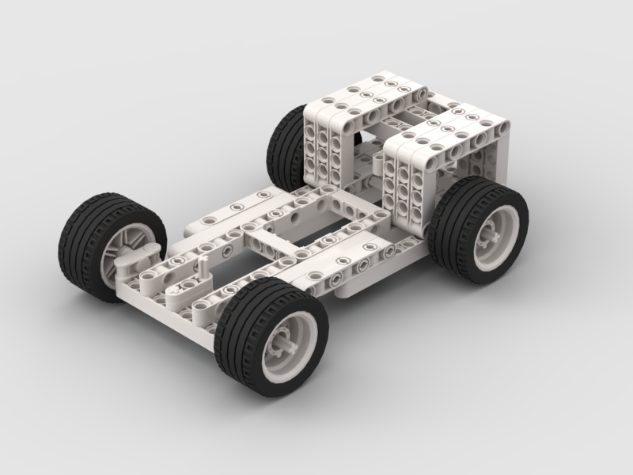

# Chasis V2 — LEGO Technic (Prototipo de Producción Actual)

Este es el archivo CAD **fuente y reproducible** del chasis de producción actual (613 gramos), modelado en **[BrickLink Studio](https://www.bricklink.com/v3/studio/download.page)** (software gratuito).

  

* **`Chasis-V2.io`**: Abrir con BrickLink Studio para inspeccionar el modelo pieza por pieza, generar la vista explosionada de ensamblaje o exportar el listado oficial de piezas con miniaturas.

## Inventario de Piezas (83 piezas totales)

Extraído directamente de la geometría del archivo `.io` (color LDraw `15` = Blanco para la estructura; las llantas usan el color interno de la pieza compuesta). El **Design ID** es el identificador único de BrickLink/LDraw — con él cualquier equipo puede localizar la pieza exacta en [BrickLink Parts Catalog](https://www.bricklink.com/catalogList.asp) para reproducir el chasis sin ambigüedad.

| Design ID | Cantidad | Pieza (identificación) |
| :---: | :---: | :--- |
| `2780` | 36 | Technic Pin con reborde de fricción y ranura central (conector estructural principal de las vigas) |
| `64179` | 8 | Technic Pin largo con reborde de fricción y doble ranura central |
| `43093` | 5 | Technic Axle Pin (pin-eje híbrido, conecta viga con eje motriz) |
| `bl_56145c01` | 4 | Conjunto Rueda + Neumático (una por esquina, tracción y dirección) |
| `40490` | 4 | Conector Technic (ver miniatura en Studio) |
| `32123a` | 4 | Technic Bush 1/2 (buje espaciador corto, reduce fricción axial) |
| `2391` | 4 | Technic Bush (buje espaciador estándar) |
| `87083` | 2 | Technic Pin largo con fricción (variante 3L) |
| `6632` | 2 | Technic Liftarm / conector de dirección |
| `44294` | 2 | Technic Liftarm |
| `41239` | 2 | Technic Liftarm |
| `32556b` | 2 | Technic Beam (viga estructural larga) |
| `32525` | 2 | Technic Beam (viga estructural) |
| `32524` | 2 | Technic Beam (viga estructural) |
| `32184` | 2 | Technic Steering Arm (brazo de dirección — geometría Ackermann, uno por rueda directriz) |
| `4519` | 1 | Technic Axle 3L (eje corto) |
| `32316` | 1 | Technic Liftarm angular |

> **Nota de trazabilidad:** Algunas piezas de la tabla se listan con nombre genérico ("ver miniatura en Studio") porque no tenemos el catálogo oficial de BrickLink instalado en el equipo que documenta — para evitar reportar un nombre incorrecto, preferimos dejar el Design ID exacto (100% verificable abriendo el `.io`) antes que adivinar el nombre comercial. Los Design ID marcados con razonamiento de ingeniería (Steering Arm, Axle Pin, bujes) sí están descritos porque son piezas clave para la cinemática Ackermann documentada en la sección 7 del README principal.

## Por qué migramos de piezas impresas en 3D a LEGO Technic puro

Ver la justificación completa de ingeniería (mitigación de resonancia en la cámara, reducción de masa del 23.37%, reconfiguración rápida en boxes) en la sección **3.1 y 3.4** del [README principal](../../README.md). El diseño anterior (V1, impreso en 3D) está archivado en [`3d-Models/V1/`](../V1/README.md).
