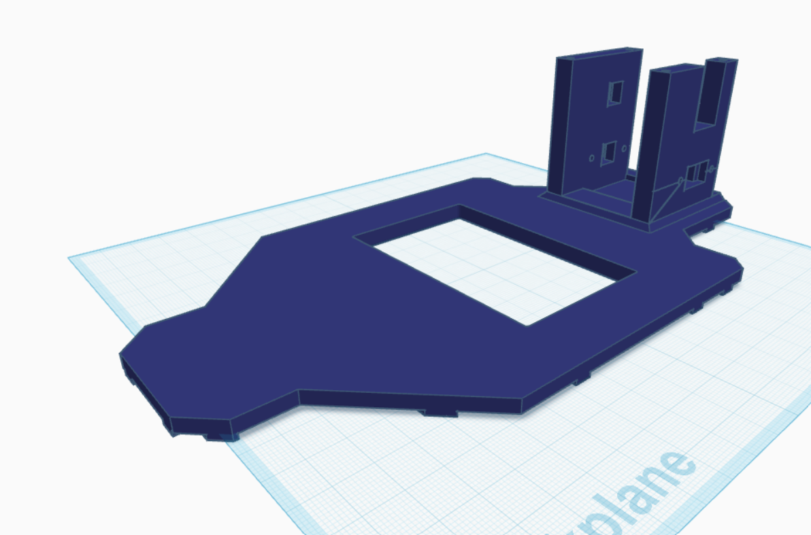
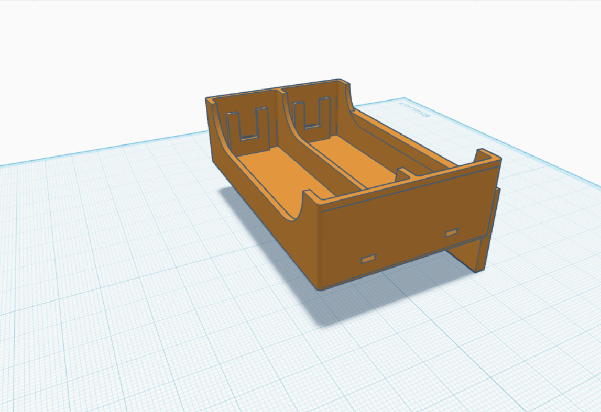
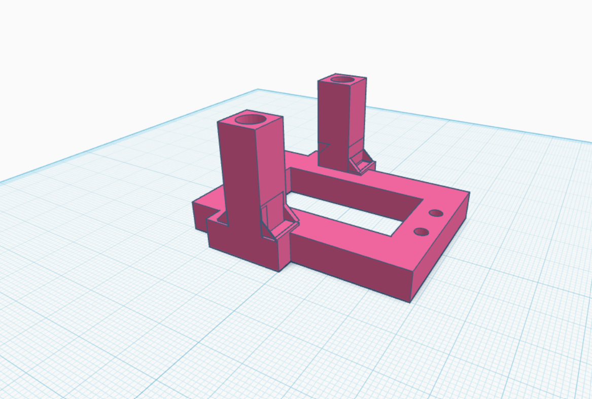
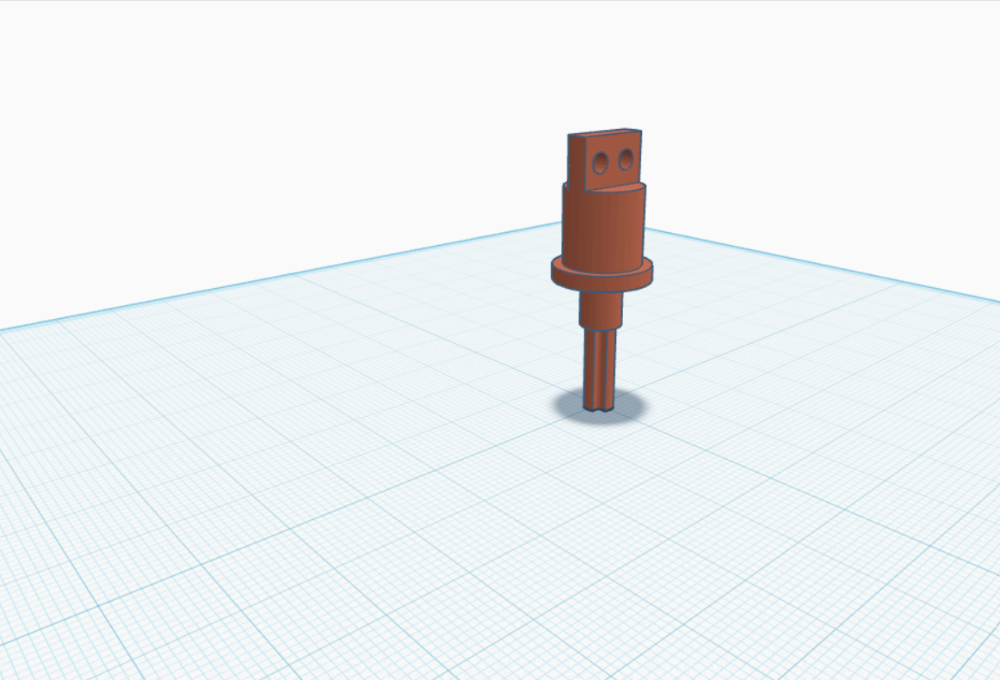
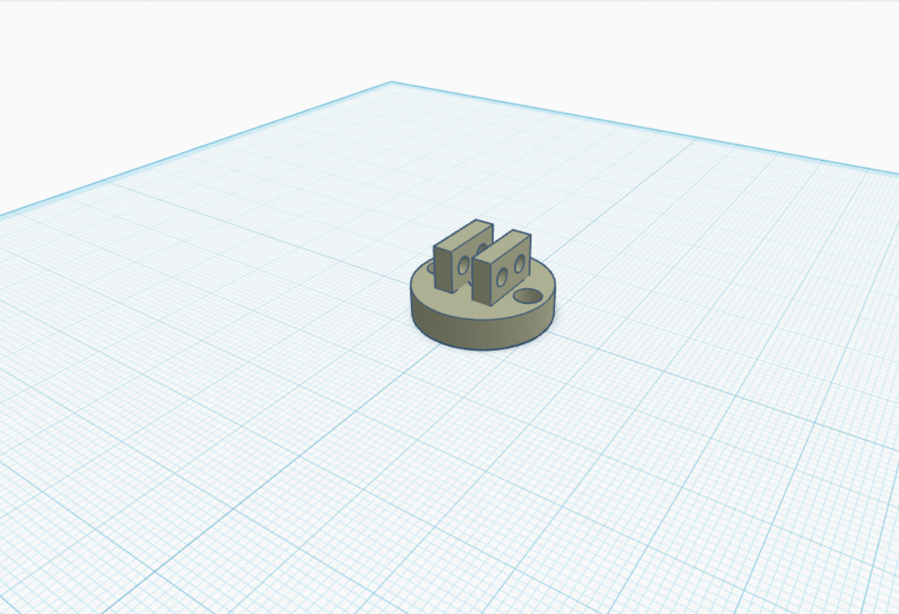
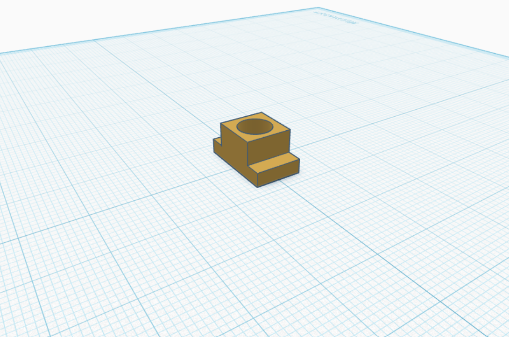
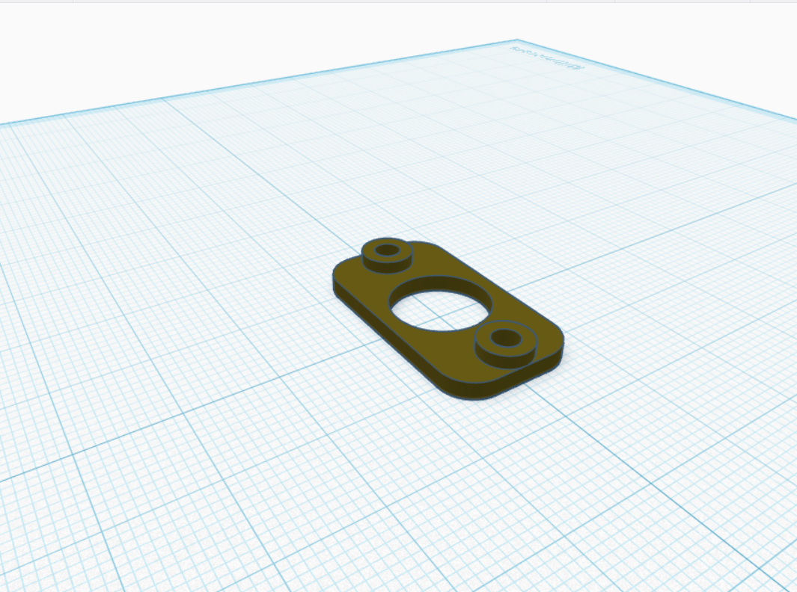

# Manual de Piezas 3D y Ensamble

> ⚠️ **Estado: Prototipo V1 (Archivado).** Las piezas STL documentadas en este archivo corresponden al **chasis monocasco impreso en 3D** del prototipo inicial (≈800 g), reemplazado por decisión de ingeniería. El **prototipo de producción actual (V2, 613 g)** usa un chasis híbrido de vigas de fricción **LEGO Technic** — su archivo CAD reproducible y listado de piezas están en [`3d-Models/Chasis-LEGO-V2/`](../Chasis-LEGO-V2/README.md). La justificación completa del cambio (mitigación de resonancia en la cámara, reducción de masa del 23.37%) está en la sección 3.1 del [README principal](../../README.md).
>
> Conservamos este manual porque documenta el proceso real de iteración del equipo (Criterio de Pensamiento Sistémico) y porque las piezas de dirección/tracción (`Eje_llanta`, `Base_llanta`) siguen siendo relevantes como referencia de diseño.

Este documento contiene la descripción técnica de todas las piezas mecánicas del kit, sus funciones y la guía recomendada para el ensamblaje.

## Catálogo de Componentes (Modelos 3D)

El diseño está compuesto por las siguientes piezas clave, las cuales se pueden identificar por sus respectivos nombres de archivo en el proyecto:

### 1. Estructura y Energía

#### Chasis

* **`Chasis.jpg`**: Es la columna vertebral del robot. Cuenta con un gran espacio central recortado para aligerar peso y organizar cables, además de una torre posterior elevada y reforzada para montar electrónica o módulos adicionales.

#### Portapillas

* **`Portapillas.jpg`**: Contenedor doble diseñado para albergar dos celdas de energía (pilas/baterías). Incluye ranuras en la base trasera para pasar las pletinas y cables de contacto eléctrico de manera segura.

---

### 2. Dirección y Articulación Frontal

#### Base Servo

* **`base_servo.jpg`**: Soporte que se fija al frente del chasis. Eleva dos columnas cuadradas que sirven de punto de giro elevado para el sistema de dirección y suspensión delantera.

#### Eje de la Llanta

* **`Eje_llanta.jpg`**: El componente de transmisión de movimiento. En la parte inferior cuenta con un perfil estriado (tipo engranaje) para acoplar la rueda con máxima tracción, y en la superior una cabeza plana con dos orificios para conectar los brazos de dirección.

#### Base de la Llanta

* **`Base_llanta.jpg`**: Una pieza cilíndrica estabilizadora con dos pestañas paralelas. Funciona como el buje receptor que abraza la cabeza del `Eje_llanta` para permitir el pivotaje.

---

### 3. Soportes de Fijación

#### Soporte Interior del Eje

* **`SopoteInterior_Eje.jpg`**: Bloque en forma de "T" invertida con un conducto circular interno. Sirve para guiar el eje desde la cara interna del mecanismo.

#### Soporte Exterior del Eje

* **`SoporteExterior_eje.jpg`**: Pletina de sujeción redondeada con orejetas laterales y agujeros pasantes, diseñada para cerrar y asegurar el conjunto del eje por la parte externa contra el chasis.

---

## Parámetros de Impresión 3D Recomendados

Para garantizar que el robot soporte el movimiento y los esfuerzos mecánicos, se recomienda configurar el software laminador (Cura, PrusaSlicer, etc.) con los siguientes parámetros:

| Pieza | Material sugerido | Relleno (Infill) | Soportes | Notas especiales |
| :--- | :--- | :--- | :--- | :--- |
| **Chasis / Portapillas** | PLA | 15% - 20% | Solo en la torre trasera | Patrón de rejilla o giroidal |
| **Eje_llanta / Base_llanta** | PETG | **50% o superior** | Recomendado | Imprimir con **Relleno Concéntrico** para máxima torsión |
| **Soportes de Eje y Base Servo**| PLA | 25% | Sí | Asegurar buena precisión en los diámetros internos |

---

## Guía de Ensamblaje Paso a Paso

> **Antes de empezar:** Lija suavemente las rebabas de impresión, especialmente en el estriado del *Eje_llanta* y en el interior de los agujeros de los pasadores para que las articulaciones giren de forma suave y limpia.

1. **Instalación del Bloque de Energía:** Inserta las pestañas metálicas de contacto en el **Portapillas**, suelda los cables de alimentación y encaja o atornilla el portapillas en el vano central del **Chasis**.
2. **Montaje del Sistema de Dirección:** Fija la **base_servo** en la sección frontal del chasis. Coloca el servomotor físico en la cavidad rectangular de la base.
3. **Armado de las Manguetas de las Ruedas:** Introduce el extremo plano del **Eje_llanta** entre las dos solapas de la **Base_llanta**. Alinea los orificios y pasa un tornillo M3.
4. **Aseguramiento en el Chasis:** Utiliza el **Soporte Interior** y el **Soporte Exterior** envolviendo las uniones laterales mecánicas para fijarlas sólidamente a la estructura del chasis, verificando que el eje pueda rotar de izquierda a derecha sin juego vertical suelto.