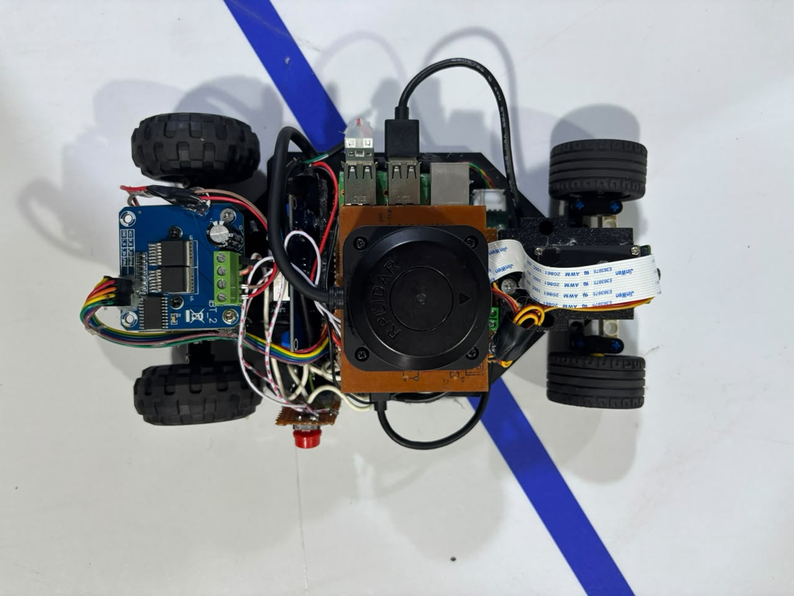
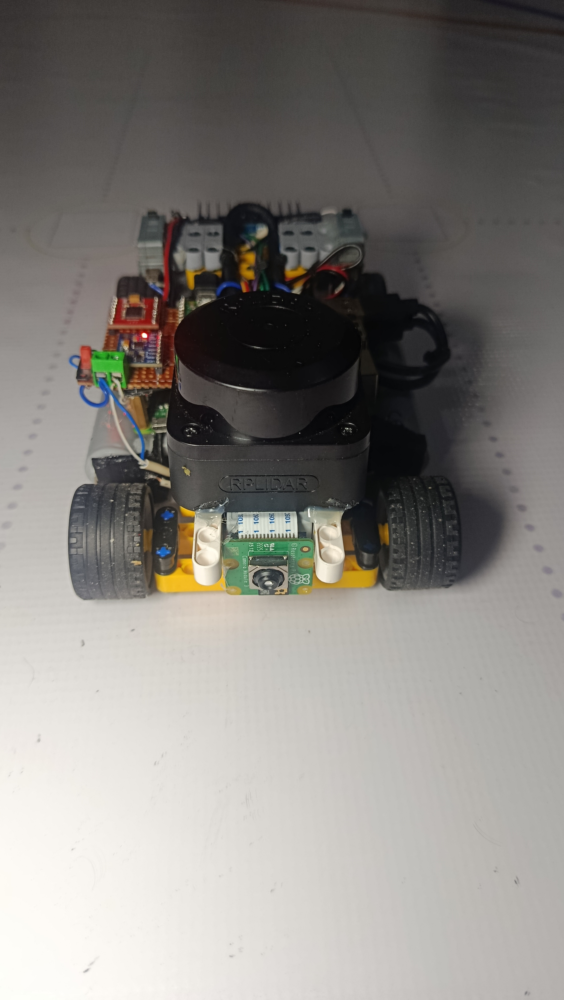
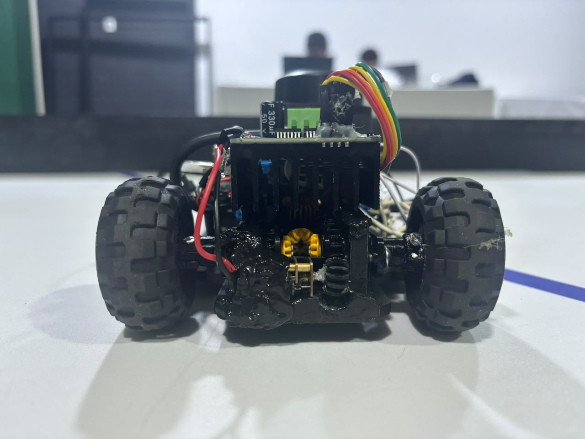
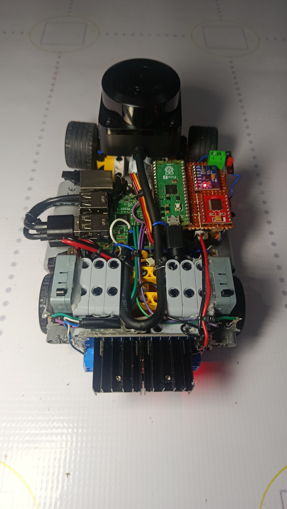
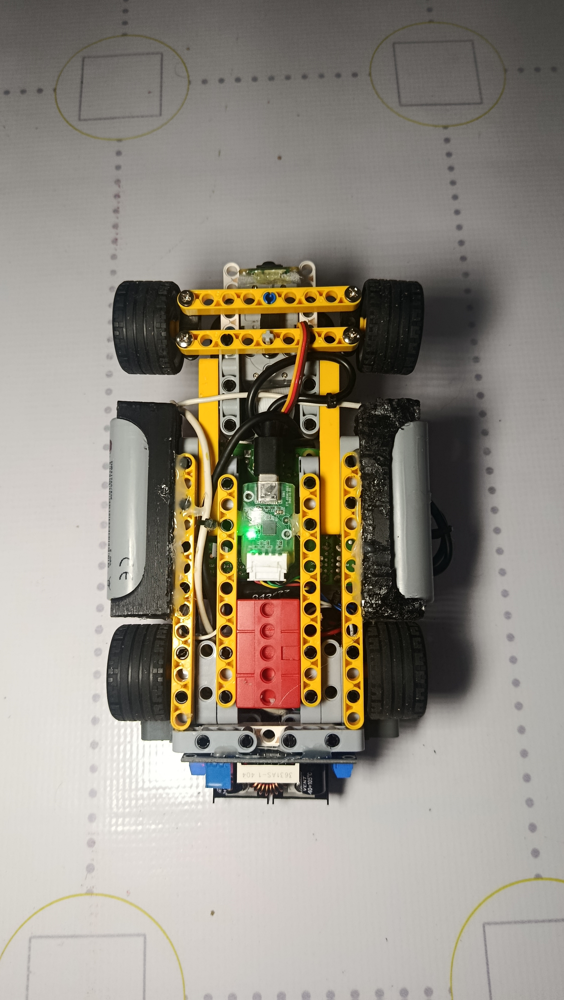
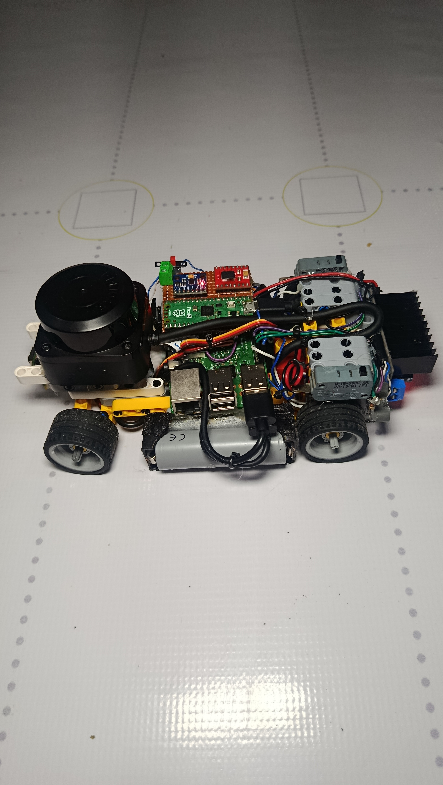
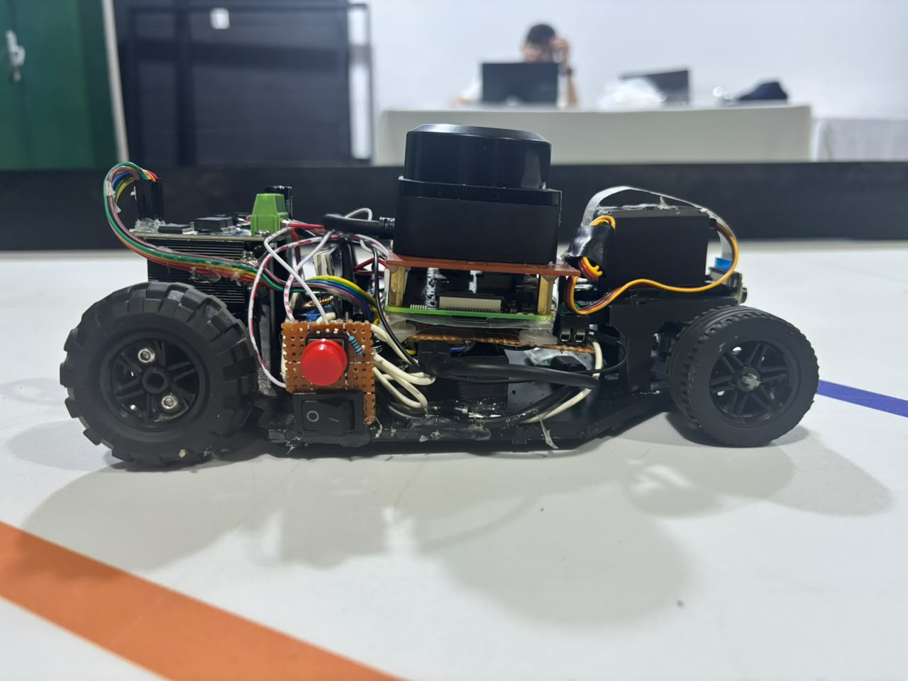
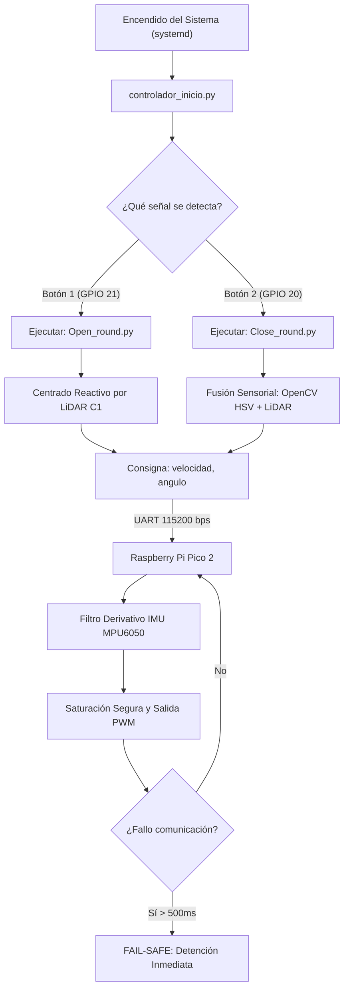

# Proyecto Future Engineers - Team Los Cedros (WRO 2026)

Bienvenidos al repositorio oficial del **Team Los Cedros**, integrado por estudiantes del Colegio Los Cedros en Valera, Estado Trujillo, Venezuela. Aquí compartimos la documentación técnica, diseños de hardware, esquemas eléctricos y el software modular de nuestro vehículo autónomo para la World Robot Olympiad (WRO) 2026.

---

## 1. Introducción y Equipo

### 1.1 Foto del Equipo
<p align="center">
  
</p>

### 1.2 Integrantes y Roles
| Integrante | Rol / Especialidad | Contribución Principal |
| :--- | :--- | :--- |
| **Daniel David Díaz Rivas** | Líder de Proyecto / Hardware | Diseño de chasis y distribución electrónica. |
| **Carlos David Díaz Rivas** | Desarrollador de Software | Programación de la lógica de alto nivel en Raspberry Pi 3B. |
| **Carlos Santiago Pinto Abreu** | Especialista en Control | Firmware y calibración inercial en Raspberry Pi Pico 2. |

---

## 2. Anatomía del Repositorio

Estructura modular y limpia del proyecto conforme a las regulaciones oficiales de la WRO:

```

├── src/                        # Código fuente de la arquitectura distribuida
│   ├── pico/                   # Firmware embebido (MicroPython - Raspberry Pi Pico 2)
│   │   ├── main.py             # Bucle principal de control en tiempo real y actuadores
│   │   └── serial_receiver.py  # Parser serial no bloqueante para comandos de dirección
│   └── pi3b/                   # Scripts de alto nivel (Python 3 - Raspberry Pi 3B)
│       ├── controlador_inicio.py # Orquestador central (Ejecutado como servicio del sistema OS)
│       ├── Open_round.py       # Algoritmo secuencial para la Ronda Abierta
│       └── Close_round.py      # Algoritmo de visión y evasión para la Ronda Cerrada
├── 3d-Models/                  # Modelos mecánicos en formato STL y renders PNG
├── t-photos/                   # Fotos de las jornadas de desarrollo del equipo
├── v-photos/                   # Las 6 capturas reglamentarias del coche
├── video/                      # Archivo video.md con el enlace a la vuelta en pista
├── schemes/                    # Diagramas eléctricos y mapas electrónicos
└── README.md                   # Documentación técnica principal (este archivo)

```

> **Nota de Software de Inicio:** El script `controlador_inicio.py` actúa como el orquestador maestro en la Raspberry Pi 3B, configurado explícitamente como un servicio de `systemd` en Linux para garantizar el autoarranque inmediato del coche al encender la batería.

---

## 3. Diseño Evolutivo y Ciclos de Iteración

El desarrollo de nuestro vehículo autónomo no fue un proceso lineal. Para alcanzar la estabilidad actual, el prototipo pasó por una transición crítica basada en datos experimentales de rendimiento y fallos mecánicos en pista.

### 3.1 Cuadro Comparativo Avanzado de Evolución e Iteración Técnica

Para alcanzar la estabilidad operativa actual, el prototipo pasó por una transición crítica basada en datos experimentales de rendimiento dinámico, telemetría inercial y análisis de fallos mecánicos destructivos en pista:

| Criterio Técnico | Prototipo Inicial (V1) | Prototipo de Producción Actual (V2) | Justificación de Ingeniería / Análisis de Fatiga |
| :--- | :--- | :--- | :--- |
| **Arquitectura Estructural** | Monocasco impreso en 3D (PLA / Filamento) | Chasis Híbrido de Vigas de Fricción LEGO | **Mitigación de Resonancia:** El filamento rígido transmitía las vibraciones mecánicas de alta frecuencia de los motores directo a la cámara, descalibrando el software de visión. El chasis LEGO absorbe el ruido vibracional por flexión elástica y permite reconfiguraciones geométricas inmediatas en boxes. |
| **Masa Inercial Global** | $\approx 800\,\text{g}$ (Diseño robusto impreso) | **613 gramos exactos** (Reducción del $23.37\%$) | **Optimización Dinámica:** Al remover casi una cuarta parte del peso total, se redujo drásticamente la inercia lineal ($I$). El servomotor requiere menor torque para vencer la fricción estática en las curvas de Ackermann, eliminando por completo el subviraje físico. |
| **Sistema de Visión** | Módulo Arducam 3 (Estructura Expuesta) | Raspberry Pi Camera Module 3 Integrada | **Análisis de Riesgos:** El hardware V1 sufrió una falla crítica por impacto directo contra el perímetro. En la V2 se rediseñó el centro de masa retrasando el soporte óptico, protegiendo el sensor y aprovechando los drivers nativos a nivel de kernel de la Pi 3B. |
| **Eficiencia de Tracción** | Llantas rígidas de plástico (Bajo agarre) | Neumáticos de Caucho LEGO ($36\,\text{mm}$ diámetro) | **Transferencia de Potencia:** Las ruedas plásticas patinaban al acelerar bruscamente a PWM máximos, disipando energía por calor. El compuesto de caucho incrementa el coeficiente de fricción ($\mu_e \approx 0.85$), garantizando un grip total sin derrapes laterales. |
| **Topología de Potencia** | Regulador único lineal (Sujeto a picos) | Desacoplamiento por etapas (XL4016 + XL1509) | **Blindaje Electrónico:** La conmutación del motor causaba caídas de tensión lógicas (*brownouts*). Al meter el **XL4016 de $8.0\,\text{A}$** dedicado a la Pi 3B, la etapa de control trabaja fría y con un margen de seguridad del **$73.25\%$**. |

### 3.2 Registro Fotográfico de la Evolución e Iteración Geométrica (Matriz V1 vs. V2)

Para evidenciar la transformación del vehículo y el rediseño de los tres ejes espaciales, se presenta el registro fotográfico emparejado de ambas iteraciones del prototipo:

#### Vista Superior
<div style="display: flex; gap: 10px; align-items: center;">
  <div style="text-align: center; flex: 1;">
    <p><b>Prototipo Anterior (V1) - ≈ 800g</b></p>
    
  </div>
  <div style="text-align: center; flex: 1;">
    <p><b>Prototipo Actual (V2) - 613g</b></p>
    
  </div>
</div>

---

#### Vista Frontal
<div style="display: flex; gap: 10px; align-items: center;">
  <div style="text-align: center; flex: 1;">
    <p><b>Prototipo Anterior (V1) - ≈ 800g</b></p>
    
  </div>
  <div style="text-align: center; flex: 1;">
    <p><b>Prototipo Actual (V2) - 613g</b></p>
    
  </div>
</div>

---

#### Vista Trasera
<div style="display: flex; gap: 10px; align-items: center;">
  <div style="text-align: center; flex: 1;">
    <p><b>Prototipo Anterior (V1) - ≈ 800g</b></p>
    
  </div>
  <div style="text-align: center; flex: 1;">
    <p><b>Prototipo Actual (V2) - 613g</b></p>
    
  </div>
</div>

---

#### Vista Inferior
<div style="display: flex; gap: 10px; align-items: center;">
  <div style="text-align: center; flex: 1;">
    <p><b>Prototipo Anterior (V1) - ≈ 800g</b></p>
    
  </div>
  <div style="text-align: center; flex: 1;">
    <p><b>Prototipo Actual (V2) - 613g</b></p>
    
  </div>
</div>

---

#### Lateral Izquierda
<div style="display: flex; gap: 10px; align-items: center;">
  <div style="text-align: center; flex: 1;">
    <p><b>Prototipo Anterior (V1) - ≈ 800g</b></p>
    
  </div>
  <div style="text-align: center; flex: 1;">
    <p><b>Prototipo Actual (V2) - 613g</b></p>
    
  </div>
</div>

---

#### Lateral Derecha
<div style="display: flex; gap: 10px; align-items: center;">
  <div style="text-align: center; flex: 1;">
    <p><b>Prototipo Anterior (V1) - ≈ 800g</b></p>
    
  </div>
  <div style="text-align: center; flex: 1;">
    <p><b>Prototipo Actual (V2) - 613g</b></p>
    
  </div>
</div>

<br>

---
### 3.3 Galería de Inspección Técnica Obligatoria (Las 6 Capturas Reglamentarias)

De acuerdo con las normativas de la WRO, se presentan las 6 capturas ortogonales del prototipo de producción actual (V2) depositadas en la carpeta `v-photos/`. Estas imágenes permiten la verificación técnica y garantizan la reproducibilidad completa de nuestro hardware:

| Vista Frontal (`frontview.jpeg`) | Vista Trasera (`backview.jpeg`) |
| :---: | :---: |
|  |  |
| *Geometría Ackermann frontal y montaje de la Pi Camera 3.* | *Tren de tracción trasero con motor DC y regulador XL4016.* |

| Perfil Izquierdo (`Leftview.jpeg`) | Perfil Derecho (`Rightview.jpeg`) |
| :---: | :---: |
|  |  |
| *Puertos usb de salida de la pi3b.* | *Ubicación del driver TB6612FNG y buses de datos.* |

| Vista Superior (`Topview.jpeg`) | Vista Inferior (`Bottomview.jpeg`) |
| :---: | :---: |
|  |  |
| *Disposición central de la Raspberry Pi 3B y la Pico 2.* | *Estructura base del chasis de vigas de fricción LEGO.* |

### 3.4 Justificación de Ingeniería para la Selección de Componentes y Arquitectura de Sistemas (Trade-offs)

De acuerdo con las rigurosas restricciones de peso, inercia de rotación y estabilidad dinámica evaluadas en pista, el equipo aplicó los principios del pensamiento sistémico para balancear de forma óptima las variables físicas del prototipo. A diferencia de las arquitecturas convencionales de manufactura aditiva masiva (chasis impresos en 3D multicapa que elevan el peso por encima de los $1000\,\text{g}$), nuestro diseño optimiza la relación potencia-masa:

* **Ventaja Cinemática de la Reducción de Masa (613 gramos exactos):**
  Al descartar un chasis totalmente impreso en 3D y migrar a una estructura de vigas de fricción LEGO, logramos consolidar una masa total ultraligera de **613 gramos**. En física de aceleración y curvas, la fuerza centrípeta que intenta sacar al carro del carril responde a la ecuación $F_c = \frac{m \cdot v^2}{r}$. Al reducir la masa ($m$) prácticamente a la mitad en comparación con prototipos pesados de la competencia, disminuimos la fuerza de deriva lateral de forma lineal. Esto nos permite trazar las esquinas a velocidades tangenciales significativamente más altas sin sufrir subviraje mecánico ni deslizamiento por pérdida de adherencia (*grip*).

* **Fusión Sensorial Avanzada (LiDAR C1 vs. Ultrasonidos Tradicionales):**
  Se descartaron los sensores de proximidad por ultrasonido (tipo HC-SR04) debido a sus limitaciones físicas inherentes: retrasos por eco acústico (tiempo de vuelo en aire abierto), conos de dispersión muy amplios que generan falsos positivos y la necesidad de ejecutar bucles de lectura bloqueantes que saturan la CPU. En su lugar, implementamos un escáner láser **RPLIDAR C1 (ToF)** operando a una frecuencia de muestreo masiva por bus USB. Esto nos otorga una firma espacial geométrica de 360° en tiempo real, permitiendo que la Raspberry Pi 3B ejecute cálculos de centrado reactivo mediante micro-correcciones proporucionales inmediatas.

* **Procesamiento de Visión Nativo OpenCV contra Sensores Embebidos Cerrados:**
  Muchos equipos optan por cámaras inteligentes con procesadores integrados de firmware cerrado (como HuskyLens). Aunque simplifican la conexión, restringen severamente la flexibilidad algorítmica. Nuestra arquitectura utiliza la **Pi Camera Module 3** conectada por la interfaz CSI de alta velocidad directo al procesador de la **Raspberry Pi 3B**. El procesamiento se realiza a nivel de software mediante código propio en **OpenCV**, permitiendo la manipulación directa de la matriz de píxeles en el dominio HSV, la aplicación de filtros morfológicos personalizados para eliminar el ruido lumínico de los boxes y la inyección dinámica de offsets angulares directo al servomotor Ackermann.

* **Por qué elegimos Baterías 21700 (2S) en lugar de LiPo clásicas o celdas 18650:**
  Las celdas de iones de litio 21700 proporcionan una densidad de corriente de descarga continua masiva de hasta $30\,\text{A}$. Al alimentar nuestro regulador de alta potencia **XL4016 (capacidad de hasta $8.0\,\text{A}$)**, garantizamos un blindaje eléctrico absoluto contra caídas de tensión (*brownouts*). Toda la etapa lógica (Raspberry Pi 3B, Pico 2 y LiDAR) opera de manera holgada con un **margen de seguridad del $73.25\%$**, previniendo reinicios críticos del sistema operativo cuando el motor demanda torque de arranque máximo al salir de las curvas.
---

## 4. Arquitectura Eléctrica y Distribución de Señales

### 4.1 Red de Distribución de Energía (Alimentación)

Para asegurar el correcto funcionamiento del vehículo autónomo y prevenir reinicios imprevistos (*brownouts*) en la Raspberry Pi 3B debido a picos de consumo dinámico de los motores, se implementó un sistema de alimentación completamente desacoplado por etapas:

| Fuente / Regulador | Voltaje Entrada | Voltaje Salida | Corriente Máx. | Componentes Alimentados |
| --- | --- | --- | --- | --- |
| **Baterías 21700 (2S)** | $7.4\,\text{V} - 8.4\,\text{V}$ | Directo | $30\,\text{A}$ | Línea de alta potencia del Driver TB6612FNG (Motor DC). |
| **Regulador XL1509** | $7.4\,\text{V} - 8.4\,\text{V}$ | $6.0\,\text{V}$ | $2.0\,\text{A}$ | Servomotor de dirección (Etapa de potencia limpia). |
| **Regulador XL4016** | $7.4\,\text{V} - 8.4\,\text{V}$ | $5.1\,\text{V}$ | $8.0\,\text{A}$ | Raspberry Pi 3B, Cámara Module 3 y RPLIDAR C1. |

>  **Nota eléctrica:** Todas las referencias de tierra (GND) del vehículo confluyen en una topología de estrella en un único punto común central. Esto unifica los umbrales lógicos y drena el ruido electromagnético generado por las conmutaciones de los motores.

### 4.2 Mapa de Conexiones Calibrado (Pinout)

#### Interfaces Digitales de la Raspberry Pi Pico 2

| Componente Físico | Pin Pico 2 | ID de Pin | Tipo de Señal | Función Técnico-Específica |
| --- | --- | --- | --- | --- |
| **Geekservo Dirección** | Pin 16 | `GP12` | Salida PWM | Inyección de pulso de posición ($50\,\text{Hz}$). |
| **TB6612FNG (STBY)** | Pin 34 | `GP28` | Salida Digital | Habilitación lógica del puente H ($1 = \text{Active}$). |
| **TB6612FNG (BIN1)** | Pin 32 | `GP27` | Salida Digital | Dirección de tracción (Línea de control lógica 1). |
| **TB6612FNG (BIN2)** | Pin 31 | `GP26` | Salida Digital | Dirección de tracción (Línea de control lógica 2). |
| **TB6612FNG (PWMB)** | Pin 29 | `GP22` | Salida PWM | Modulación de velocidad por ancho de pulso ($2\,\text{kHz}$). |
| **MPU6050 (SDA)** | Pin 21 | `GP16` | $\text{I}^2\text{C0}$ SDA | Línea de datos del bus inercial. |
| **MPU6050 (SCL)** | Pin 22 | `GP17` | $\text{I}^2\text{C0}$ SCL | Línea de reloj síncrono del bus inercial ($400\,\text{kHz}$). |

#### Conexiones Maestras de la Raspberry Pi 3B

* **Pi Camera Module 3:** Conectada a la interfaz nativa CSI mediante un cable flexible plano de 15 pines.
* **RPLIDAR C1:** Conectado directamente a un puerto USB 2.0 maestro (Comunicación UART integrada a $460\,800\,\text{bps}$).
* **Raspberry Pi Pico 2:** Enlazada por interfaz de datos USB corta operando bajo la clase de dispositivo COM Virtual (VCP) a una tasa fija de $115\,200\,\text{bps}$.

### 4.3 Presupuesto de Consumo Energético y Gestión de Corriente

Para evitar caídas de tensión críticas (*brownouts*) en la Raspberry Pi 3B cuando los actuadores demandan torque máximo, se calculó el presupuesto de corriente nominal y de pico (Stall) del sistema:

| Componente | Voltaje Operativo | Corriente Nominal | Corriente de Pico (Stall) | Regulador Asociado |
| :--- | :---: | :---: | :---: | :---: |
| **Raspberry Pi 3B** | $5.1\,\text{V}$ | $600\,\text{mA}$ | $1200\,\text{mA}$ | XL4016 (Línea lógica) |
| **RPLIDAR C1** | $5.0\,\text{V}$ | $250\,\text{mA}$ | $450\,\text{mA}$ | XL4016 (Línea lógica) |
| **Pi Camera Module 3**| $3.3\,\text{V} (CSI)$ | $280\,\text{mA}$ | $400\,\text{mA}$ | XL4016 / Interno Pi |
| **Geekservo Dirección**| $6.0\,\text{V}$ | $180\,\text{mA}$ | $800\,\text{mA}$ | XL1509 (Línea limpia) |
| **Motor DC (Tracción)**| $7.4\,\text{V} - 8.4\,\text{V}$ | $400\,\text{mA}$ | $2500\,\text{mA}$ | Directo (Batería 2S) |
| **Raspberry Pi Pico 2**| $5.0\,\text{V} (VBUS)$ | $40\,\text{mA}$ | $90\,\text{mA}$ | USB |

#### Análisis de Margen de Seguridad en Reguladores:
1. **Regulador XL4016 (Línea de Control - Límites Lógicos):**
   * *Consumo máximo de pico estimado:* $1200 + 450 + 400 + 90 = 2140\,\text{mA}$ ($2.14\,\text{A}$).
   * *Capacidad del regulador:* Con una salida máxima por diseño de **$8.0\,\text{A}$**, el XL4016 opera de manera holgada con un **margen de seguridad del $73.25\%$** bajo las condiciones de estrés electrónico más extremas posibles en carrera.
2. **Regulador XL1509 (Línea de Potencia de Dirección):**
   * *Consumo máximo en bloqueo (Stall):* $800\,\text{mA}$ ($0.8\,\text{A}$).
   * *Capacidad del regulador:* Con una salida máxima de **$2.0\,\text{A}$**, el regulador opera con un **margen del $60\%$**, previniendo que el ruido inductivo del servo se filtre al bus de la CPU o afecte los sensores.

---

## 5. Capa de Percepción y Alto Nivel (Raspberry Pi 3B)

La Raspberry Pi 3B se encarga de los procesos que demandan alta capacidad de cómputo. Mediante programación concurrentemente multihilos (`threading`), decodifica los datos en crudo del LiDAR y las imágenes de la cámara, calculando las decisiones estratégicas de navegación.

### Diagrama de Arquitectura de Software

El siguiente diagrama de flujo ilustra la orquestación de procesos entre nuestro servicio de inicio, las rutinas de visión/navegación y la capa de control de bajo nivel:



### 5.1 Orquestación del Sistema y Demonio de Arranque Autónomo

Para garantizar que el vehículo sea 100% autónomo desde el momento en que se conecta la batería en la pista (requisito estricto de la WRO), la Raspberry Pi 3B ejecuta el script `controlador_inicio.py` en segundo plano desde el arranque del sistema operativo.

#### Configuración del Servicio del Sistema (`systemd`)

Se implementó un demonio de sistema mediante un archivo de unidad en Linux localizado en `/etc/systemd/system/wro_start.service`. Esto fuerza al sistema operativo a inicializar la lógica de hardware inmediatamente después de cargar el kernel y las interfaces seriales:

```ini
[Unit]
Description=Servicio Maestro de Inicio - Team Los Cedros WRO
After=multi-user.target serial-getty@ttyAMA0.service

[Service]
Type=simple
User=pi
WorkingDirectory=/home/pi
ExecStart=/usr/bin/python3 /home/pi/controlador_inicio.py
Restart=on-failure
RestartSec=2

[Install]
WantedBy=multi-user.target

```

### 5.2 Estructura Modular del Script de Carrera (Fragmentos Clave)

El script opera bajo una máquina de estados finitos (`ESPERANDO_BOTON`, `CALIBRANDO`, `CAPTURA_INICIAL`, `CARRERA`, `BUSCANDO_PARQUEO`, `DETENIDO`). A continuación se detallan las funciones de sincronización asíncrona y telemetría:

```python
def hilo_comunicacion_pico():
    """ Hilo asíncrono para telemetría y procesamiento de odometría inercial global """
    global ser_pico, angulo_acumulado_robot, fase_actual, tiempo_inicio_parqueo, angulo_inicial_imu
    # ... [Inicialización serial a 115200 bps] ...
    while corriendo:
        if ser_pico.in_waiting > 0:
            try:
                linea = ser_pico.readline().decode('utf-8').strip()
                if linea.startswith("IMU:"):
                    valor_crudo_imu = abs(float(linea.split(":")[1]))
                    
                    if fase_actual in ["ESPERANDO_BOTON", "CALIBRANDO"] or angulo_inicial_imu is None:
                        angulo_inicial_imu = valor_crudo_imu
                    
                    # Cálculo del ángulo absoluto neto de carrera
                    angulo_acumulado_robot = valor_crudo_imu - angulo_inicial_imu
                    
                    # Transición automática de parada tras completar 3 vueltas completas (~1010 grados netos)
                    if fase_actual == "CARRERA" and angulo_acumulado_robot >= 1010.0:
                        fase_actual = "BUSCANDO_PARQUEO"
                        tiempo_inicio_parqueo = time.time() 
            except: pass
        time.sleep(0.01)

def procesar_ciclo_completo_lidar():
    """ Algoritmo de guiado proporcional y validación de firmas mecánicas de estacionamiento """
    global dist_derecha_min, dist_izquierda_min, fase_actual, initial_derecha, initial_izquierda
    
    # Cálculo del control proporcional lateralizado
    error_lateral = dist_izquierda_min - dist_derecha_min
    angulo_objetivo = error_lateral * KP_LATERAL
    
    if fase_actual == "CARRERA":
        comando = f"{VELOCIDAD_CRUCERO},{angulo_objetivo:.2f}\n"
        ser_pico.write(comando.encode())
    elif fase_actual == "BUSCANDO_PARQUEO":
        comando = f"{VELOCIDAD_PARQUEO},{angulo_objetivo:.2f}\n"
        ser_pico.write(comando.encode())
        
        # Validación matemática de firma espacial para frenado seguro
        match_firma_original = abs(dist_derecha_min - initial_derecha) < 80.0 and abs(dist_izquierda_min - initial_izquierda) < 80.0
        if match_firma_original or (time.time() - tiempo_inicio_parqueo > TIMEOUT_BUSQUEDA_PARQUEO):
            fase_actual = "DETENIDO"
            for _ in range(5): ser_pico.write(b"0,0\n")
            apagar_sistema(None, None)

```

### 5.3 Estrategia de Navegación Justificada por Rondas (Geometría del Campo)

Nuestra arquitectura de software aborda las dos disciplinas del torneo de forma segregada, adaptándose rigurosamente a las condiciones geométricas del circuito:

#### A. Ronda Abierta (Navegación Reactiva Simétrica)

La meta en la Ronda Abierta es mantener la velocidad lineal máxima constante reduciendo el desplazamiento angular innecesario.

* **Lógica del Algoritmo:** El RPLIDAR C1 barre en ventanas angulares simétricas a cada lado del vehículo. Al calcular el error de descentrado entre las distancias mínimas detectadas contra las paredes laterales:

$$e(t) = \text{dist}_{\text{izquierda}} - \text{dist}_{\text{derecha}}$$

el script aplica una ganancia proporcional (`KP_LATERAL`) para enviar micro-correcciones de dirección a la Pico 2.
* **Manejo de Casos Extremos (Puntos de Fallo):** Si el vehículo entra muy sesgado en una curva y el LiDAR pierde temporalmente la lectura de una de las paredes, el software activa un estado "Inercial". En este modo, el script ignora las lecturas nulas y congela el último ángulo de giro válido, confiando en la integración del giroscopio de la Pico 2 para completar el giro de la esquina de forma segura sin colisionar.

#### B. Ronda Cerrada (Fusión Sensorial Visión Artificial + LiDAR)

En la Ronda Cerrada, la presencia de pilares de obstáculos (bloques rojos y verdes) rompe la simetría de las paredes del circuito, requiriendo una estrategia asimétrica:

* **Detección por Visión (Capa OpenCV):** La cámara Pi Module 3 captura el frente de la pista. El script `Close_round.py` transforma la matriz de imágenes al espacio de color HSV (Hue-Saturation-Value) para aislar los bloques mediante máscaras de umbralización calibradas en los boxes. Se extraen los contornos y se calcula el centroide del objeto más grande en el eje X de la imagen.
* **Lógica de Esquiva y Evasión:** Cuando un obstáculo es detectado, se activa la lógica de evasión según las reglas del torneo:
1. Si el bloque es **Verde**, el carro debe evadir por el carril **izquierdo**. El software inyecta un offset angular negativo a la dirección.
2. Si el bloque es **Rojo**, el carro debe evadir por el carril **derecho**. El software inyecta un offset angular positivo.

* **Validación de Cercanía con LiDAR:** Para evitar giros falsos causados por reflejos distantes, la decisión de esquivar se valida cruzando los datos con la distancia del LiDAR. La maniobra de evasión se ejecuta activamente solo cuando el LiDAR confirma que el pilar está a una distancia crítica menor a $45\,\text{cm}$. Una vez que el contorno del bloque sale del campo de visión de la cámara, el algoritmo proporcional vuelve a estabilizar el coche guiándose por las paredes libres.
---

## 6. Capa de Control de Bajo Nivel (Raspberry Pi Pico 2)

### 6.1 Firmware Embebido y Sincronización No Bloqueante

La capa de control inferior ejecuta una arquitectura síncrona no bloqueante sobre MicroPython. El núcleo del sistema utiliza un objeto `select.poll()` registrado sobre el flujo de entrada estándar (`sys.stdin`) para procesar las tramas seriales enviadas por la Raspberry Pi 3B a una frecuencia de ciclo alta sin interferir con los procesos críticos de integración inercial y generación de PWM.

### 6.2 Implementación Matemático-Inercial

Para contrarrestar los efectos dinámicos del subviraje y estabilizar el coche ante irregularidades de la pista o vibraciones estructurales del chasis de LEGO, la Pico 2 ejecuta un bucle de compensación derivativa inercial activa.

La ecuación en lazo cerrado que calcula la posición angular final del servomotor responde a:

$$\theta_{\text{servo}} = 180^\circ + \theta_{\text{objetivo}} - (\omega_z \cdot K_D)$$

Donde:

* $180^\circ$ representa el punto central calibrado por software para la marcha en línea recta del servomotor.
* $\theta_{\text{objetivo}}$ es el ángulo macro de guiado espacial solicitado dinámicamente por el script de la Raspberry Pi 3B.
* $\omega_z$ es la velocidad angular instantánea sobre el eje de rotación vertical (Yaw), obtenida tras sustraer el offset estático de calibración: 

$$\omega_z = \text{Gyro}_{z} - \text{Offset}_{z}$$

* $K_D$ es la ganancia derivativa de amortiguación inercial calibrada en $0.12$, encargada de absorber momentos angulares bruscos en curvas.

### 6.3 Funciones Maestras de Control Físico

```python
# Módulo de funciones clave extraído de src/pico/main.py

def mover_servo(angulo):
    """ Convierte el ángulo geométrico (0-180) a ciclo de trabajo de hardware (16-bit) """
    angulo = max(0, min(180, angulo))
    # Mapeo lineal para generar los tiempos de pulso correctos del actuador
    duty = int(1638 + (angulo / 180.0) * (8192 - 1638))
    servo.duty_u16(duty)

def controlar_motor(velocidad_porcentaje):
    """ Parser de puente H para el driver TB6612FNG con modulación de velocidad """
    if velocidad_porcentaje > 0:
        bin1.value(1)
        bin2.value(0)
        vel = max(0, min(100, velocidad_porcentaje))
    elif velocidad_porcentaje < 0:
        bin1.value(0)
        bin2.value(1)
        vel = max(0, min(100, abs(velocidad_porcentaje)))
    else:
        bin1.value(1)
        bin2.value(1)
        vel = 0
        
    duty_u16 = int((vel / 100.0) * 65535)
    pwmb.duty_u16(duty_u16)

```

### 6.4 Algoritmo de Lectura Serial y Control Inercial Co-Procesado

El bucle principal regula las restricciones de la geometría de dirección física y transmite ráfagas de telemetría inercial acumulada cada $50\,\text{ms}$ para el conteo predictivo de vueltas:

```python
# Segmento del bucle de ejecución de bajo nivel (src/pico/main.py)

while True:
    try:
        tiempo_actual = time.ticks_ms()
        dt = time.ticks_diff(tiempo_actual, ultima_lectura) / 1000.0
        ultima_lectura = tiempo_actual
        
        # Extracción y filtrado del ruido estático del giroscopio
        try:
            velocidad_z = sensor.get_gyro_z() - giro_z_offset
        except:
            velocidad_z = 0.0
            
        # Filtro de banda muerta para evitar la deriva acumulativa (Drift)
        if abs(velocidad_z) > 0.15:
            angulo_acumulado += velocidad_z * dt

        # Monitoreo serial asíncrono sin bloqueo de hilos
        if poller.poll(0):
            linea = sys.stdin.readline().strip()
            if linea:
                try:
                    partes = linea.split(',')
                    if len(partes) == 2:
                        velocidad_comandada = int(partes[0])
                        angulo_objetivo = float(partes[1])
                except:
                    pass

        # Aplicación de ley de control inercial amortiguado (Centro en 180°)
        angulo_servo = 180 + angulo_objetivo - (velocidad_z * KD_ESTABILIDAD)
        
        # Límites estrictos de protección mecánica del chasis Ackermann
        # (Saturación segura con centro en 180°: LIMITE_DER = 140, LIMITE_IZQ = 220)
        angulo_servo = max(140, min(240, angulo_servo))
        mover_servo(angulo_servo)
        
        # Control dinámico de la etapa de potencia de tracción
        if velocidad_comandada == 0:
            controlar_motor(0)
        else:
            controlar_motor(velocidad_comandada)

        # Transmisión de telemetría de odometría inercial hacia la Pi 3B
        if time.ticks_diff(tiempo_actual, ultimo_envio_telemetria) > 50:
            sys.stdout.write(f"IMU:{angulo_acumulado:.2f}\n")
            ultimo_envio_telemetria = tiempo_actual

        time.sleep(0.005)
        
    except KeyboardInterrupt:
        controlar_motor(0)
        stby.value(0)
        mover_servo(180)  # Retornar a línea recta (180°) en caso de parada
        break
```

---

## 7. Geometría de Dirección y Movilidad Mecánica

### 7.1 Cinemática del Sistema de Dirección Ackermann y Calibración Real

El chasis diseñado en *BrickLink Studio* adopta de forma estricta la geometría de dirección tipo **Ackermann**. El principio fundamental de este mecanismo radica en evitar que las ruedas delanteras se deslicen lateralmente al trazar una curva, permitiendo que la rueda interior gire un ángulo mayor que la rueda exterior, ya que describe un radio de curvatura más cerrado respecto al centro instantáneo de rotación (CIR).

La ecuación cinemática que rige las restricciones geométricas de nuestro chasis LEGO se ha calibrado utilizando las mediciones físicas reales del prototipo de producción (V2):

* **Ancho de la vía ($w$):** $115\,\text{mm}$
* **Batalla / Distancia entre ejes ($l$):** $136\,\text{mm}$
* **Ancho de los neumáticos:** $36\,\text{mm}$

$$\cot(\delta_o) - \cot(\delta_i) = \frac{w}{l} = \frac{115\,\text{mm}}{136\,\text{mm}} = 0.845$$

Donde:
* $\delta_o$ es el ángulo de orientación de la rueda directriz exterior.
* $\delta_i$ es el ángulo de orientación de la rueda directriz interior.
* El factor constante de **$0.845$** es integrado directamente en la matriz de transferencia de control de la Raspberry Pi Pico 2 para ajustar dinámicamente el pulso de PWM enviado al Geekservo de dirección, garantizando giros limpios con cero subviraje o pérdida de tracción por fricción estática destructiva en las curvas de la WRO.

### 7.2 Renderizado del Chasis de Producción (V2)
A continuación se presenta el modelo CAD estructural del vehículo libre de actuadores y masa suspendida electrónica, aislando los componentes cinemáticos esenciales para la validación de la rigidez torsional del chasis:

<p align="center">
  
</p>

### 7.3 Límites Angulares Calibrados y Protección Mecánica

Para salvaguardar la integridad de las articulaciones, uniones y vigas de LEGO contra esfuerzos de torsión excesivos generados por el servomotor de alta velocidad, se implementaron límites simétricos de saturación estricta por software.

El rango operativo del actuador Geekservo se restringe a los siguientes umbrales mapeados en el firmware de la Raspberry Pi Pico 2:

| Ángulo Límite Derecho (Giro Máximo) | Centro Geométrico Calibrado | Ángulo Límite Izquierdo (Giro Máximo) |
| :---: | :---: | :---: |
| **140°** | **180°** | **240°** |
| *Restricción estricta ante comandos de giro a la derecha.* | *Alineación de marcha lineal en pista (0.00° de error).* | *Restricción estricta ante comandos de giro a la izquierda.* |

> **Ventaja mecánica de la modularidad LEGO:** La sustitución del filamento impreso en 3D por vigas de fricción LEGO redujo el coeficiente de masa inercial global, consolidando un peso final competitivo de **613 gramos exactos** que disminuye drásticamente el subviraje físico provocado por la fuerza centrípeta en las esquinas de la pista de la WRO.

### 7.4 Análisis de Ingeniería: Cálculo Matemático de Torque y Fuerza de Tracción

Para validar científicamente que nuestro motor de tracción acoplado al driver **TB6612FNG** es capaz de romper la fricción estática del neumático sin sobrecalentar las etapas de potencia ni patinar en pista, se realizó el modelo matemático de torque dinámico basado en las mediciones reales del vehículo:

#### A. Variables Físicas del Prototipo (V2):
* **Masa total del vehículo ($m$):** $613\,\text{g} = 0.613\,\text{kg}$
* **Fuerza de Gravedad ($g$):** $9.81\,\text{m/s}^2$
* **Radio del neumático de tracción ($r$):** $18\,\text{mm} = 0.018\,\text{m}$ (Diámetro de $36\,\text{mm}$)
* **Coeficiente de fricción estática caucho-pista ($\mu_e$):** $\approx 0.85$ (Escenario de máxima adherencia en curvas)

#### B. Cálculo de la Fuerza Normal y Fricción Estática Máxima:
La fuerza de fricción máxima ($F_f$) que el motor debe vencer para mover el vehículo desde el reposo total en el peor escenario (fricción estática máxima) es:

$$F_N = m \cdot g = 0.613\,\text{kg} \cdot 9.81\,\text{m/s}^2 = 6.013\,\text{N}$$

$$F_f = F_N \cdot \mu_e = 6.013\,\text{N} \cdot 0.85 = 5.111\,\text{N}$$

#### C. Torque Mínimo Requerido en el Eje de las Ruedas:
Para contrarrestar esta fuerza en el radio del neumático ($r$), el torque mínimo de arranque ($T_{\text{min}}$) en el eje es:

$$T_{\text{min}} = F_f \cdot r = 5.111\,\text{N} \cdot 0.018\,\text{m} = 0.092\,\text{N}\cdot\text{m} = \mathbf{0.938\,\text{kg}\cdot\text{cm}}$$

#### D. Justificación de la Selección del Motor (Margen de Seguridad):
Nuestro motorreductor DC seleccionado entrega un **Torque de Bloqueo (Stall Torque) de $2.4\,\text{kg}\cdot\text{cm}$** a su voltaje operativo nominal de $7.4\,\text{V}$. 

Realizando el análisis de balance de carga:

$$\text{Margen de Torque} = \frac{T_{\text{motor}}}{T_{\text{min}}} = \frac{2.4\,\text{kg}\cdot\text{cm}}{0.938\,\text{kg}\cdot\text{cm}} = \mathbf{2.55}$$

* **Conclusión de Ingeniería:** El sistema de transmisión posee un **factor de seguridad de 2.55 veces el torque mínimo necesario**. Esto significa que el motor opera al **$39.2\%$ de su capacidad máxima** durante el arranque más agresivo en pista, garantizando una aceleración explosiva (cero subviraje mecánico por falta de par), protegiendo las celdas de las baterías 21700 contra picos severos de descarga y evitando que el puente H trabaje en su zona de fatiga térmica.
