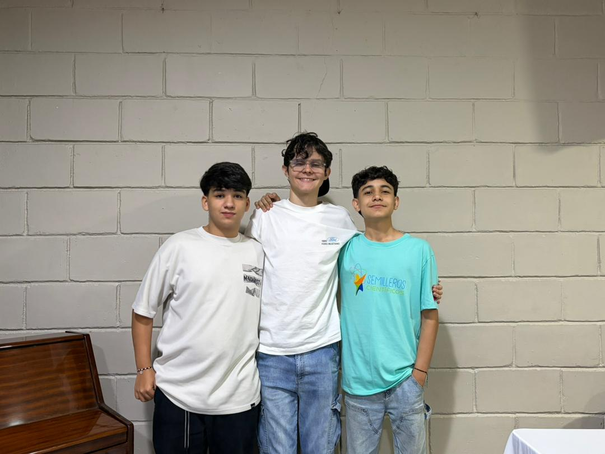
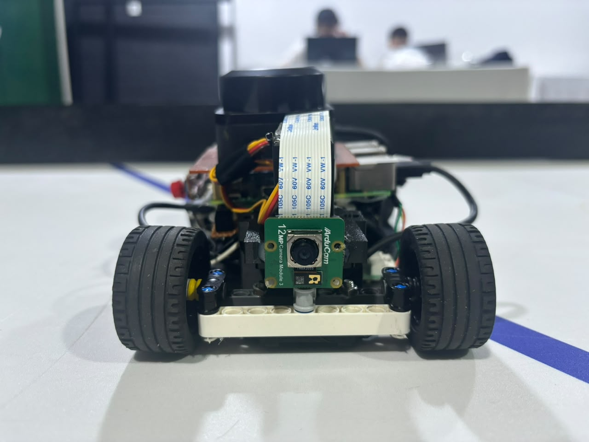
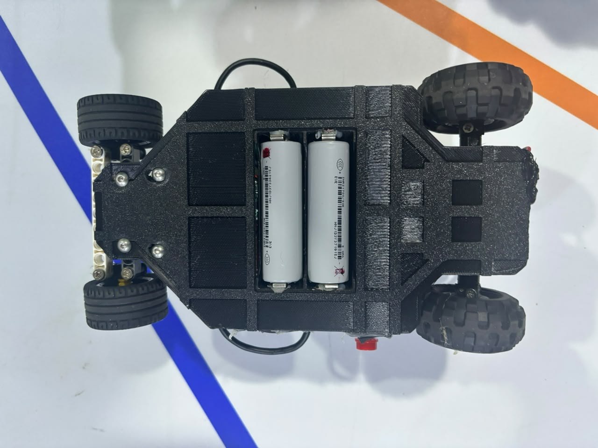
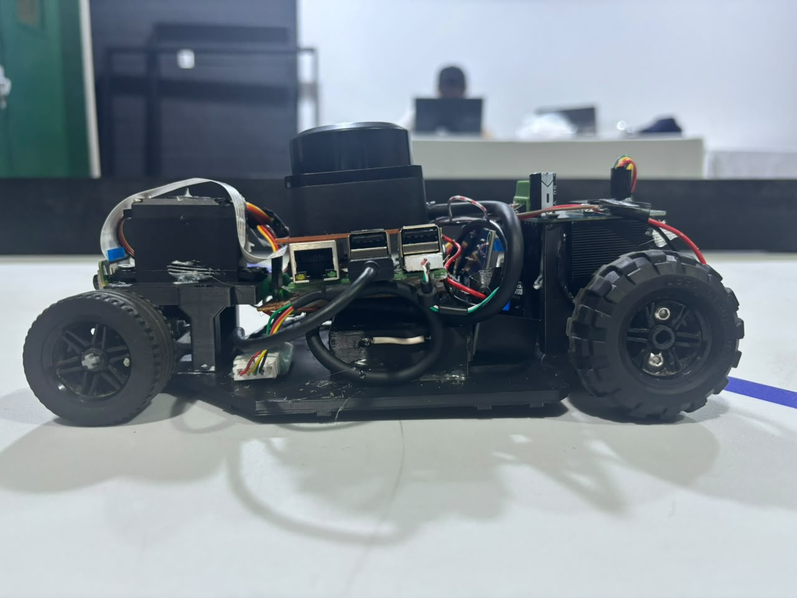
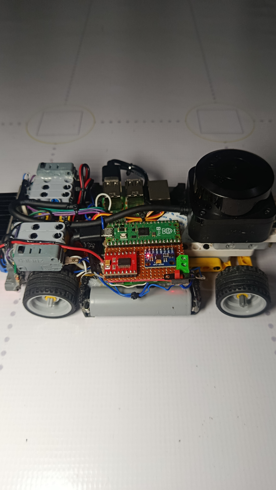

 # Proyecto Future Engineers - Team Los Cedros (WRO 2026)

Bienvenidos al repositorio oficial del Team Los Cedros, integrado por 3 estudiantes del Colegio Los Cedros en Valera, Estado Trujillo, Venezuela. Aquí compartimos el código fuente, los diagramas eléctricos y la documentación técnica de nuestro vehículo autónomo para la World Robot Olympiad (WRO) 2026, en la categoría Future Engineers.

Este proyecto es el resultado de muchas horas de diseño, pruebas en pista y sobre todo, pasión por la robótica. Para la competencia de este año, desarrollamos un vehículo basado en una arquitectura de procesamiento dual: un "Cerebro" encargado del procesamiento del entorno mediante fusión de sensores y visión artificial (Raspberry Pi 3B), y un "Actuador" (Raspberry Pi Pico 2) dedicado al control de movimiento de baja latencia y estabilidad de variables críticas en tiempo real.

---

## Integrantes del Equipo y Roles

El Team Los Cedros está conformado por tres estudiantes:

### Foto Oficial del Equipo
<p align="center">
  
</p>

---

* **CARLOS DAVID DIAZ RIVAS** — PROGRAMADOR PRRINCIPAL0.
* **DANIEL DAVID DIAZ RIVAS** — ENCARGADO DEL HARDWARE.
* **Carlos Alejandro Pinto Abreu** — INGENIERO MECANICO.


## Arquitectura de Sistema Distribuida

Para cumplir con las demandas dinámicas de la competencia, implementamos una arquitectura distribuida de dos capas. Esta topología desacopla el procesamiento perceptivo de alto nivel de las tareas de control síncrono en tiempo real, optimizando el ancho de banda y eliminando cuellos de botella informáticos.

1. **Raspberry Pi 3B (Capa Corporativa/Estratégica):** Unidad central de análisis y percepción visual. Se conecta al sensor RPLIDAR C1 mediante una comunicación serial binaria cruda (UART a USB a 460,800 bps) para capturar nubes de puntos y a una cámara Arducam de 12MP (a través de la interfaz CSI flex nativa) para procesar el flujo de video en tiempo real. La Pi 3B procesa el flujo en memoria mediante filtros de mediana móvil y segmenta la pista en tres vectores espaciales críticos (Frontal, Izquierda y Derecha), además de clasificar los elementos visuales del circuito. Esto reduce drásticamente el ruido informático y alivia la latencia del canal al transferir solo datos geométricos sintetizados al actuador.

2. **Raspberry Pi Pico 2 (Capa Ejecutora de Tiempo Real):** Unidad de control síncrono basada en microcontrolador. Al estar libre del procesamiento pesado del Lidar y la cámara, la Pico 2 ejecuta un bucle de control de alta frecuencia que procesa de forma no bloqueante la telemetría inercial de la IMU (extrayendo el ángulo Yaw integrado en tiempo real) y recibe las directrices de proximidad espacial calculadas por la Pi 3B. Controla directamente las señales PWM del servo de dirección MG996R y la etapa de potencia de alta corriente BTS7960 para el motor de tracción trasera.

---

## Lógica de Control y Algoritmo de Navegación

### 1. Funcionamiento del Código de la Raspberry Pi 3B
Este script se divide en dos procesos que corren al mismo tiempo gracias al uso de Hilos (threading):

#### A. El Hilo del Lidar (leer_lidar)
El Lidar gira sobre su propio eje y envía ráfagas de puntos (ángulo y distancia) a una velocidad altísima (460,800 baudios). Si procesáramos punto por punto, el coche se volvería loco por el ruido o el retraso (jitter).

* **Zonificación:** El código toma cada punto recibido y, según su ángulo, lo mete en un contenedor o buffer específico (frente, izq_frontal, izq_lateral, izq_trasera).
* **Suavizado:** Cuando un contenedor junta más de 5 lecturas, calcula el promedio de la distancia y actualiza el diccionario global telemetria. Esto limpia la señal y le da al robot una percepción estable del entorno.

#### B. El Bucle Principal (Algoritmo de Control)
Este bucle corre de forma perpetua cada 20 milisegundos (50 veces por segundo) y ejecuta la lógica matemática:

* **Evaluación de Seguridad (Frente):** Revisa el sensor frontal. Si el espacio libre al frente es menor a 350 mm o la esquina delantera-izquierda se acerca a menos de 200 mm de una pared, la velocidad se clava en 0 para evitar una colisión destructiva. Si la pista está despejada, acelera a MAX_VEL (95%).
* **Cálculo del Error:** Compara la distancia real medida a la izquierda (izq_lat) contra la distancia que tú quieres mantener (DISTANCIA_OBJETIVO).
```text
Error = Distancia Real - Distancia Objetivo
```
* **Control Proporcional (P):** Multiplica ese error por KP.
  * Si el robot se aleja del centro (Distancia Real > Objetivo), el error es positivo. Al multiplicarlo por -1, da un ángulo negativo que hace que el coche gire a la izquierda para acercarse.
  * Si se pega demasiado (Distancia Real < Objetivo), el error es negativo. Al multiplicarlo por -1, da un ángulo positivo que hace que el coche gire a la derecha para alejarse.
* **Protección de Cola:** Si la diagonal trasera izquierda (izq_trasera) detecta que la parte de atrás del coche se está pegando demasiado al cuadro, artificialmente altera el error restándole 80 unidades. Esto obliga al coche a abrirse inmediatamente a la derecha para no golpear la esquina interna con la rueda trasera.
* **Envío Serial:** Empaqueta los valores calculados en una cadena simple de texto (ejemplo: "-15,95\n") y la manda por el puerto serial /dev/ttyACM0.

### 2. Funcionamiento del Código de la Raspberry Pico 2
La Pico 2 corre MicroPython y utiliza un bucle de lectura de bajísima latencia basado en select.select:

* **Lectura Serial no Bloqueante:** En lugar de quedarse congelada esperando datos, la Pico revisa la entrada serial (sys.stdin). Si hay datos frescos de la Pi 3B, los lee; si no, continúa su ciclo de inmediato para mantener los motores activos.
* **Mapeo del Servo (mapear_servo):** El servo de dirección se controla mediante modulación por ancho de pulsos (PWM) a 50Hz. La Pico recibe un ángulo de -35 a 35. Mediante la ecuación:
```text
Duty = 4950 + (10 * 52)
```
  Transforma esos grados en el pulso exacto en microsegundos que el servo necesita para mover las ruedas delanteras.
* **Control del Puente H BTS7960 (controlar_motores):** Este puente H industrial requiere señales de alta frecuencia (20,000Hz para que los motores no silben). El código toma el porcentaje de velocidad (0 a 100), lo escala a una resolución de 16 bits (0 a 65535) y activa el pin RPWM para avanzar. Si en algún momento la velocidad calculada es 0, el firmware pone en estado lógico bajo (LOW) tanto los pines de control (RPWM, LPWM) como los de habilitación (R_EN, L_EN), aplicando un frenado electrónico dinámico e inmediato sobre el motor.

---

## Red de Distribución de Energía (Power Delivery) y Robustez Eléctrica

En un prototipo robótico de alta competencia, la estabilidad eléctrica es tan crítica como la optimización del código. El uso del puente H BTS7960 permite manejar grandes corrientes para el motor de tracción trasera, pero sus picos de arranque pueden provocar caídas severas de tensión (brownouts) capaces de reiniciar la Raspberry Pi 3B si las líneas lógicas y de potencia no estuvieran correctamente aisladas.

Para blindar el sistema contra estas fluctuaciones, diseñamos una arquitectura de alimentación desacoplada basada en los siguientes pilares técnicos:

### 1. Matriz de Distribución y Capacidad de Corriente
Cada línea de voltaje fue calculada en función de su tensión y del amperaje máximo soportado para asegurar un funcionamiento holgado de los componentes:

| Fuente / Regulador | V. Entrada | V. Salida | Corriente Máx. | Destino Principal y Justificación Técnico |
| :--- | :--- | :--- | :--- | :--- |
| Baterías 21700 (2S) | N/A | 7.4V - 8.4V | 30A (Descarga) | Línea directa a los pines de potencia `B+` y `B-` del Puente H BTS7960. Maneja los picos exigidos por la tracción sin degradar la electrónica lógica. |
| Regulador XL1509 | 7.4V - 8.4V | 6.0V | 2.0A | `VCC` de potencia del Servo MG996R. Evita que el torque dinámico máximo afecte la electrónica de control. |
| Regulador XL4015 | 7.4V - 8.4V | 5.1V | 5.0A | Entrada de alimentación microUSB/GPIO de la Raspberry Pi 3B, la cámara Arducam y el sensor RPLIDAR C1. Entrega corriente limpia y constante bajo alta carga de procesamiento. |
| Pin 3V3_OUT (Pico 2) | 5.0V (Int.) | 3.3V | 300mA | `VCC` de la IMU MPU6050 y alimentación lógica (`VCC`) de las entradas del BTS7960, aislándolo por completo del ruido eléctrico de los motores. |

### 2. Referencia y Masa Unificada (Anti-Ruido)
* **Tierra Común (GND Común):** Para evitar errores de lectura y asegurar la correcta interpretación de las señales lógicas y PWM entre ambos controladores y los drivers de potencia, todos los puntos de referencia de tierra (GND) del vehículo confluyen en una topología de nodo central en estrella. Esto previene eficazmente los bucles de tierra (ground loops) y estabiliza la comunicación serial.

### 3. Sistema de Seguridad y Protecciones por Hardware
* **Aislamiento de Líneas de Potencia:** El circuito de alta potencia (destinado al consumo del servomotor y el motor de tracción a través del BTS7960) se encuentra físicamente separado del plano de alimentación lógico (Raspberry Pi 3B y Pico 2). De este modo, si un motor experimenta una alta carga de trabajo en pista, el drenaje excesivo de corriente se gestiona directamente desde la batería a través de los reguladores dedicados, impidiendo que afecte o interrumpa el procesamiento del "Cerebro Estratégico".

---

## Mapa de Conexiones (Pinout)

### Conexiones de la Raspberry Pi Pico 2
*Nota de optimización de hardware: El puente H BTS7960 requiere pines independientes de habilitación (EN) y control de sentido/velocidad por PWM para el lado izquierdo (L_PWM/L_EN) y derecho (R_PWM/R_EN). La interfaz I2C destinada a la IMU se mantiene físicamente aislada en los pines GP16 y GP17 para mitigar el ruido electromagnético.*

| Componente | Pin Físico (Pico 2) | ID del Pin | Tipo de Señal | Función |
| :--- | :--- | :--- | :--- | :--- |
| Servo MG996R | Pin 25 | `GP19` | Salida PWM | Control de ángulo de dirección (Giro) |
| Driver BTS7960 (R_PWM) | Pin 34 | `GP28` | Salida PWM | Control de velocidad hacia adelante (Forward) |
| Driver BTS7960 (L_PWM) | Pin 32 | `GP27` | Salida PWM | Control de velocidad en reversa (Backward) |
| Driver BTS7960 (R_EN) | Pin 31 | `GP26` | Salida Digital | Habilitación de rama derecha (Activa con High) |
| Driver BTS7960 (L_EN) | Pin 29 | `GP22` | Salida Digital | Habilitación de rama izquierda (Activa con High) |
| MPU6050 (SDA) | Pin 21 | `GP16` | I2C0 SDA (Pull-Up) | Bus de Datos de la IMU |
| MPU6050 (SCL) | Pin 22 | `GP17` | I2C0 SCL (Pull-Up) | Bus de Reloj de la IMU |

### Conexiones de la Raspberry Pi 3B (El Estratega)
* **Cámara Arducam 12MP:** Conectada a la interfaz nativa CSI de la placa mediante un cable plano flex de 15 pines para transmisión de video de alta velocidad.
* **RPLIDAR C1:** Conectado a un puerto USB de la Raspberry Pi 3B capaz de proveer la corriente de arranque del motor de escaneo y sostener la transferencia binaria a 460,800 baudios.
* **Raspberry Pi Pico 2:** Interconectada mediante la interfaz USB nativa de la Pico hacia un puerto USB de la Pi 3B. Actúa como canal UART bidireccional estable operando en modo VCP (Virtual COM Port) a 115,200 bps.
* **Pulsador (Botón Start):** Conectado al pin `GPIO17` (Pin físico 11) configurado con una resistencia Pull-Down externa de 10kOhm hacia tierra para disparar la rutina autónoma en pista.

---

## Registro Fotográfico Reglamentario (v-photos)

En cumplimiento con las normas oficiales de inspección técnica de la World Robot Olympiad, se presentan los 6 ángulos visuales obligatorios del vehículo autónomo perfectamente alineados:

| Vista Frontal | Vista Trasera |
| :---: | :---: |
|  |  |
| **Vista Superior** | **Vista Inferior (Chasis)** |
|  |  |
| **Vista Lateral Izquierda** | **Vista Lateral Derecha** |
|  |  |

---

## Anatomía del Repositorio

Cumpliendo rigurosamente las regulaciones internacionales de la WRO, organizamos la estructura de archivos de forma modular, limpia y totalmente auditable:

```text
├── src/                      # Código fuente de la arquitectura distribuida
│   ├── pico/                 # Firmware embebido en MicroPython (Raspberry Pi Pico 2)
│   │   ├── main.py           # Bucle principal de control e interrupciones en tiempo real
│   │   ├── motores.py        # Abstracción PWM y habilitaciones para servo e inversión con BTS7960
│   │   ├── test_motores.py   # Script crudo de calibración de ángulos del actuador servo
│   │   ├── imu.py            # Inicialización de registros I2C0 e integración del ángulo Yaw (Z)
│   │   └── serial_receiver.py# Parser serial no bloqueante para adquisición de zonas del Lidar
│   └── pi3b/                 # Scripts en Python 3 de alto nivel (Raspberry Pi 3B)
│       ├── main_control.py   # Orquestador central de navegación, procesamiento visual de la Arducam y estrategia
│       ├── lidar_handler.py  # Driver de adquisición binaria directa y filtrado de mediana para RPLIDAR C1
│       └── serial_sender.py  # Módulo emisor de telemetría espacial compactada hacia la Pico 2
├── 3d-Models/                # Modelos de piezas mecánicas en formato STL/PNG y su sub-manual
│   ├── README.md             # Manual técnico exclusivo y documentación visual de piezas en 3D
│   ├── Chasis.stl            # Modelado de la estructura central
│   ├── Chasis.png            # Renderizado del chasis
│   └── [Resto de archivos mecánicos .stl y .png...]
├── t-photos/                 # Registro fotográfico oficial de las jornadas de desarrollo del equipo
│   └── Photo_Team.jpeg       # Foto oficial de los integrantes
├── v-photos/                 # Las 6 capturas reglamentarias obligatorias del coche desde los ángulos rectores
├── video/                    # Contiene el archivo video.md con el hipervínculo a la mejor vuelta en pista
├── schemes/                  # Planos esquemáticos, diagramas de flujo y mapas eléctricos
└── README.md                 # Documentación técnica principal (este archivo)

```
