# Proyecto Future Engineers - Team Los Cedros (WRO 2026)

Bienvenidos al repositorio oficial del **Team Los Cedros**, integrado por estudiantes del Colegio Los Cedros en Valera, Estado Trujillo, Venezuela. Aquí compartimos la documentación técnica, diseños de hardware, esquemas eléctricos y el software modular de nuestro vehículo autónomo para la World Robot Olympiad (WRO) 2026.

<p align="center">
  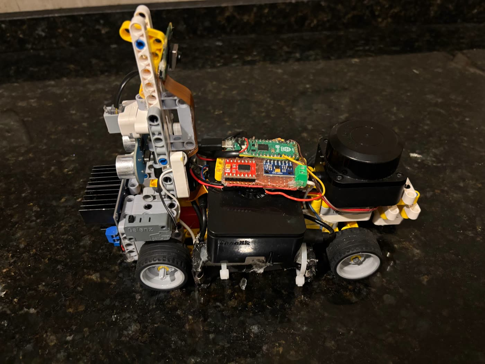
</p>

---

## El robot en una página

Un coche autónomo de **242 x 138 mm y 720 g** sobre chasis LEGO Technic, con dirección Ackermann. Lo gobiernan **dos cerebros**: una Raspberry Pi 5 que decide (visión, LiDAR y máquina de estados) y una Pico 2 que ejecuta con puntualidad garantizada (PWM, giroscopio y un watchdog que frena solo si la Pi calla). Ve el mundo con un **RPLiDAR C1** a 360°, una **Pi Camera Module 3** y cuatro sensores embarcados.

| Prueba | Estado | Evidencia |
| :--- | :--- | :--- |
| **Ronda Abierta** | Completa y grabada | [Ver el vídeo](https://youtu.be/zwYa40_EVPY) (06-09-2026) |
| **Ronda de Obstáculos** | El vehículo ejecuta la secuencia entera —sale del estacionamiento, esquiva los pilares por el lado que marca su color y vuelve al cuadrante de salida—, pero **la corrida limpia de tres vueltas sigue pendiente**. Las dos causas que lo impiden están identificadas y medidas. | [Las cinco corridas, una por una](video/video.md#ronda-cerrada) |

> Ese "pendiente" está escrito a propósito. Todo lo que este repositorio afirma se puede comprobar: cada corrida deja un CSV por barrido de LiDAR, y el marcador que usamos no es el registro interno del robot sino un verificador independiente que solo cuenta un pilar como superado cuando el eje trasero cruza su posición con separación positiva del lado obligatorio. Cuando el vídeo y el registro se contradicen, mandamos el vídeo.

## Dónde mirar

| Si busca... | Está en |
| :--- | :--- |
| **Movilidad y diseño mecánico** | [Sección 7 — Geometría de dirección](#7-geometría-de-dirección-y-movilidad-mecánica) — cinemática Ackermann, límites de giro calibrados en pista y el cálculo de torque con su margen. [Secciones 3.2 y 3.3](#32-registro-fotográfico-de-la-evolución-e-iteración-geométrica-matriz-v1--v2--v3) — evolución V1→V3 y las seis vistas reglamentarias. CAD reproducible pieza a pieza en [`models/`](models/). |
| **Arquitectura de potencia y sensores** | [Sección 4 completa](#4-arquitectura-eléctrica-y-distribución-de-señales) — empieza por el [diagrama de bloques de señales](schemes/Diagrama_Bloques_Senales.svg). Alimentación desacoplada en tres etapas, pinout calibrado pin a pin y **consumo real medido con multímetro**, no estimado por hoja de datos. |
| **Arquitectura de software y estrategia de obstáculos** | [Sección 5 — Percepción y alto nivel](#5-capa-de-percepción-y-alto-nivel-raspberry-pi-5) — máquina de estados de carrera, evasión y estacionamiento. [Sección 5.3](#53-estrategia-de-navegación-justificada-por-rondas-geometría-del-campo) — la estrategia por rondas, deducida de la geometría del campo. [Sección 6](#6-capa-de-control-de-bajo-nivel-raspberry-pi-pico-2) — el firmware de tiempo real. |
| **Pensamiento sistémico y decisiones de ingeniería** | [Sección 3.4 — Trade-offs](#34-justificación-de-ingeniería-para-la-selección-de-componentes-y-arquitectura-de-sistemas-trade-offs) — por qué cada componente y qué se descartó. [Sección 8](#8-análisis-de-riesgos-y-registro-de-iteraciones) — interacción entre subsistemas y **cuatro casos de estudio con datos de pista**. [Sección 9](#9-estado-actual-y-trabajo-pendiente) — lo que falta, y lo que se descartó midiendo. |
| **Reproducibilidad** | Tres documentos encadenados: [`BOM.md`](BOM.md) qué comprar → [`ENSAMBLAJE.md`](ENSAMBLAJE.md) cómo montarlo, con la comprobación que cierra cada etapa → [`INSTALACION.md`](INSTALACION.md) cómo dejar las dos placas en este mismo estado. Y [`CHANGELOG.md`](CHANGELOG.md), con los hashes de commit de cada hito. |
| **El código que corre hoy** | [`src/pi5/ronda_curvas/`](src/pi5/ronda_curvas/) en la Raspberry Pi 5 y [`src/pico/`](src/pico/) en la Pico 2. Lo archivado está separado a propósito en `legacy/`. |

---

### Índice

1. [Introducción y Equipo](#1-introducción-y-equipo)
2. [Anatomía del Repositorio](#2-anatomía-del-repositorio)
3. [Diseño Evolutivo y Ciclos de Iteración](#3-diseño-evolutivo-y-ciclos-de-iteración)
4. [Arquitectura Eléctrica y Distribución de Señales](#4-arquitectura-eléctrica-y-distribución-de-señales)
5. [Capa de Percepción y Alto Nivel (Raspberry Pi 5)](#5-capa-de-percepción-y-alto-nivel-raspberry-pi-5)
6. [Capa de Control de Bajo Nivel (Raspberry Pi Pico 2)](#6-capa-de-control-de-bajo-nivel-raspberry-pi-pico-2)
7. [Geometría de Dirección y Movilidad Mecánica](#7-geometría-de-dirección-y-movilidad-mecánica)
8. [Análisis de Riesgos y Registro de Iteraciones](#8-análisis-de-riesgos-y-registro-de-iteraciones)
9. [Estado Actual y Trabajo Pendiente](#9-estado-actual-y-trabajo-pendiente)

**Documentos que acompañan a este README:** [`BOM.md`](BOM.md) · [`ENSAMBLAJE.md`](ENSAMBLAJE.md) · [`INSTALACION.md`](INSTALACION.md) · [`CHANGELOG.md`](CHANGELOG.md) · [`video/video.md`](video/video.md)

---

## 0. Estado Actual del Hardware (última revisión: 06-09-2026)

El robot cambió en cinco puntos respecto a la primera versión documentada en este README. Cada cambio se detalla en su sección; esta tabla existe para que no haya que reconstruirlo leyendo el documento entero.

| Qué cambió | Antes | Ahora | Dónde se detalla |
| :--- | :--- | :--- | :--- |
| **Cerebro de alto nivel** | Raspberry Pi 3B | **Raspberry Pi 5** (migrado el 03-09-2026) | 4.2 y 5 |
| **Soporte del LiDAR** | Sin mástil documentado | **Mástil** con el plano de barrido a 69 mm del piso; se enmascara el sector 140-213° que él mismo ocupa | 4.2 |
| **Medida trasera** | Ninguna | **Ultrasonido HC-SR04** en `GP14`/`GP15`, único sensor que ve hacia atrás | 4.2 y 4.3 |
| **Sensor de color de piso** | TCS3472 bajo el chasis | **Sigue montado, y se mudó al frente.** Se desconectó durante la migración a la Pi 5, se volvió a conectar, y en el montaje actual va por delante del eje delantero en vez de bajo el chasis. Hoy es una de las tres evidencias del sentido, junto a la cámara y la asimetría de paredes | 4.2 y 5.3-C |
| **Arranque** | Dos botones (uno por ronda) | **Un solo botón en `GPIO 21`** | 4.2 y 4.3 |

---

### Montaje actual (V4)

El vehículo se reconstruyó sobre el mismo chasis para la fase final. Dos cambios de colocación, y los dos por el mismo motivo: **adelantar la percepción**.

* **La cámara subió a un mástil trasero**, desde donde mira hacia adelante por encima de todo el vehículo, y el LiDAR bajó al chasis por delante. Antes era al revés: el LiDAR arriba y la cámara abajo. El mástil lleva también el ultrasonido, apuntando hacia atrás.
* **El sensor de color se adelantó**, por delante del eje delantero en vez de bajo el chasis. Leer la línea antes de pisarla da margen de reacción; leerla debajo solo avisa de que ya se cruzó.

| Frontal | Trasera |
| :---: | :---: |
| 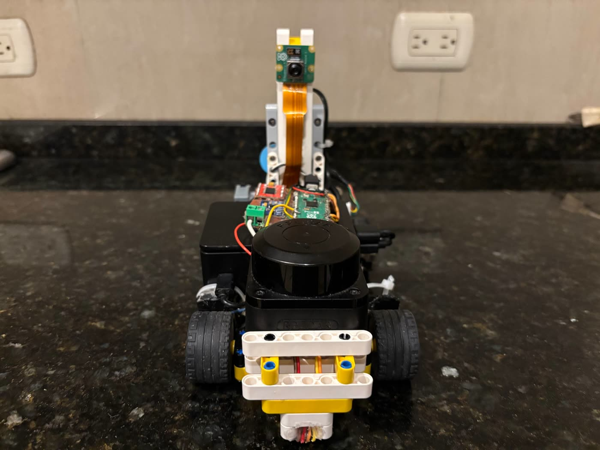 | 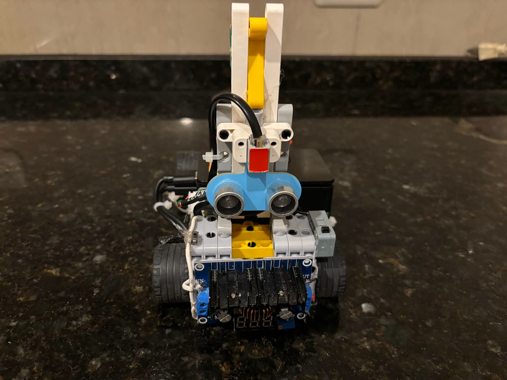 |

| Superior | Inferior |
| :---: | :---: |
| 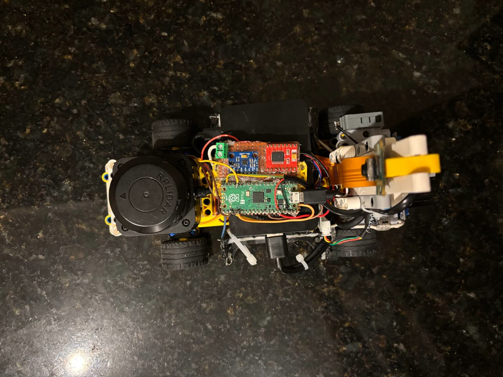 | 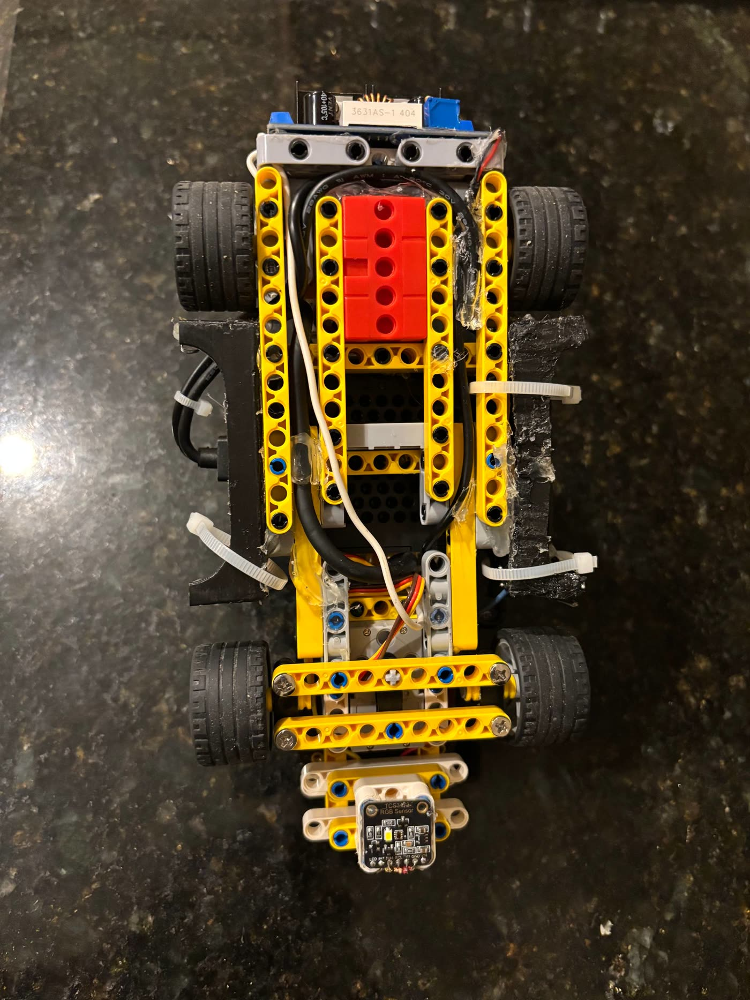 |

| Perfil izquierdo | Perfil derecho |
| :---: | :---: |
|  | 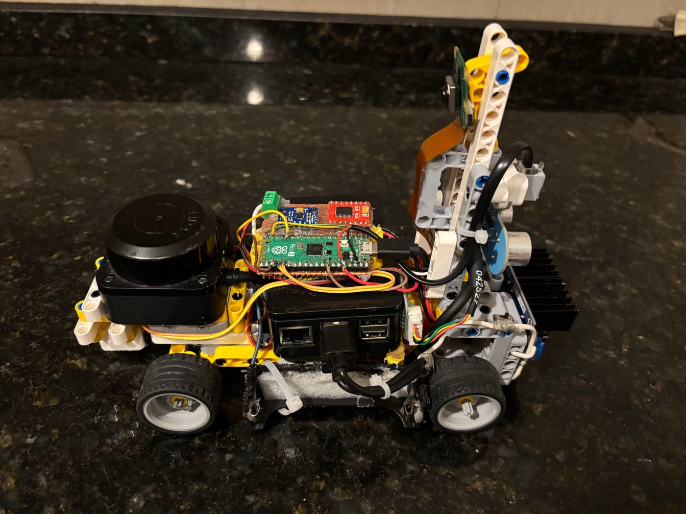 |

En la vista inferior se ve el **TCS3472 montado sobre vigas Technic por delante del eje delantero**, fuera del contorno del chasis. Esa es la colocación que le da anticipación sobre la línea.

> Las medidas de la sección 7.5 —dimensiones del chasis y radios de giro trazados con marcadores— **corresponden a este montaje**.

---

## 1. Introducción y Equipo

### 1.1 Foto del Equipo
<p align="center">
  
</p>

### 1.2 Integrantes y Roles
| Integrante | Rol / Especialidad | Contribución Principal |
| :--- | :--- | :--- |
| **Daniel David Díaz Rivas** | Líder de Proyecto / Hardware | Diseño de chasis y distribución electrónica. |
| **Carlos David Díaz Rivas** | Desarrollador de Software | Programación de la lógica de alto nivel en Raspberry Pi (3B primero, Pi 5 desde el 03-09-2026). |
| **Carlos Santiago Pinto Abreu** | Especialista en Control | Firmware y calibración inercial en Raspberry Pi Pico 2. |

---

## 2. Anatomía del Repositorio

Estructura modular y limpia del proyecto conforme a las regulaciones oficiales de la WRO:

```

├── src/                          # Código fuente de la arquitectura distribuida
│   ├── pico/                     # Firmware embebido (MicroPython - Raspberry Pi Pico 2)
│   │   ├── main.py               # Bucle principal de control en tiempo real y actuadores
│   │   ├── protocolo_seguro.py   # Valida consignas y modela el watchdog de 500 ms
│   │   └── Mpu6050.py            # Driver I2C standalone para el sensor inercial MPU6050
│   ├── pi5/                      # Scripts de alto nivel (Python 3 - Raspberry Pi 5) -- CODIGO VIVO
│   │   ├── deploy.sh             # Despliegue atomico "create only": nunca mezcla sobre una instalacion previa
│   │   ├── MEDICIONES_20260906.md # Medidas de banco del chasis, la bahia y la velocidad
│   │   ├── comun/                # Driver del LiDAR compartido por los tres cerebros
│   │   ├── legacy/               # Implementaciones históricas de Pi 5 (no activas)
│   │   │   ├── ronda_nueva/      # Cerebro modular archivado, con configuración y pruebas
│   │   │   └── ronda_cerrada/    # Cerebro previo archivado
│   │   ├── ronda_abierta/        # Open Challenge en un solo archivo auditable
│   │   └── herramientas/         # 15 diagnosticos de banco (ver seccion 2.2)
│   └── pi3B/                     # Scripts de la Raspberry Pi 3B -- ARCHIVADO (ver seccion 4.2)
│       ├── controlador_inicio.py # Orquestador central (Ejecutado como servicio del sistema OS)
│       ├── deploy.sh             # Copia los .py de carrera planos a /home/pi/
│       ├── comun/                # Drivers compartidos por ambas rondas
│       │   ├── lidar_driver.py   # Driver: protocolo binario RPLIDAR C1
│       │   ├── lidar_geometria.py # Procesador: paredes y clustering ABD
│       │   ├── enlace_pico.py    # Canal serial con la Pico 2 (consignas + telemetria IMU)
│       │   └── registro_metricas.py # Logger CSV de telemetria por ciclo (error lateral, angulo, heading)
│       ├── ronda_abierta/
│       │   └── ronda_abierta.py  # Reutiliza comun/: centrado proporcional + parqueo
│       ├── ronda_cerrada/        # FSM de navegación/evasión de la Ronda Cerrada
│       │   ├── ronda_cerrada.py  # Punto de entrada (importa comun/ + los 4 siguientes)
│       │   ├── navegacion.py     # Cerebro: máquina de estados de carrera/evasión/parqueo
│       │   ├── camara_driver.py  # Driver: adquisición de frames (Picamera2)
│       │   ├── vision.py         # Procesador: detección HSV de postes rojo/verde
│       │   ├── tracker.py        # Object persistence tracker del obstáculo activo
│       │   └── legacy/           # Versiones superadas (archivadas, no desplegar)
│       ├── prueba/               # Borradores nunca desplegados (distinto de legacy/, ver su README)
│       ├── requirements.txt      # Dependencias Python del entorno de la Pi 3B
│       └── wro_start.service     # Unidad systemd real para el arranque autónomo
├── models/                    # Modelos mecánicos: STL del chasis V1 (archivado) y CAD LEGO del V2
│   ├── Chasis-LEGO-V2/           # Archivo .io (BrickLink Studio), render y listado de piezas del chasis actual
│   └── V1/                       # STL, catálogo y guía de ensamblaje del chasis impreso archivado
├── t-photos/                     # Fotos de las jornadas de desarrollo del equipo
├── v-photos/                     # Las 6 capturas reglamentarias, fotos V1 vs V2 y componentes
│   ├── Componentes/               # Foto individual de cada componente electrónico usado
│   └── Ackermann/                 # Evidencia fotográfica de los límites de giro calibrados
├── video/                        # Enlace oficial del video de pista y borradores de prueba
├── schemes/                      # Diagrama de cableado y fotos de la placa perforada
├── README.md                      # Documentación técnica principal (este archivo)
├── BOM.md                         # Lista de materiales: qué comprar y para qué sirve cada pieza
├── ENSAMBLAJE.md                  # Manual de montaje físico, etapa a etapa y con su verificación
├── INSTALACION.md                 # Manual paso a paso para reproducir el entorno desde cero
└── CHANGELOG.md                   # Notas de versión por hito, referenciadas a commits reales

```

> **Nota de Software de Inicio:** `controlador_inicio.py` fue el orquestador maestro de la Raspberry Pi 3B, arrancado por `systemd`. En la Pi 5 el cerebro se lanza directamente (`python3 -m ronda_nueva.ronda_nueva`) y espera el botón de `GPIO 21`; las unidades `wro_start.service` y `wro_robot.service` están copiadas pero **deshabilitadas**, igual que en la 3B.

> **Reproducibilidad.** Reconstruir este vehículo desde cero son tres documentos encadenados: [`BOM.md`](BOM.md) dice qué comprar y por qué se eligió cada pieza, [`ENSAMBLAJE.md`](ENSAMBLAJE.md) cómo montarlo etapa por etapa con la comprobación que cierra cada una, e [`INSTALACION.md`](INSTALACION.md) cómo dejar la Raspberry Pi 5 y la Pico 2 en este mismo estado de software.

### 2.1 Historial de Versiones y Control de Cambios

El repositorio mantiene un historial de commits granular (70+ confirmaciones) que documenta el proceso real de ingeniería, no solo el resultado final. Los hitos principales, en orden cronológico:

| Etapa | Commits representativos | Qué cambió |
| :--- | :--- | :--- |
| **Estructura inicial** | `chore: crear estructura de carpetas oficiales para WRO 2026`, `docs: inicializar README.md` | Se define el esqueleto reglamentario del repositorio (`src/`, `v-photos/`, `schemes/`, etc.). |
| **Firmware base Pico 2** | `feat(pico2): script nativo en MicroPython`, `feat(control): implementar máquina de estados base`, `feat(pico): implementar parser serial no bloqueante` | Primera versión funcional del control de bajo nivel y protocolo serial Pi↔Pico. |
| **Integración de sensores** | `feat(pi5): implementar procesamiento crudo de bytes para rplidar`, `feat(pico): corregir mapeo de pines I2C de la IMU` | Se resuelven conflictos de canales PWM y se estabiliza la lectura del LiDAR y del giroscopio. |
| **Migración de chasis V1 → V2** | `Estructura base y hardware V2 en LEGO`, `justificar ventajas cinemáticas del chasis LEGO de 613g frente a impresión 3D` | Rediseño completo de la plataforma mecánica (ver sección 3). |
| **Corrección de calibración de dirección** | `Arreglo de angulo central del robot de 90 a 180 grados` → `Arreglo en equivocacion de angulo central` | Se probó un centro de servo a 180° y se revirtió a **90°** tras validar en pista que generaba error de alineación (ver sección 6 y 7.3 — el README refleja el valor vigente). |
| **Ronda Cerrada (en curso)** | `Añadimos codigos de Calibracion HSV para la ronda cerrada`, rama `dev-close_round` | Desarrollo activo del algoritmo de evasión de obstáculos con herramienta de calibración HSV dedicada. |

> **Nota de reproducibilidad:** Se puede auditar la evolución exacta de cualquier archivo con `git log --follow -p -- <archivo>`, por ejemplo `git log --follow -p -- src/pico/main.py` muestra el cambio de calibración del ángulo central documentado arriba.

> **Notas de lanzamiento:** El detalle de cada hito (con los hashes de commit exactos que lo componen) está en [`CHANGELOG.md`](CHANGELOG.md). Los hitos principales también están marcados como tags de git (`git tag`, o [ver Releases en GitHub](https://github.com/Team-Los-Cedros/WRO-FE-26/tags)).

---

## 3. Diseño Evolutivo y Ciclos de Iteración

El desarrollo de nuestro vehículo autónomo no fue un proceso lineal. Para alcanzar la estabilidad actual, el prototipo pasó por una transición crítica basada en datos experimentales de rendimiento y fallos mecánicos en pista

### 3.1 Cuadro Comparativo Avanzado de Evolución e Iteración Técnica

Para alcanzar la estabilidad operativa actual, el prototipo pasó por una transición crítica basada en datos experimentales de rendimiento dinámico, telemetría inercial y análisis de fallos mecánicos destructivos en pista:

> **El prototipo actual es la V3.** Esta tabla documenta el salto **V1 → V2**, que fue *mecánico*: chasis, masa, tracción y topología de potencia. El salto **V2 → V3** fue *electrónico* y no cambió el chasis, así que se documenta aparte en la [sección 0](#0-estado-actual-del-hardware-última-revisión-06-09-2026): Raspberry Pi 5, mástil del LiDAR, ultrasonido trasero y botón único de arranque.

| Criterio Técnico | Prototipo Inicial (V1) | Rediseño Mecánico (V2) | Justificación de Ingeniería / Análisis de Fatiga |
| :--- | :--- | :--- | :--- |
| **Arquitectura Estructural** | Monocasco impreso en 3D (PLA / Filamento) | Chasis Híbrido de Vigas de Fricción LEGO | **Mitigación de Resonancia:** El filamento rígido transmitía las vibraciones mecánicas de alta frecuencia de los motores directo a la cámara, descalibrando el software de visión. El chasis LEGO absorbe el ruido vibracional por flexión elástica y permite reconfiguraciones geométricas inmediatas en boxes. |
| **Masa Inercial Global** | $\approx 800\,\text{g}$ (Diseño robusto impreso) | **613 gramos exactos** (Reducción del $23.37\%$) | **Optimización Dinámica:** Al remover casi una cuarta parte del peso total, se redujo drásticamente la inercia lineal ($I$). El servomotor requiere menor torque para vencer la fricción estática en las curvas de Ackermann, eliminando por completo el subviraje físico. |
| **Sistema de Visión** | Módulo Arducam 3 (Estructura Expuesta) | Raspberry Pi Camera Module 3 Integrada | **Análisis de Riesgos:** El hardware V1 sufrió una falla crítica por impacto directo contra el perímetro. En la V2 se rediseñó el centro de masa retrasando el soporte óptico, protegiendo el sensor y aprovechando los drivers nativos a nivel de kernel de la Pi 3B. |
| **Eficiencia de Tracción** | Llantas rígidas de plástico (Bajo agarre) | Neumáticos de Caucho LEGO ($36\,\text{mm}$ diámetro) | **Transferencia de Potencia:** Las ruedas plásticas patinaban al acelerar bruscamente a PWM máximos, disipando energía por calor. El compuesto de caucho incrementa el coeficiente de fricción ($\mu_e \approx 0.85$), garantizando un grip total sin derrapes laterales. |
| **Topología de Potencia** | Regulador único lineal (Sujeto a picos) | Desacoplamiento por etapas (XL4016 + XL1509) | **Blindaje Electrónico:** La conmutación del motor causaba caídas de tensión lógicas (*brownouts*). Al meter el **XL4016 de $8.0\,\text{A}$** dedicado a la Pi 3B, la etapa de control trabaja fría y con un margen de seguridad del **$73.25\%$**. |

### 3.2 Registro Fotográfico de la Evolución e Iteración Geométrica (Matriz V1 / V2 / V3)

Para evidenciar la transformación del vehículo y el rediseño de los tres ejes espaciales, se presenta el registro fotográfico emparejado de las tres iteraciones. Entre la V2 y la V3 el chasis no cambió: lo que cambió es lo que va montado encima, y por eso las siluetas se parecen mientras la electrónica no:

| Vista | V1 — ≈800 g | V2 — 613 g | **V3 — actual** |
| :---: | :---: | :---: | :---: |
| **Superior** |  |  | 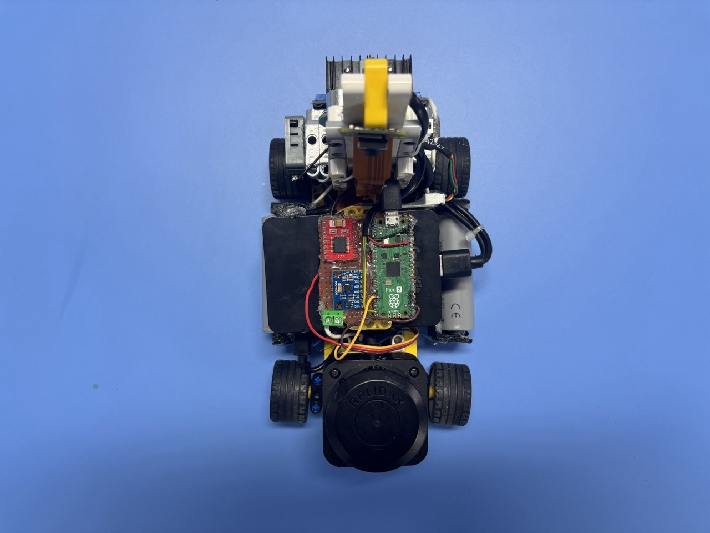 |
| **Frontal** |  |  | 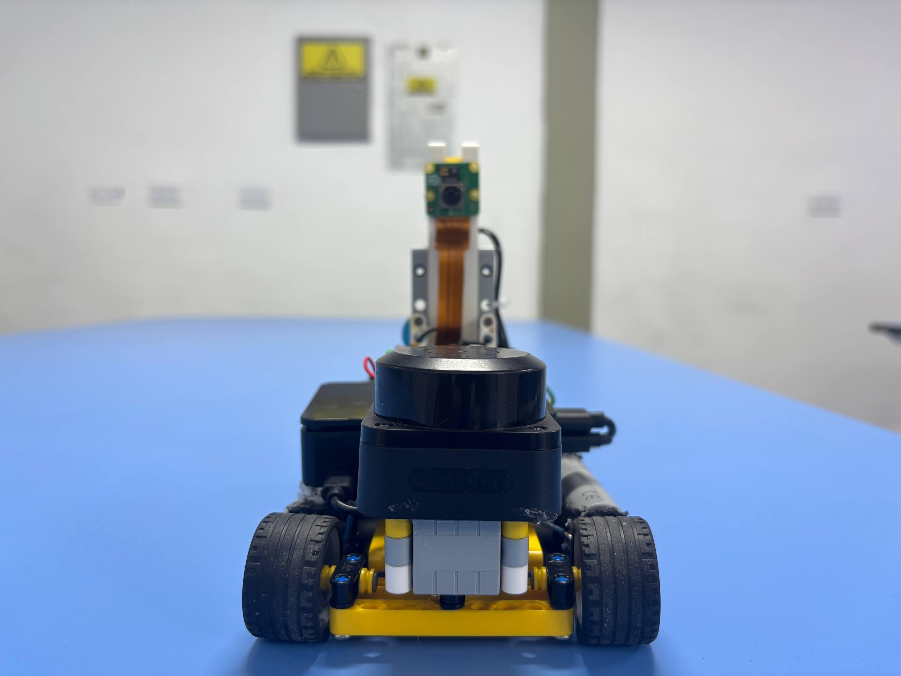 |
| **Trasera** |  |  | 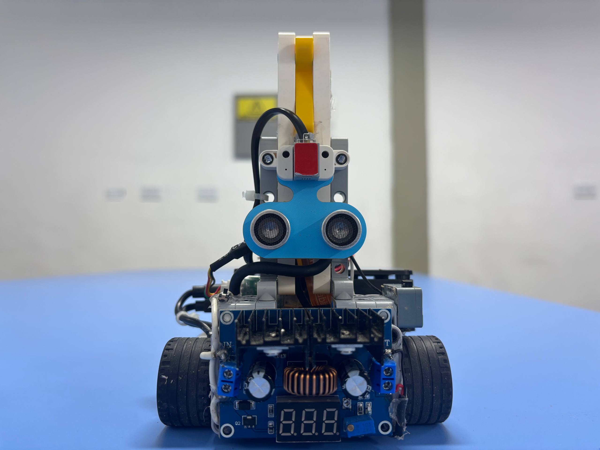 |
| **Inferior** |  |  | 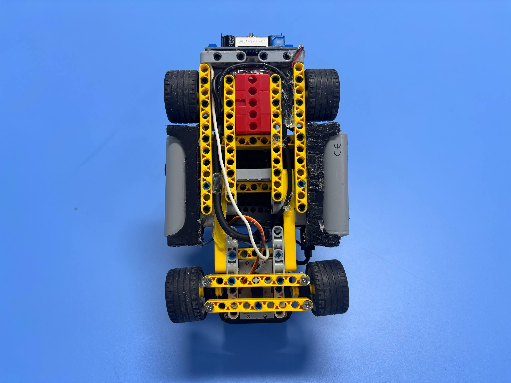 |
| **Lateral Izquierda** |  |  | 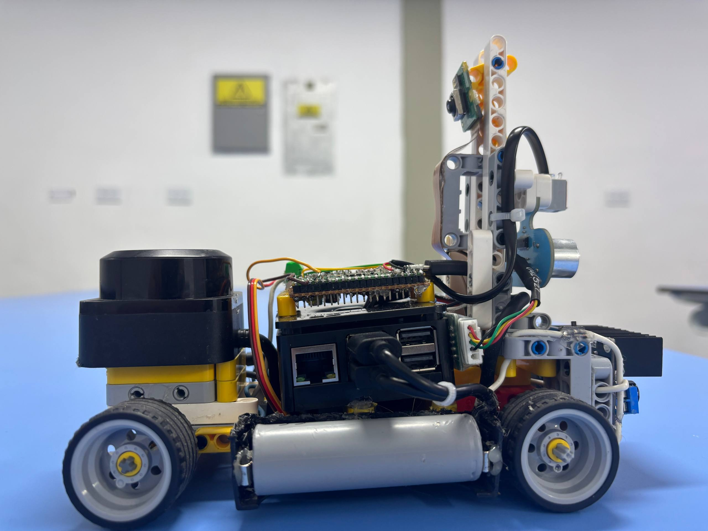 |
| **Lateral Derecha** |  |  | 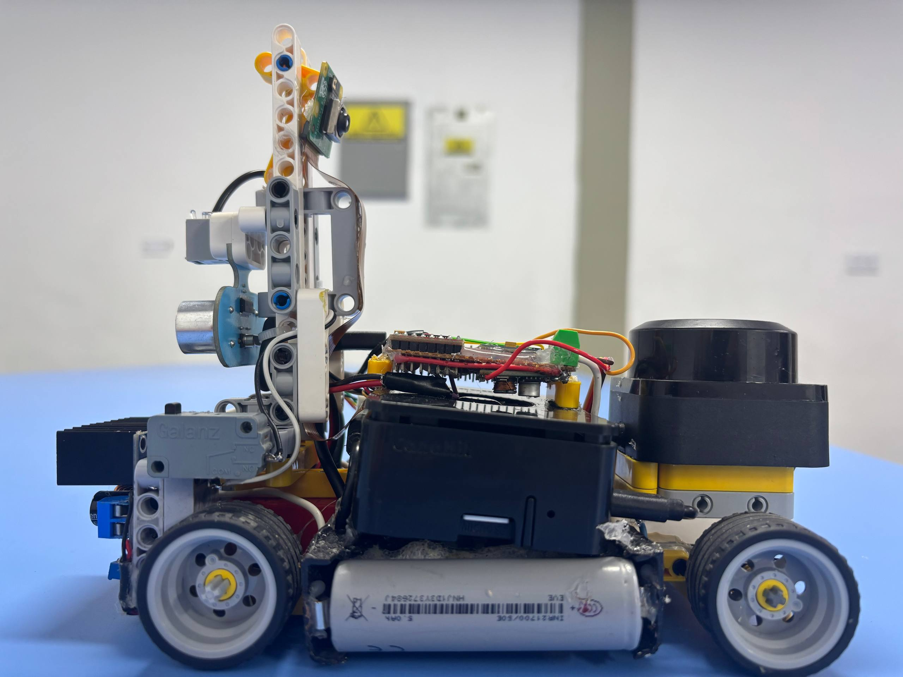 |

---
### 3.3 Galería de Inspección Técnica Obligatoria (Las 6 Capturas Reglamentarias)

Las seis capturas ortogonales del vehículo **tal como compite**, depositadas en `v-photos/V4/`. Las del montaje anterior se conservan en `v-photos/V3/` y `v-photos/V1/` como evidencia de la evolución documentada en la sección 3.2.

| Vista | Captura | Descripción |
| :---: | :---: | :--- |
| **Frontal** (`V4/Frontview.jpg`) |  | El extremo que va primero. El **RPLiDAR C1 montado bajo, sobre el chasis**, con las dos ruedas directrices a los lados y el sensor de color asomando por debajo. Al fondo se ve el mástil trasero. |
| **Trasera** (`V4/Backview.jpg`) |  | El **mástil**, que lleva la cámara en lo alto y el **ultrasonido HC-SR04 mirando hacia atrás**, única medida real en ese sentido. Debajo, el regulador XL4016 con su display de tensión y el tren de tracción. |
| **Perfil Izquierdo** (`V4/Leftview.jpg`) |  | El reparto completo de un vistazo: LiDAR bajo y delante, la Pico 2 con el MPU6050 y el TB6612FNG sobre la placa perforada en el centro, y el mástil atrás. La cámara mira hacia adelante **por encima** de todo, que es lo que impide que el LiDAR le tape el campo. |
| **Perfil Derecho** (`V4/Rightview.jpg`) |  | El mismo perfil desde el otro lado, con la Raspberry Pi 5 en su carcasa y el microinterruptor de corte de batería. |
| **Superior** (`V4/Topview.jpg`) |  | Disposición central: el LiDAR adelantado al eje delantero y, detrás, la placa perforada con la Pico 2, la IMU y el driver. El cable plano naranja de la cámara sube al mástil. |
| **Inferior** (`V4/Bottomview.jpg`) |  | Estructura de vigas de fricción LEGO, el portapilas 21700 en rojo al centro, el servo de dirección, y el **TCS3472 sobre vigas Technic por delante del eje delantero**, fuera del contorno del chasis. |

### 3.4 Justificación de Ingeniería para la Selección de Componentes y Arquitectura de Sistemas (Trade-offs)

De acuerdo con las rigurosas restricciones de peso, inercia de rotación y estabilidad dinámica evaluadas en pista, el equipo aplicó los principios del pensamiento sistémico para balancear de forma óptima las variables físicas del prototipo. A diferencia de las arquitecturas convencionales de manufactura aditiva masiva (chasis impresos en 3D multicapa que elevan el peso por encima de los $1000\,\text{g}$), nuestro diseño optimiza la relación potencia-masa:

* **Ventaja Cinemática de la Reducción de Masa (V3: 720 g; V2: 613 g):**
  Al descartar un chasis totalmente impreso en 3D y migrar a una estructura de vigas de fricción LEGO, la V2 quedó en **613 g**. La versión que compite actualmente, **V3**, pesa **720 g**: añade 107 g por la Raspberry Pi 5 con carcasa, el mástil del LiDAR y el ultrasonido trasero (medición del 06-09-2026, sección 7.4). Aun con esa instrumentación, la masa sigue por debajo de los aproximadamente 800 g de V1. Como $F_c = \frac{m \cdot v^2}{r}$, reducir la masa disminuye linealmente la fuerza lateral requerida en curva; la mejora debe entenderse como una comparación V1→V3, no como si la V3 todavía pesara 613 g.

* **Fusión Sensorial Avanzada (LiDAR C1 vs. Ultrasonidos Tradicionales):**
  Se descartó el ultrasonido **como sensor de percepción principal** (tipo HC-SR04) por sus limitaciones físicas inherentes: retrasos por eco acústico, conos de dispersión muy amplios que generan falsos positivos y bucles de lectura bloqueantes. Para eso implementamos un escáner láser **RPLIDAR C1 (ToF)** por bus USB, que da una firma geométrica de 360° en tiempo real. Ahora bien, esa decisión tiene una excepción medida: el mástil del propio LiDAR le tapa el sector **140-213°**, así que hacia atrás no ve. En el parqueo el robot entra marcha atrás contra esa pared, y la "trasera" que el LiDAR reconstruye de los hombros en oblicuo llegó a discrepar **1777 mm contra 44** del ultrasonido en la misma pose (06-09). Por eso se añadió **un** HC-SR04 mirando atrás: no compite con el LiDAR, cubre exactamente el ángulo donde el LiDAR es ciego.

* **Procesamiento de Visión Nativo OpenCV contra Sensores Embebidos Cerrados:**
  Muchos equipos optan por cámaras inteligentes con procesadores integrados de firmware cerrado (como HuskyLens). Aunque simplifican la conexión, restringen severamente la flexibilidad algorítmica. Nuestra arquitectura utiliza la **Pi Camera Module 3** conectada por la interfaz CSI de alta velocidad directo al procesador de la **Raspberry Pi 5**. El procesamiento se realiza a nivel de software mediante código propio en **OpenCV**, permitiendo la manipulación directa de la matriz de píxeles en el dominio HSV, la aplicación de filtros morfológicos personalizados para eliminar el ruido lumínico de los boxes y la inyección dinámica de offsets angulares directo al servomotor Ackermann.

* **Por qué elegimos Baterías 21700 (2S) en lugar de LiPo clásicas o celdas 18650:**
  Las celdas de iones de litio 21700 proporcionan una densidad de corriente de descarga continua masiva de hasta $30\,\text{A}$. Al alimentar nuestro regulador de alta potencia **XL4016 (capacidad de hasta $8.0\,\text{A}$)**, garantizamos un blindaje eléctrico absoluto contra caídas de tensión (*brownouts*). Toda la etapa lógica (Raspberry Pi 5, Pico 2 y LiDAR) opera de manera holgada: el consumo real del sistema completo en marcha, medido con multímetro el 06-09, es de $1.39\,\text{A}$ (sección 4.4), previniendo reinicios críticos del sistema operativo cuando el motor demanda torque de arranque máximo al salir de las curvas.
---

## 4. Arquitectura Eléctrica y Distribución de Señales

Antes del detalle de cada etapa, esta es la vista completa de cómo viaja la información por el vehículo: qué sensor entra por dónde, qué decide cada una de las dos capas de cómputo y cómo llega la orden hasta las ruedas.

<p align="center">
  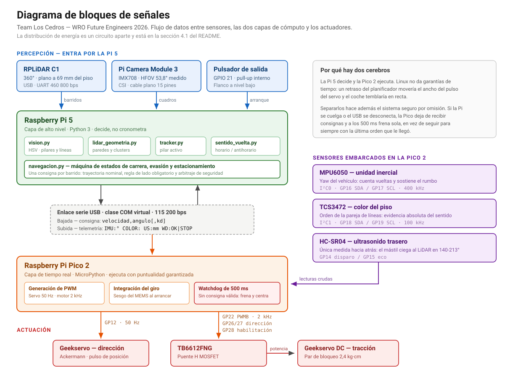
</p>

> **El diagrama se lee de arriba abajo y la división horizontal es la decisión de arquitectura más importante del proyecto.** Todo lo que exige juicio — reconocer un pilar, decidir por qué lado pasarlo, saber en qué vuelta va — ocurre en la Raspberry Pi 5. Todo lo que exige puntualidad — el ancho de cada pulso del servo, la integración del giroscopio — ocurre en la Pico 2. Entre las dos hay un único cable serie y un protocolo de dos líneas de texto, y esa estrechez es deliberada: obliga a que la frontera entre "decidir" y "ejecutar" sea explícita y auditable en el log de cualquier corrida.


### 4.1 Red de Distribución de Energía (Alimentación)

Para asegurar el correcto funcionamiento del vehículo autónomo y prevenir reinicios imprevistos (*brownouts*) en la Raspberry Pi debido a picos de consumo dinámico de los motores, se implementó un sistema de alimentación completamente desacoplado por etapas:

| Fuente / Regulador | Voltaje Entrada | Voltaje Salida | Corriente Máx. | Componentes Alimentados |
| --- | --- | --- | --- | --- |
| **Baterías 21700 (2S)** | $7.4\,\text{V} - 8.4\,\text{V}$ | Directo | $30\,\text{A}$ | Línea de alta potencia del Driver TB6612FNG (Motor DC). |
| **Regulador XL1509** | $7.4\,\text{V} - 8.4\,\text{V}$ | $6.0\,\text{V}$ | $2.0\,\text{A}$ | Servomotor de dirección (Etapa de potencia limpia). |
| **Regulador XL4016** | $7.4\,\text{V} - 8.4\,\text{V}$ | $5.1\,\text{V}$ | $8.0\,\text{A}$ | Raspberry Pi 5, Cámara Module 3 y RPLIDAR C1. |

>  **Nota eléctrica:** Todas las referencias de tierra (GND) del vehículo confluyen en una topología de estrella en un único punto común central. Esto unifica los umbrales lógicos y drena el ruido electromagnético generado por las conmutaciones de los motores.

#### Diagrama de Cableado Oficial

Diagrama de referencia usado por el equipo durante el ensamblaje, verificado contra el pinout real de `src/pico/main.py`. La parte de la Pico 2 sigue vigente tal cual; en la Pi el diagrama muestra los **dos** botones del selector de ronda, que hoy es **uno solo en `GPIO 21`** (sección 4.2):

<p align="center">
  
</p>

#### Implementación Física: Placa Perforada

La integración electrónica de la Pico 2, el driver TB6612FNG y el MPU6050 se soldó sobre una placa perforada (protoboard permanente) para eliminar el riesgo de falsos contactos por vibración que sí existía con conexiones de jumpers sueltos:

| Capa Superior — Pico 2 + MPU6050 | Capa Inferior — Soldadura y buses |
| :---: | :---: |
|  |  |

### 4.2 Catálogo de Componentes y Justificación de Selección

Cada sensor y actuador fue elegido, ubicado y calibrado con un criterio específico ligado a la geometría del campo de la WRO. La justificación comparativa completa (por qué se descartaron alternativas como ultrasonido o HuskyLens) está en la sección 3.4; aquí se documenta la selección final con evidencia fotográfica:

| Componente | Foto | Justificación de selección y ubicación |
| :--- | :---: | :--- |
| **RPLiDAR C1** |  | Montado **bajo sobre el chasis**, con el mástil delantero reservado para la cámara. El haz corta a la misma altura tanto postes como paredes (ambos de 100 mm según el reglamento); la distinción entre uno y otro **no es por altura**, la hace la clasificación geométrica del cluster. El soporte tiene un coste conocido y medido: el LiDAR se ve a sí mismo, y por eso `lidar.blind_sectors_deg` enmascara el arco que ocupa. El plano de barrido sigue a **69 mm del piso**: al reubicar la cámara el LiDAR no cambió de altura. |
| **Pi Camera Module 3** (estándar; HFOV efectivo **53,8° medidos**, no la Wide) |  | Montada en lo alto de un **mastil trasero**, desde donde mira hacia adelante por encima del vehiculo entero: asi el LiDAR, que va bajo y delante, no le tapa el campo. Estuvo al frente y por debajo del LiDAR hasta el remontaje final. **Es la Module 3 estándar, no la Wide**, aunque durante un tiempo se documentó al revés: `medir_fov.py` emparejó una esquina que el LiDAR sitúa en −21,5° con su borde en el frame y sale un HFOV efectivo de **53,8°**, que concuerda con los 51,9° previstos para la estándar recortada a 4:3 y no con los 85,6° de la Wide (ver [`optica.py`](src/pi5/ronda_curvas/optica.py)). Suponer el catálogo de la Wide inflaba el rumbo calculado de cada pilar 2,3 veces. |
| **MPU6050 (IMU)** |  | Montado rígidamente sobre la placa perforada, alineado con el eje longitudinal del chasis para que la lectura del eje Z corresponda exactamente al *yaw* del vehículo sin necesidad de compensar desalineación mecánica. |
| **Geekservo Servo (Dirección)** |  | Acoplado directo al `base_servo` del eje delantero; se eligió por compatibilidad mecánica nativa con las vigas Technic, evitando adaptadores impresos que añaden holgura al sistema de dirección. |
| **Geekservo DC (Tracción)** |  | Seleccionado por su torque de bloqueo de $2.4\,\text{kg}\cdot\text{cm}$, validado matemáticamente en la sección 7.4 con un margen de seguridad de **2.18×** sobre los 720 g de la V3 (era 2.55× con los 613 g de la V2). |
| **Driver TB6612FNG** |  | Preferido sobre el clásico L298N por su topología MOSFET (menor caída de tensión y disipación térmica), crítico dado el presupuesto de corriente ajustado del sistema (sección 4.3). |
| **Raspberry Pi 5** | 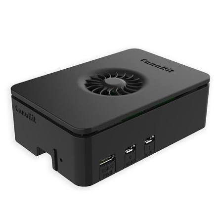 | Capa de alto nivel, montada en su carcasa Canakit con ventilador (es la que se ve en los perfiles de la sección 3.3). **Sustituye a la Pi 3B el 03-09-2026** (migración verificada: 3325 archivos y los 170 CSV idénticos por md5). El motivo es cómputo medido, no preferencia: el mismo pipeline de visión pasó de **67-72 ms a 4,8 ms** por cuadro a 640x360, y a 1280x720 —resolución que en la 3B no cabía— cuesta **22,2 ms**. La edad del barrido LiDAR bajó de 16,0 ms de media a **0,1 ms**. Eso es lo que permitió subir la cámara a 1280x720 @ 30 fps. |
| **Raspberry Pi Pico 2** |  | Capa de bajo nivel de tiempo real: descarga a la Pi 5 de la generación de PWM y la integración del giroscopio, evitando que el *jitter* del sistema operativo Linux afecte la estabilidad del lazo de control físico. |
| **Reguladores XL1509 / XL4016** |   | Ver arquitectura de desacoplamiento por etapas en la sección 4.1 y análisis de margen de seguridad en la sección 4.3. |
| **Baterías 21700 (2S)** |  | Ver justificación de densidad de corriente en la sección 3.4. |
| **Botón físico de arranque (x1)** |  | **Un solo botón, en `GPIO 21` de la Pi 5** (entrada con *pull-up*, se dispara al ponerse a nivel bajo). Antes eran dos, uno por ronda. Se dejó en uno porque la ronda ya no se elige por hardware sino por el programa que se lanza (`ronda_nueva`, `ronda_abierta` o `ronda_cerrada`), y un único pulsador reduce el cableado y los modos de fallo en la línea de salida. El arranque sin botón existe solo como opción de banco (`--arranque-inmediato`) y la ronda oficial no la usa. |
| **Ultrasonido trasero HC-SR04** | 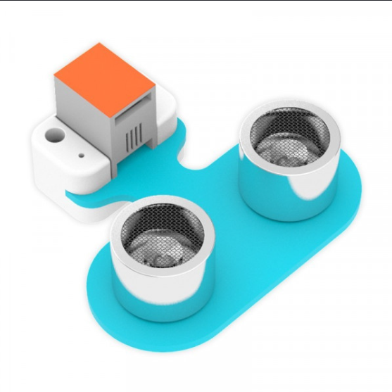 | Añadido para el parqueo, la única maniobra en que el robot va marcha atrás contra una pared que **el LiDAR no puede ver**: el soporte del propio sensor le tapa el sector 140-213°, así que la "pared trasera" que el LiDAR reporta se reconstruye de los hombros en oblicuo y no es una medida. Medido el 06-09 con el robot aparcado a mano: el ultrasonido leía 44 mm y el LiDAR 1777 mm con calidad 0,95. Va en la Pico 2 (`GP14` trigger / `GP15` echo) y está **34 mm por delante del punto más atrasado del robot**, así que la holgura real de la culata es su lectura menos esos 34. |
| **Sensor de Color TCS3472** |  | Montado **al frente del vehículo**, por delante del eje delantero y mirando el piso. Estuvo bajo el chasis; se adelantó para que la línea se lea antes de pisarla, lo que da margen de reacción en vez de avisar cuando ya se cruzó. Clasifica la línea del piso como `AZUL` o `NARANJA` y la Pico 2 la transmite en la trama de telemetría. Es la **única evidencia absoluta** del sentido de carrera: no depende del yaw ni de interpretar la geometría, porque las líneas están pintadas en la pista y su orden al cruzarlas no admite ambigüedad. Por eso puede *corregir* un sentido ya comprometido por geometría, cosa que ninguna otra fuente puede hacer (sección 5.3-C). Estuvo desconectado un tiempo tras la migración a la Pi 5 —la Pico respondía `COLOR:SIN_SENSOR`— y se volvió a conectar. |

#### Método de Calibración de Sensores

* **IMU (MPU6050):** Al energizar la Pico 2, `src/pico/main.py` promedia 100 lecturas del giroscopio en el eje Z (~1 segundo, con una espera de 10 ms entre muestras) para calcular `giro_z_offset` antes de entrar al bucle de control. Esto elimina el *bias* estático de fabricación del MEMS sin necesidad de recalibración manual entre carreras.
* **Cámara (Segmentación HSV):** `calibrar_hsv.py` transmite el feed de la Pi Camera por socket TCP a la laptop del equipo y expone sliders interactivos de OpenCV para ajustar en vivo los rangos `H/S/V` de verde y rojo (el rojo requiere dos rangos por el *wraparound* del matiz en 0°/180°). Los umbrales resultantes se copian al bloque `vision` de `src/pi5/ronda_nueva/configuracion.json` antes de cada jornada de pruebas, ya que la iluminación de los boxes varía respecto a la de la pista oficial.
* **Sensor de Color de Piso (TCS3472):** al arrancar, `src/pico/main.py` promedia 25 lecturas de saturación del piso blanco bajo la iluminación real (`calibrar_suelo_inicial()`) y fija `saturacion_base_pista` como ese promedio más un margen de 0.12 — un umbral dinámico en vez de un valor fijo que se desajusta con cada cambio de luz entre el box y la pista oficial. Cada lectura pasa además por un promedio móvil de 4 muestras en tono (H) y saturación (S) antes de clasificarse, para filtrar destellos puntuales del sensor.
* **Puntos de fallo considerados:** si la IMU se satura o pierde el bus I2C, `main.py` captura la excepción y fuerza `velocidad_z = 0.0` (el coche sigue guiándose solo por LiDAR en vez de trabar el bucle de control); si el LiDAR pierde la lectura de una pared, la Pi 5 congela el último ángulo válido (modo "Inercial", sección 5.3) en lugar de enviar un comando basado en datos corruptos.

### 4.3 Mapa de Conexiones Calibrado (Pinout)

#### Interfaces Digitales de la Raspberry Pi Pico 2

| Componente Físico | Pin Pico 2 | ID de Pin | Tipo de Señal | Función Técnico-Específica |
| --- | --- | --- | --- | --- |
| **Geekservo Dirección** | Pin 16 | `GP12` | Salida PWM | Inyección de pulso de posición ($50\,\text{Hz}$). |
| **TB6612FNG (STBY)** | Pin 34 | `GP28` | Salida Digital | Habilitación lógica del puente H ($1 = \text{Active}$). |
| **TB6612FNG (BIN1)** | Pin 32 | `GP27` | Salida Digital | Dirección de tracción (Línea de control lógica 1). |
| **TB6612FNG (BIN2)** | Pin 31 | `GP26` | Salida Digital | Dirección de tracción (Línea de control lógica 2). |
| **TB6612FNG (PWMB)** | Pin 29 | `GP22` | Salida PWM | Modulación de velocidad por ancho de pulso ($2\,\text{kHz}$). |
| **MPU6050 (SDA)** | Pin 21 | `GP16` | $\text{I}^2\text{C0}$ SDA | Línea de datos del bus inercial. |
| **MPU6050 (SCL)** | Pin 22 | `GP17` | $\text{I}^2\text{C0}$ SCL | Línea de reloj síncrono del bus inercial ($400\,\text{kHz}$). |
| **HC-SR04 (TRIG)** | Pin 19 | `GP14` | Salida Digital | Disparo del ultrasonido trasero, usado por el parqueo (sección 4.2). |
| **HC-SR04 (ECHO)** | Pin 20 | `GP15` | Entrada Digital | Retorno de eco. Es la única medida trasera real: el LiDAR tiene ciego el sector 140-213°. |
| **TCS3472 (SDA)** | Pin 24 | `GP18` | $\text{I}^2\text{C1}$ SDA | Línea de datos del sensor de color de piso. |
| **TCS3472 (SCL)** | Pin 25 | `GP19` | $\text{I}^2\text{C1}$ SCL | Línea de reloj del bus de color ($100\,\text{kHz}$, más lento que el de la IMU porque el TCS3472 no soporta $400\,\text{kHz}$ de forma confiable). |

#### Conexiones Maestras de la Raspberry Pi 5

* **Pi Camera Module 3:** Conectada a la interfaz nativa CSI mediante un cable flexible plano de 15 pines.
* **RPLIDAR C1:** Conectado directamente a un puerto USB 2.0 maestro (Comunicación UART integrada a $460\,800\,\text{bps}$).
* **Raspberry Pi Pico 2:** Enlazada por interfaz de datos USB corta operando bajo la clase de dispositivo COM Virtual (VCP) a una tasa fija de $115\,200\,\text{bps}$.
* **Botón de arranque:** un único pulsador contra masa en `GPIO 21`, leído con resistencia de *pull-up* interna. Es lo que da la salida en la ronda oficial.

### 4.4 Presupuesto de Consumo Energético y Gestión de Corriente

Para evitar caídas de tensión críticas (*brownouts*) cuando los actuadores demandan torque máximo, se calculó el presupuesto de corriente nominal y de pico (Stall) del sistema. **La tabla siguiente es la estimación por hoja de datos y se hizo con la Raspberry Pi 3B.** Debajo están las medidas reales del sistema con la Pi 5, tomadas con multímetro el 06-09-2026, que es lo que hay que mirar.

| Componente | Voltaje Operativo | Corriente Nominal | Corriente de Pico (Stall) | Regulador Asociado |
| :--- | :---: | :---: | :---: | :---: |
| **Raspberry Pi 3B** *(estimación original)* | $5.1\,\text{V}$ | $600\,\text{mA}$ | $1200\,\text{mA}$ | XL4016 (Línea lógica) |
| **RPLIDAR C1** | $5.0\,\text{V}$ | $250\,\text{mA}$ | $450\,\text{mA}$ | XL4016 (Línea lógica) |
| **Pi Camera Module 3**| $3.3\,\text{V} (CSI)$ | $280\,\text{mA}$ | $400\,\text{mA}$ | XL4016 / Interno Pi |
| **Geekservo Dirección**| $6.0\,\text{V}$ | $180\,\text{mA}$ | $800\,\text{mA}$ | XL1509 (Línea limpia) |
| **Motor DC (Tracción)**| $7.4\,\text{V} - 8.4\,\text{V}$ | $400\,\text{mA}$ | $2500\,\text{mA}$ | Directo (Batería 2S) |
| **Raspberry Pi Pico 2**| $5.0\,\text{V} (VBUS)$ | $40\,\text{mA}$ | $90\,\text{mA}$ | USB |

#### Consumo Real Medido (06-09-2026, banco del laboratorio)

La tabla anterior es **estimada por hoja de datos**. Estas son las medidas reales, tomadas con un multímetro ANENG M118A en serie con la batería y la fuente de banco a $8.4\,\text{V}$, que es lo que da un 2S de 21700 a plena carga. Se midieron tres estados, y el tercero (con la Pi apagada) es el que permite separar lo que consume el cerebro de lo que consume el resto:

| Estado | Corriente | Lectura de la foto | Evidencia | Qué incluye |
| :--- | :---: | :---: | :---: | :--- |
| **En funcionamiento** | $\mathbf{1.39\,\text{A}}$ | $1.499\,\text{A}$ | 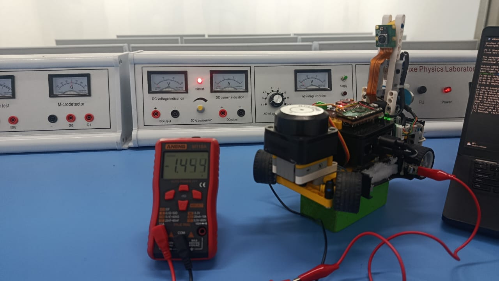 | Todo: Pi 5, LiDAR girando, cámara, Pico 2, sensores, servo y motor de tracción en marcha. |
| **En reposo** | $\mathbf{0.61\,\text{A}}$ | $0.678\,\text{A}$ | 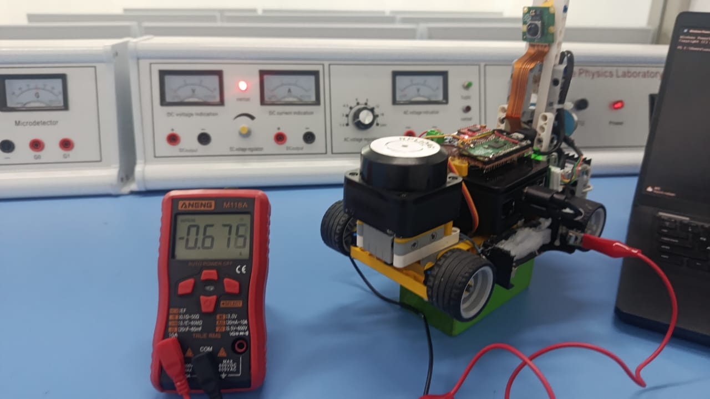 | Sistema energizado y ejecutándose, sin tracción. |
| **Con la Pi 5 apagada** | $\mathbf{0.21\,\text{A}}$ | $0.219\,\text{A}$ | 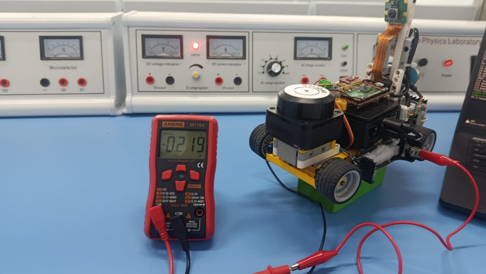 | Solo Pico 2, IMU, ultrasonido, servo y electrónica de potencia. |

> El multímetro oscila y la foto congela un instante, por eso se dan las dos cifras. Dos de las tres coinciden casi exactas (0,219 contra 0,21 y 0,611 contra 0,61, esta última en `En_reposo_mostrando_voltaje.jpeg`); la de funcionamiento difiere porque 1,499 A es un pico de arranque del motor y 1,39 A el valor sostenido, que es el que manda para el presupuesto. Los cálculos de abajo usan las cifras sostenidas. La foto `En_reposo_mostrando_voltaje.jpeg` documenta además la tensión de alimentación del banco durante la prueba.

**Lo que se deduce restando estados:**

$$I_{\text{Pi 5}} = 0.61 - 0.21 = \mathbf{0.40\,\text{A}} \qquad I_{\text{tracción}} = 1.39 - 0.61 = \mathbf{0.78\,\text{A}}$$

| Bloque | Corriente | % del total en marcha |
| :--- | :---: | :---: |
| Tracción y dirección en movimiento | $0.78\,\text{A}$ | $56\,\%$ |
| Raspberry Pi 5 (con cámara y LiDAR por USB) | $0.40\,\text{A}$ | $29\,\%$ |
| Pico 2, IMU, ultrasonido y electrónica de potencia | $0.21\,\text{A}$ | $15\,\%$ |

**Potencia y autonomía.** A $8.4\,\text{V}$ el consumo en marcha es $1.39 \times 8.4 = \mathbf{11.7\,\text{W}}$ ($10.3\,\text{W}$ con la batería ya a $7.4\,\text{V}$). Las celdas son INR21700/50E de $5.0\,\text{Ah}$, y **en 2S la capacidad no se suma**, solo la tensión:

$$t = \frac{5.0\,\text{Ah}}{1.39\,\text{A}} = 3.6\,\text{h} \quad\longrightarrow\quad \text{al } 80\,\% \text{ de descarga útil} = \mathbf{2.9\,\text{h}}$$

Una ronda de la WRO dura 3 minutos, así que la batería da para unas **58 rondas seguidas** sin recargar. La autonomía no es una restricción de este diseño: el límite práctico lo pone el desgaste mecánico, no la energía.

**Contraste con la estimación de hoja de datos.** El presupuesto de la tabla anterior predecía $2.14\,\text{A}$ de pico solo en la línea lógica. La medida real del sistema **completo** en marcha es $1.39\,\text{A}$, o sea que la estimación era conservadora por un factor de $1.5\times$ largo. Eso es lo esperable —las hojas de datos publican el peor caso— y confirma que el margen de los reguladores es mayor que el calculado, no menor. Sobre la corriente total de batería, el pico medido deja el XL4016 de $8.0\,\text{A}$ con un **margen del $82.6\,\%$**.

> **Cuidado al leer ese margen:** $1.39\,\text{A}$ es la corriente de **batería**, no la de cada regulador por separado. Repartir ese total entre el XL4016, el XL1509 y la línea directa del motor exigiría medir cada rama, y eso no se ha hecho. El margen por regulador de la sección siguiente sigue siendo la estimación de diseño.

#### Análisis de Margen de Seguridad en Reguladores:
1. **Regulador XL4016 (Línea de Control - Límites Lógicos):**
   * *Consumo máximo de pico estimado:* $1200 + 450 + 400 + 90 = 2140\,\text{mA}$ ($2.14\,\text{A}$).
   * *Capacidad del regulador:* Con una salida máxima por diseño de **$8.0\,\text{A}$**, el XL4016 opera de manera holgada con un **margen de seguridad del $73.25\%$** bajo las condiciones de estrés electrónico más extremas posibles en carrera.
2. **Regulador XL1509 (Línea de Potencia de Dirección):**
   * *Consumo máximo en bloqueo (Stall):* $800\,\text{mA}$ ($0.8\,\text{A}$).
   * *Capacidad del regulador:* Con una salida máxima de **$2.0\,\text{A}$**, el regulador opera con un **margen del $60\%$**, previniendo que el ruido inductivo del servo se filtre al bus de la CPU o afecte los sensores.

---

## 5. Capa de Percepción y Alto Nivel (Raspberry Pi 5)

La Raspberry Pi 5 se encarga de los procesos que demandan alta capacidad de cómputo. Sustituyó a la Pi 3B el 03-09-2026 (sección 4.2); los números de tiempo de este README que vengan de la 3B están marcados como tales. Mediante programación concurrentemente multihilos (`threading`), decodifica los datos en crudo del LiDAR y las imágenes de la cámara, calculando las decisiones estratégicas de navegación.

### Diagrama de Arquitectura de Software

El siguiente diagrama ilustra la orquestación actual de `prueba_abierta.py`, desde el botón de salida hasta el control de bajo nivel. El antiguo servicio de inicio se conserva únicamente como referencia:

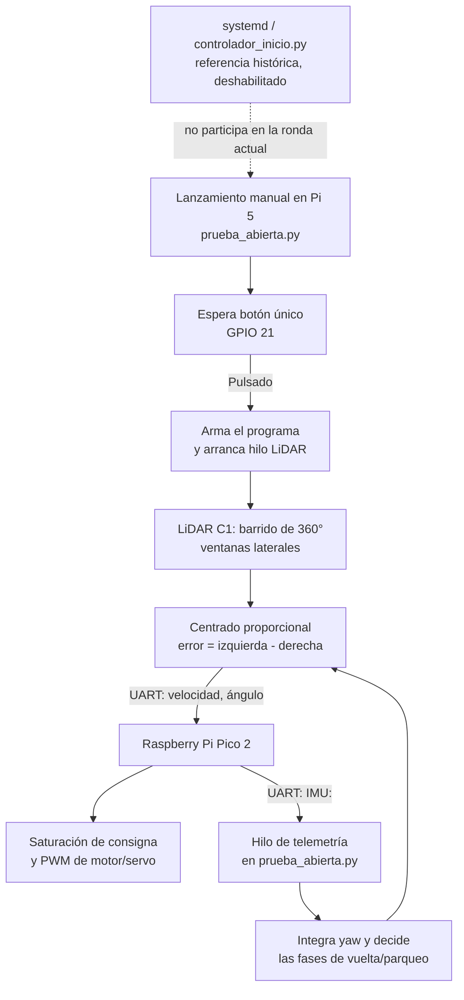
```mermaid
graph TD
    A["Lanzamiento manual en Pi 5\nprueba_abierta.py"] --> B["Espera botón único\nGPIO 21"]
    B -->|"Pulsado"| C["Arma el programa\ny arranca hilo LiDAR"]

    C --> D["LiDAR C1: barrido de 360°\nventanas laterales"]
    D --> E["Centrado proporcional\nerror = izquierda - derecha"]
    E -->|"UART: velocidad, ángulo"| F["Raspberry Pi Pico 2"]
    F --> G["Saturación de consigna\ny PWM de motor/servo"]
    F -->|"UART: IMU:<yaw>"| H["Hilo de telemetría\nen prueba_abierta.py"]
    H --> I["Integra yaw y decide\nlas fases de vuelta/parqueo"]
    I --> E

    J["systemd / controlador_inicio.py\nreferencia histórica, deshabilitado"] -. "no participa en la ronda actual" .-> A

```

> **Alcance del diagrama:** representa el flujo que implementa
> `src/pi5/ronda_abierta/prueba_abierta.py`: un único botón en GPIO 21, LiDAR
> para el centrado y telemetría IMU para el conteo angular. `systemd`,
> `controlador_inicio.py` y el protocolo `WD:OK/WD:STOP` pertenecen al
> orquestador/firmware más reciente de `ronda_nueva`; no son estados ni
> requisitos de arranque de este script de prueba.

### 5.1 Orquestación del Sistema y Demonio de Arranque Autónomo

Para garantizar que el vehículo sea 100% autónomo desde el momento en que se conecta la batería (requisito estricto de la WRO), la Raspberry Pi 5 lanza la ronda completa al arrancar el sistema operativo mediante una unidad `systemd`.

#### Configuración del Servicio del Sistema (`systemd`)

La unidad se instala en `/etc/systemd/system/wro.service` y el archivo real, listo para copiar durante la reproducción del sistema, está en [`src/pi5/wro.service`](src/pi5/wro.service):

```ini
[Unit]
Description=Ronda de obstaculos WRO - Team Los Cedros
After=multi-user.target
Conflicts=shutdown.target

[Service]
Type=oneshot
User=pi
WorkingDirectory=/home/pi/ronda_curvas
Environment=PYTHONUNBUFFERED=1
ExecStartPre=/bin/sleep 10
ExecStart=/bin/bash /home/pi/correr_completa.sh
RemainAfterExit=yes
TimeoutStartSec=0
StandardOutput=append:/home/pi/ronda_curvas/logs/servicio.log
StandardError=append:/home/pi/ronda_curvas/logs/servicio.log

[Install]
WantedBy=multi-user.target
```

El servicio no arranca el motor: ejecuta [`correr_completa.sh`](src/pi5/correr_completa.sh), que **espera el pulsador de `GPIO 21`** antes de mover nada. Mientras espera, el LED de la Pico parpadea; esa es la señal visible de que el sistema está cargado y listo. Al pulsar, el LED se apaga y arranca la secuencia: salida del estacionamiento, ronda, y parada en el cuadrante de salida. Esto cumple las dos condiciones a la vez — el sistema es autónomo desde que se conecta la batería, y la salida la da una acción física sobre el robot, como exige el reglamento.

Cuatro decisiones de esta unidad no son cosméticas:

* **`After=multi-user.target` y `ExecStartPre=/bin/sleep 10`.** El enlace con la Pico se abre en el primer segundo del script; sin margen para que el USB enumere `/dev/ttyACM0`, el servicio arranca antes que el hardware y muere.
* **Sin `Restart=`.** La unidad anterior tenía `Restart=always`, que relanzaba la ronda entera en cuanto terminaba: el robot volvía a salir del estacionamiento solo, una y otra vez. Una carrera se lanza una sola vez.
* **`TimeoutStartSec=0`.** El servicio se pasa la mayor parte del tiempo esperando el pulsador, y el límite de 90 s que `systemd` aplica por defecto a los `oneshot` lo mataría antes de que nadie lo pulsara.
* **Registro a archivo además del diario.** `logs/servicio.log` sobrevive al reinicio y no depende de `journalctl`, que en una tarjeta SD con escritura volátil puede quedarse corto.

> **Para lanzar a mano por SSH hay que parar el servicio antes** (`sudo systemctl stop wro.service`). Si no, los dos procesos se disputan el GPIO del pulsador y el lanzamiento manual aborta con `GPIO ocupado`.

### 5.2 Estructura Modular del Script de Carrera (Fragmentos Clave)

`src/pi5/ronda_abierta/prueba_abierta.py` usa una máquina de estados propia y no usa el sensor de color ni cuenta líneas de pista. El hilo de telemetría recibe `IMU:<yaw>` desde la Pico, integra los cambios normalizados a $[-180°, 180°]$ y emplea el valor absoluto acumulado para contar tres vueltas: 990° inicia la aproximación y 1080° marca las tres vueltas completas. El LiDAR captura una firma lateral al inicio y mantiene el centrado proporcional durante las tres fases móviles.

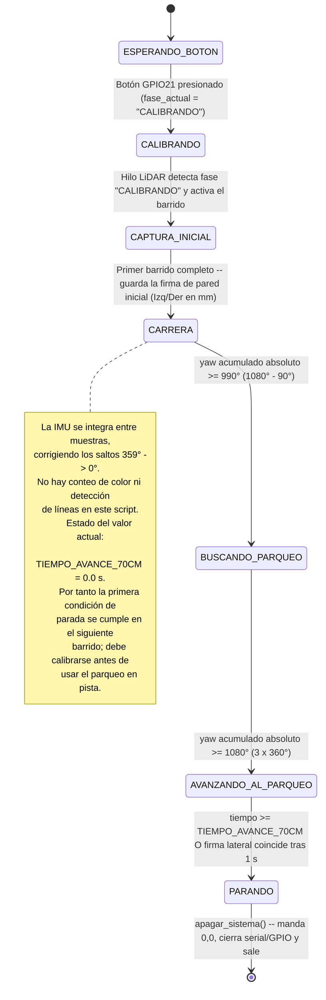
```mermaid
stateDiagram-v2
    [*] --> ESPERANDO_BOTON
    ESPERANDO_BOTON --> CALIBRANDO: Botón GPIO21 presionado (fase_actual = "CALIBRANDO")
    CALIBRANDO --> CAPTURA_INICIAL: Hilo LiDAR detecta fase "CALIBRANDO" y activa el barrido
    CAPTURA_INICIAL --> CARRERA: Primer barrido completo -- guarda la firma de pared inicial (Izq/Der en mm)
    CARRERA --> BUSCANDO_PARQUEO: yaw acumulado absoluto >= 990° (1080° - 90°)
    BUSCANDO_PARQUEO --> AVANZANDO_AL_PARQUEO: yaw acumulado absoluto >= 1080° (3 x 360°)
    AVANZANDO_AL_PARQUEO --> PARANDO: tiempo >= TIEMPO_AVANCE_70CM O firma lateral coincide tras 1 s
    PARANDO --> [*]: apagar_sistema() -- manda 0,0, cierra serial/GPIO y sale

    note right of CARRERA
        La IMU se integra entre muestras,
        corrigiendo los saltos 359° -> 0°.
        No hay conteo de color ni detección
        de líneas en este script.

        Estado del valor actual:
        TIEMPO_AVANCE_70CM = 0.0 s.
        Por tanto la primera condición de
        parada se cumple en el siguiente
        barrido; debe calibrarse antes de
        usar el parqueo en pista.
    end note
```

A continuación se muestran los fragmentos que gobiernan las transiciones reales:

```python
def hilo_comunicacion_pico():
    """Hilo asincrono: telemetria IMU y conteo angular de vueltas."""
    global ser_pico, angulo_acumulado_robot, fase_actual
    global angulo_imu_previo, tiempo_inicio_avance
    # ... [Inicializacion serial a 115200 bps] ...
    while corriendo:
        if ser_pico.in_waiting > 0:
            try:
                linea = ser_pico.readline().decode('utf-8').strip()
                if "IMU:" not in linea:
                    continue
                campos = {}
                for parte in linea.split(','):
                    if ':' in parte:
                        clave, valor = parte.split(':', 1)
                        campos[clave.strip().upper()] = valor.strip()
                if "IMU" not in campos:
                    continue
                valor_crudo_imu = float(campos["IMU"])
                if fase_actual in ["ESPERANDO_BOTON", "CALIBRANDO"] or angulo_imu_previo is None:
                    angulo_imu_previo = valor_crudo_imu
                    angulo_acumulado_robot = 0.0
                    continue
                delta_angulo = valor_crudo_imu - angulo_imu_previo
                if delta_angulo > 180.0:
                    delta_angulo -= 360.0
                elif delta_angulo < -180.0:
                    delta_angulo += 360.0
                angulo_acumulado_robot += delta_angulo
                angulo_imu_previo = valor_crudo_imu
                progreso_angular = abs(angulo_acumulado_robot)
                if fase_actual == "CARRERA" and progreso_angular >= 990.0:
                    fase_actual = "BUSCANDO_PARQUEO"
                elif fase_actual == "BUSCANDO_PARQUEO" and progreso_angular >= 1080.0:
                    fase_actual = "AVANZANDO_AL_PARQUEO"
                    tiempo_inicio_avance = time.time()
            except: pass
        time.sleep(0.005)

def procesar_ciclo_completo_lidar():
    """Guiado proporcional por fase y parada final."""
    global dist_derecha_min, dist_izquierda_min, fase_actual, tiempo_inicio_avance

    error_lateral = dist_izquierda_min - dist_derecha_min
    angulo_objetivo = error_lateral * KP_LATERAL

    if fase_actual == "CARRERA":
        enviar_comando_navegacion(VELOCIDAD_CRUCERO)
    elif fase_actual == "BUSCANDO_PARQUEO":
        enviar_comando_navegacion(VELOCIDAD_PARQUEO)
    elif fase_actual == "AVANZANDO_AL_PARQUEO":
        enviar_comando_navegacion(VELOCIDAD_PARQUEO)
        tiempo_transcurrido = time.time() - tiempo_inicio_avance
        coincidencia_geometrica = (tiempo_transcurrido >= TIEMPO_MINIMO_PARA_FIRMA
                                    and abs(dist_izquierda_min - initial_izquierda) < 80.0
                                    and abs(dist_derecha_min - initial_derecha) < 80.0)
        if tiempo_transcurrido >= TIEMPO_AVANCE_70CM or coincidencia_geometrica:
            fase_actual = "PARANDO"
            for _ in range(8): ser_pico.write(b"0,0\n")
            apagar_sistema(None, None)

```

> **Nota de estado:** `prueba_abierta.py` no instancia `comun/registro_metricas.py`, así que no deja un CSV por corrida. Además, `TIEMPO_AVANCE_70CM` vale actualmente `0.0`; el diagrama no lo interpreta como un parqueo de 70 cm ya validado, sino como una parada inmediata pendiente de calibración.

### 5.3 Estrategia de Navegación Justificada por Rondas (Geometría del Campo)

Nuestra arquitectura de software aborda las dos disciplinas del torneo de forma segregada, adaptándose rigurosamente a las condiciones geométricas del circuito:

#### A. Ronda Abierta (Navegación Reactiva Simétrica)

La meta en la Ronda Abierta es mantener la velocidad lineal máxima constante reduciendo el desplazamiento angular innecesario.

* **Lógica del Algoritmo:** El RPLIDAR C1 barre en ventanas angulares simétricas a cada lado del vehículo. Al calcular el error de descentrado entre las distancias mínimas detectadas contra las paredes laterales:

$$e(t) = \text{dist}_{\text{izquierda}} - \text{dist}_{\text{derecha}}$$

el script aplica una ganancia proporcional (`KP_LATERAL`) para enviar micro-correcciones de dirección a la Pico 2.
* **Manejo de Casos Extremos (Puntos de Fallo) — Modo "Inercial":** Si el vehículo entra muy sesgado en una curva y el LiDAR pierde temporalmente la lectura de una de las paredes (lectura > 4000mm), el script **sostiene el último valor válido conocido de esa pared** en vez de sustituirlo por un valor fijo arbitrario. Esto se corrigió durante la depuración de la Ronda Cerrada (sección 8.2): la implementación original saltaba a un valor fijo de 2000mm apenas se perdía la lectura, lo que podía producir un giro brusco justo al entrar en una curva cerrada. La versión actual de ambos scripts (`ronda_abierta.py` y `ronda_cerrada.py`) sostiene el dato real más reciente. *Nota de alcance:* todavía no se integra el giroscopio de la Pico para predecir la posición de la pared durante la pérdida de señal — es una mejora identificada, no implementada aún.

#### B. Ronda Cerrada (Fusión Sensorial Visión Artificial + LiDAR)

En la Ronda Cerrada, la presencia de pilares de obstáculos (bloques rojos y verdes) rompe la simetría de las paredes del circuito, requiriendo una estrategia asimétrica:

* **Detección por Visión (Capa OpenCV):** La cámara Pi Module 3 captura el frente de la pista. El hilo de cámara en `src/pi3B/ronda_cerrada/vision.py` (portado a `src/pi5/ronda_cerrada/` y superado por `ronda_nueva/vision_pista.py`) (ver sección 8.2 para el historial de depuración) transforma la matriz de imágenes al espacio de color HSV (Hue-Saturation-Value) para aislar los bloques mediante máscaras de umbralización calibradas con `calibrar_hsv.py`. Se extraen los contornos y se calcula el centroide del objeto más grande.
* **Lógica de Esquiva y Evasión:** Cuando un obstáculo es detectado, se activa la lógica de evasión según las reglas del torneo:
1. Si el bloque es **Verde**, el carro debe evadir por el carril **izquierdo**. El software inyecta un offset angular negativo a la dirección.
2. Si el bloque es **Rojo**, el carro debe evadir por el carril **derecho**. El software inyecta un offset angular positivo.

* **Validación de Cercanía con LiDAR:** Para evitar giros falsos causados por reflejos distantes, la decisión de esquivar se valida cruzando los datos de color con un *tracker* de posición basado en clustering del LiDAR (ver sección 4.2). La maniobra se ejecuta solo cuando el LiDAR confirma proximidad real, y el algoritmo proporcional vuelve a estabilizar el coche por las paredes libres una vez que el tracker confirma que el obstáculo quedó atrás.


#### Máquina de Estados de Evasión (`navegacion.py`)

Máquina de estados vigente tras la reescritura modular de la navegación de la Ronda Cerrada. La evasión dejó de usar ángulos fijos por estado: el giro de `APROXIMACION` se calcula por **pure pursuit geométrico** hacia un punto de paso lateral al poste (posición real medida por el tracker LiDAR), y la superación del poste se decide por **odometría** (rotación IMU + traslación por velocidad comandada), no por cronómetro:

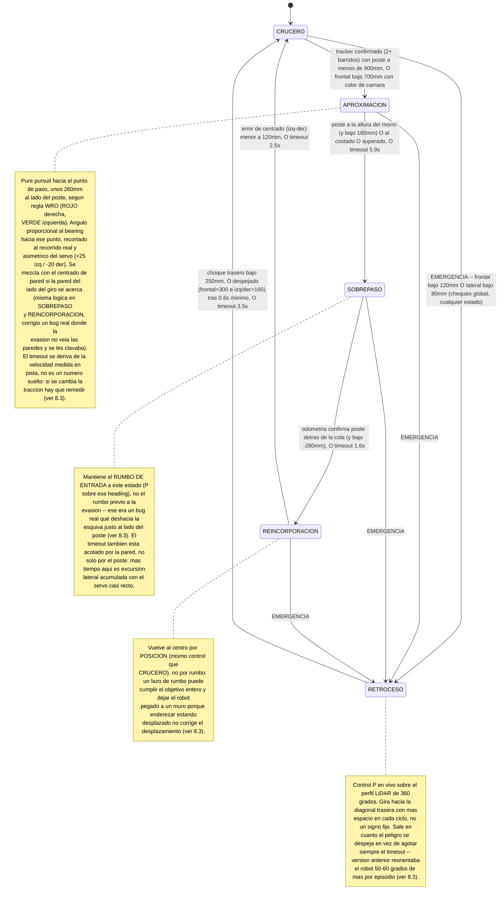
```mermaid
stateDiagram-v2
    [*] --> CRUCERO

    CRUCERO --> APROXIMACION: tracker confirmado (2+ barridos) con poste a menos de 900mm, O frontal bajo 700mm con color de camara
    APROXIMACION --> SOBREPASO: poste a la altura del morro (y bajo 180mm) O al costado O superado, O timeout 5.9s
    SOBREPASO --> REINCORPORACION: odometria confirma poste detras de la cola (y bajo -280mm), O timeout 1.6s
    REINCORPORACION --> CRUCERO: error de centrado (izq-der) menor a 120mm, O timeout 2.5s

    CRUCERO --> RETROCESO: EMERGENCIA -- frontal bajo 120mm O lateral bajo 80mm (chequeo global, cualquier estado)
    APROXIMACION --> RETROCESO: EMERGENCIA
    SOBREPASO --> RETROCESO: EMERGENCIA
    REINCORPORACION --> RETROCESO: EMERGENCIA
    RETROCESO --> CRUCERO: choque trasero bajo 250mm, O despejado (frontal>300 e izq/der>160) tras 0.6s minimo, O timeout 3.5s

    note right of APROXIMACION
        Pure pursuit hacia el punto de paso, unos 260mm
        al lado del poste, segun regla WRO (ROJO derecha,
        VERDE izquierda). Angulo proporcional al bearing
        hacia ese punto, recortado al recorrido real y
        asimetrico del servo (+25 izq / -20 der). Se
        mezcla con el centrado de pared si la pared del
        lado del giro se acerca (misma logica en SOBREPASO
        y REINCORPORACION, corrigio un bug real donde la
        evasion no veia las paredes y se les clavaba).
        El timeout se deriva de la velocidad medida en
        pista, no es un numero suelto: si se cambia la
        traccion hay que remedir (ver 8.3).
    end note

    note right of SOBREPASO
        Mantiene el RUMBO DE ENTRADA a este estado (P
        sobre ese heading), no el rumbo previo a la
        evasion -- ese era un bug real que deshacia la
        esquiva justo al lado del poste (ver 8.3). El
        timeout tambien esta acotado por la pared, no
        solo por el poste: mas tiempo aqui es excursion
        lateral acumulada con el servo casi recto.
    end note

    note right of REINCORPORACION
        Vuelve al centro por POSICION (mismo control que
        CRUCERO), no por rumbo: un lazo de rumbo puede
        cumplir el objetivo entero y dejar el robot
        pegado a un muro porque enderezar estando
        desplazado no corrige el desplazamiento (ver 8.3).
    end note

    note right of RETROCESO
        Control P en vivo sobre el perfil LiDAR de 360
        grados. Gira hacia la diagonal trasera con mas
        espacio en cada ciclo, no un signo fijo. Sale en
        cuanto el peligro se despeja en vez de agotar
        siempre el timeout -- version anterior reorientaba
        el robot 50-60 grados de mas por episodio (ver 8.3).
    end note
```

> El bloque `RETROCESO` es un chequeo de seguridad que se evalúa en **cada ciclo, sin importar el estado actual** (excepto si ya está en él), por eso el diagrama lo muestra como alcanzable desde los cuatro estados normales de la maniobra. La lógica completa vive en `src/pi3B/ronda_cerrada/navegacion.py` -- portada sin cambios a `src/pi5/ronda_cerrada/` -- como clase pura sin I/O (probada con barridos sintéticos fuera del robot); `ronda_cerrada.py` quedó como orquestador delgado con *watchdog* de percepción. El LiDAR (`src/pi3B/comun/lidar_geometria.py`) construye un perfil de distancia mínima en los 360° completos (1 grado por bin) en cada barrido; los sectores fijos (pared, frontal, diagonales traseras) son consultas sobre ese perfil, no cálculos independientes.
>
> Los timeouts de `APROXIMACION` y `SOBREPASO` no son constantes sueltas: `navegacion.py` los calcula a partir de `tracker.MM_POR_SEG_A_PWM100` (400mm/s, medido en pista — sección 8.3) y la velocidad de PWM de cada fase, con un margen de 1.3× sobre el tiempo teórico. Son **red de seguridad**, no la vía normal — la transición esperada es geométrica (por posición del tracker), y si el timeout es más corto que la física, se convierte en la ruta principal sin que nadie lo note (exactamente lo que pasaba antes de medir la velocidad real).

#### C. Sentido de Carrera — Tres Evidencias, y una que puede Corregir a las Otras

El reglamento fija que la dirección de circulación (horario o antihorario) se sortea antes de cada ronda, así que el robot no puede asumirla. Equivocarse no cuesta puntos: cuesta la ronda entera, porque el lado por el que hay que pasar cada pilar depende del sentido.

El sistema vivo (`sentido_vuelta.py`) lo resuelve con tres fuentes de distinta calidad, y las trata como tales:

1. **Las líneas de piso vistas por la cámara** (`fijar_por_camara`). Es la primera en llegar: en cuanto la cámara ve una línea de esquina, el color de la que tiene *más cerca* fija el sentido — naranja primero significa horario, azul primero antihorario. Se compromete una sola vez y no se revisa, porque a esa distancia el dato es inequívoco.

2. **El TCS3472, al frente del vehículo** (`observar_linea`). No mira el color de una línea suelta sino **el orden en que se cruza la pareja** de líneas de una misma esquina. Esa es la única evidencia absoluta del sistema: no depende del yaw del robot ni de interpretar la geometría de la pista. Por eso es la única que puede **corregir un sentido ya comprometido**, y tiene tres salvaguardas medidas en pista:
   * **Marcha atrás no cuenta.** Retroceder sobre una línea la cruza en orden inverso, o sea que afirma el sentido contrario del real.
   * **La pareja tiene que ser de la misma esquina.** Sin una ventana temporal se emparejaba la naranja de una esquina con la azul de la siguiente, y el sentido oscilaba: cinco cambios en una sola corrida.
   * **Desdecir a otra línea exige dos parejas seguidas.** Corregir a la geometría es inmediato, porque la línea es mejor evidencia; contradecir a otra lectura de línea no, porque entonces una de las dos está mal y hace falta desempate.

   Requiere calibrar el orden una sola vez con `calibrar_lineas.py`, empujando el robot una vuelta a mano en un sentido conocido. **Sin esa calibración no se inventa nada: la fuente se ignora por completo.**

3. **La asimetría de las paredes** (`SentidoPorGeometria`). El bloque interior siempre está más cerca que el muro exterior, así que comparar la distancia mínima izquierda contra la derecha da el sentido sin ver ninguna línea. Es la red de seguridad cuando la lona está sucia, hay un reflejo o un pilar tapa la línea.

La jerarquía no es arbitraria: una fuente absoluta corrige a una interpretativa, nunca al revés. Y ninguna de las tres inventa un valor cuando no tiene evidencia — se prefiere no tener dato a tener uno fabricado, porque un sentido equivocado con confianza alta es peor que no tener sentido.

### 5.4 Parámetros de Control y Proceso de Ajuste

Los valores numéricos vigentes en `ronda_abierta.py`, obtenidos empíricamente mediante prueba y error directamente en pista (sin instrumentación de *logging* de datos, por lo que el método de validación fue observacional: repetir vueltas hasta eliminar oscilación visible contra las paredes):

| Parámetro | Valor Vigente | Efecto observado al ajustarlo |
| :--- | :---: | :--- |
| `KP_LATERAL` | `0.14` | Ganancia proporcional del centrado. Valores mayores generaban zigzag (sobrecorrección) en los tramos rectos; valores menores dejaban al coche "flotando" sin corregir a tiempo antes de una curva cerrada. Unificado a `0.14` en `ronda_abierta.py` y `ronda_cerrada.py` (antes `ronda_abierta.py` tenía `0.22`, un valor no probado que quedó desincronizado). |
| `KD_ESTABILIDAD` | `0.12` | Amortiguación derivativa en la Pico 2 (sección 6.2). Compensa el sobregiro que el término proporcional introduce al salir de una curva. |
| `VELOCIDAD_CRUCERO` | `100` | Velocidad de PWM en tramo recto/curva estándar. |
| `VELOCIDAD_PARQUEO` | `60` | Velocidad reducida durante la búsqueda de la posición de estacionamiento final, priorizando precisión sobre velocidad. |
| `TIMEOUT_BUSQUEDA_PARQUEO` | `4.0 s` | Límite de seguridad: si la firma espacial de estacionamiento no coincide en 4 segundos, el sistema fuerza la detención igualmente para no exceder el tiempo de carrera reglamentario. |
| Umbral de distancia de evasión | `45 cm` | Distancia LiDAR a la que se activa la maniobra de esquiva; se eligió para dar margen de reacción mecánica sin iniciar el giro tan temprano que el coche invada el carril contrario de forma innecesaria. |
| Umbral de coincidencia de estacionamiento | `80 mm` | Tolerancia entre la firma espacial inicial y la actual (`match_firma_original`) para considerar que el coche volvió a su punto de partida. |

* **Proceso de ajuste:** El equipo itera cambiando un parámetro a la vez, corriendo 2-3 vueltas consecutivas en la pista de práctica y observando el comportamiento cualitativo (oscilación lateral, choque con paredes, retraso en la reacción a curvas), validado con métricas cuantitativas de la corrida (ver abajo).

#### Métricas de Validación de Rendimiento

Cada corrida de `ronda_abierta.py`/`ronda_cerrada.py` instancia [`registro_metricas.py`](src/pi5/ronda_curvas/registro_metricas.py) (en `ronda_nueva` ese papel lo cumple `telemetria.py`), que escribe un CSV en `logs/` con una fila por barrido de LiDAR procesado (`fase`, `estado`, `heading`, `error_lateral`, `angulo`, `velocidad`) — error lateral promedio/máximo/mediano en mm, porcentaje de ciclos con el servo saturado en su límite físico y número de eventos de emergencia (transiciones a `RETROCESO`).

Formato de salida (ejemplo ilustrativo con datos sintéticos, no una corrida real):

```
Error lateral |e|: promedio 18.4 mm, maximo 96.0 mm, mediana 12.0 mm
Ciclos con angulo saturado en el limite fisico del servo: 4/812 (0.5%)
Eventos de emergencia (entradas a RETROCESO): 1
```

Esto reemplaza la validación puramente observacional: dos corridas con el mismo `KP_LATERAL` se pueden comparar por error lateral promedio y saturación del servo en vez de una impresión subjetiva de "se vio mejor". *Nota de estado:* la herramienta se agregó a este repositorio pero todavía no se ha corrido en pista con el hardware real — los CSV de corridas reales del equipo, una vez capturados, reemplazarán este ejemplo.

---

## 6. Capa de Control de Bajo Nivel (Raspberry Pi Pico 2)

### 6.1 Firmware Embebido y Sincronización No Bloqueante

La capa de control inferior ejecuta una arquitectura síncrona no bloqueante sobre MicroPython. El núcleo del sistema utiliza un objeto `select.poll()` registrado sobre el flujo de entrada estándar (`sys.stdin`) para procesar las tramas seriales enviadas por la Raspberry Pi 3B a una frecuencia de ciclo alta sin interferir con los procesos críticos de integración inercial y generación de PWM.

### 6.2 Implementación Matemático-Inercial

Para contrarrestar los efectos dinámicos del subviraje y estabilizar el coche ante irregularidades de la pista o vibraciones estructurales del chasis de LEGO, la Pico 2 ejecuta un bucle de compensación derivativa inercial activa.

La ecuación en lazo cerrado que calcula la posición angular final del servomotor responde a:

$$\theta_{\text{servo}} = 90^\circ + \theta_{\text{objetivo}} - (\omega_z \cdot K_D)$$

Donde:

* $90^\circ$ (constante `CENTRO` en `src/pico/main.py`) representa el punto central calibrado por software para la marcha en línea recta del servomotor. Este valor se validó y corrigió en pista: el equipo probó inicialmente $180^\circ$ como centro (ver historial de versiones, sección 2.1) y lo revirtió a $90^\circ$ tras detectar desalineación física del servo con ese offset.
* $\theta_{\text{objetivo}}$ es el ángulo macro de guiado espacial solicitado dinámicamente por el script de la Raspberry Pi.
* $\omega_z$ es la velocidad angular instantánea sobre el eje de rotación vertical (Yaw), obtenida tras sustraer el offset estático de calibración: 

$$\omega_z = \text{Gyro}_{z} - \text{Offset}_{z}$$

* $K_D$ es la ganancia derivativa de amortiguación inercial calibrada en $0.12$, encargada de absorber momentos angulares bruscos en curvas.

### 6.3 Funciones Maestras de Control Físico

```python
# Funciones clave extraídas literalmente de src/pico/main.py

# Límites de giro del servo calibrados en pista
CENTRO = 90
LIMITE_DER = 70    # Máximo giro a la derecha
LIMITE_IZQ = 115   # Máximo giro a la izquierda

def mover_servo(angulo):
    # Protegemos el servo usando los límites calibrados en lugar de 0 y 180
    angulo = max(LIMITE_DER, min(LIMITE_IZQ, angulo))
    duty = int(1638 + (angulo / 180.0) * (8192 - 1638))
    servo.duty_u16(duty)

def controlar_motor(velocidad_porcentaje):
    """ Parser de puente H para el driver TB6612FNG con modulación de velocidad """
    if velocidad_porcentaje > 0:
        bin1.value(1)
        bin2.value(0)
        vel = max(0, min(100, velocidad_porcentaje))
    elif velocidad_porcentaje < 0:
        bin1.value(0)
        bin2.value(1)
        vel = max(0, min(100, abs(velocidad_porcentaje)))
    else:
        bin1.value(1)
        bin2.value(1)
        vel = 0
        
    duty_u16 = int((vel / 100.0) * 65535)
    pwmb.duty_u16(duty_u16)

```

### 6.4 Algoritmo de Lectura Serial y Control Inercial Co-Procesado

El bucle principal regula las restricciones de la geometría de dirección física y transmite ráfagas de telemetría inercial acumulada cada $50\,\text{ms}$ para el conteo predictivo de vueltas:

```python
# Calibración del offset del giroscopio al arrancar (src/pico/main.py)
# Promedia 100 muestras (~1s) para eliminar el bias estático del MEMS
giro_z_offset = 0.0
for _ in range(100):
    try:
        giro_z_offset += sensor.get_gyro_z()
    except: pass
    time.sleep(0.01)
giro_z_offset /= 100.0

# Segmento del bucle de ejecución de bajo nivel (src/pico/main.py)

while True:
    try:
        tiempo_actual = time.ticks_ms()
        dt = time.ticks_diff(tiempo_actual, ultima_lectura) / 1000.0
        ultima_lectura = tiempo_actual
        
        # Extracción y filtrado del ruido estático del giroscopio
        try:
            velocidad_z = sensor.get_gyro_z() - giro_z_offset
        except:
            velocidad_z = 0.0
            
        # Filtro de banda muerta para evitar la deriva acumulativa (Drift)
        if abs(velocidad_z) > 0.15:
            angulo_acumulado += velocidad_z * dt

        # Monitoreo serial asíncrono sin bloqueo de hilos
        if poller.poll(0):
            linea = sys.stdin.readline().strip()
            if linea:
                try:
                    partes = linea.split(',')
                    if len(partes) == 2:
                        velocidad_comandada = int(partes[0])
                        angulo_objetivo = float(partes[1])
                except:
                    pass

        # Aplicación de ley de control inercial amortiguado (Centro en 90°)
        angulo_servo = CENTRO + angulo_objetivo - (velocidad_z * KD_ESTABILIDAD)
        
        # Límites estrictos de protección mecánica del chasis Ackermann
        # (Saturación segura: LIMITE_DER = 70°, CENTRO = 90°, LIMITE_IZQ = 115°)
        angulo_servo = max(LIMITE_DER, min(LIMITE_IZQ, angulo_servo))
        mover_servo(angulo_servo)
        
        # Control dinámico de la etapa de potencia de tracción
        if velocidad_comandada == 0:
            controlar_motor(0)
        else:
            controlar_motor(velocidad_comandada)

        # Transmisión de telemetría de odometría inercial hacia la Pi 3B
        if time.ticks_diff(tiempo_actual, ultimo_envio_telemetria) > 50:
            sys.stdout.write(f"IMU:{angulo_acumulado:.2f}\n")
            ultimo_envio_telemetria = tiempo_actual

        time.sleep(0.005)
        
    except KeyboardInterrupt:
        controlar_motor(0)
        stby.value(0)
        mover_servo(CENTRO)  # Retornar a línea recta (90°) en caso de parada
        break
```

---

## 7. Geometría de Dirección y Movilidad Mecánica

### 7.1 Cinemática del Sistema de Dirección Ackermann y Calibración Real

El chasis diseñado en *BrickLink Studio* adopta de forma estricta la geometría de dirección tipo **Ackermann**. El principio fundamental de este mecanismo radica en evitar que las ruedas delanteras se deslicen lateralmente al trazar una curva, permitiendo que la rueda interior gire un ángulo mayor que la rueda exterior, ya que describe un radio de curvatura más cerrado respecto al centro instantáneo de rotación (CIR).

La ecuación cinemática que rige las restricciones geométricas de nuestro chasis LEGO se ha calibrado utilizando las mediciones físicas reales del prototipo de producción (V2):

* **Ancho de la vía ($w$):** $115\,\text{mm}$
* **Batalla / Distancia entre ejes ($l$):** $136\,\text{mm}$
* **Ancho de los neumáticos:** $36\,\text{mm}$
* **Dimensiones totales del robot:** $138\,\text{mm}$ de ancho $\times$ $242\,\text{mm}$ de largo **medidas con regla** (antes se documentaban 125 x 222 aproximados) — dentro del límite reglamentario de $300\times200\,\text{mm}$ de WRO Future Engineers 2026 con margen amplio en ambos ejes.

$$\cot(\delta_o) - \cot(\delta_i) = \frac{w}{l} = \frac{115\,\text{mm}}{136\,\text{mm}} = 0.845$$

Donde:
* $\delta_o$ es el ángulo de orientación de la rueda directriz exterior.
* $\delta_i$ es el ángulo de orientación de la rueda directriz interior.
* El factor constante de **$0.845$** es integrado directamente en la matriz de transferencia de control de la Raspberry Pi Pico 2 para ajustar dinámicamente el pulso de PWM enviado al Geekservo de dirección, garantizando giros limpios con cero subviraje o pérdida de tracción por fricción estática destructiva en las curvas de la WRO.

### 7.2 Renderizado del Chasis de Producción (V2, compartido con la V3)
A continuación se presenta el modelo CAD estructural del vehículo libre de actuadores y masa suspendida electrónica, aislando los componentes cinemáticos esenciales para la validación de la rigidez torsional del chasis. El archivo fuente reproducible (`.io` de BrickLink Studio) y el listado completo de las 83 piezas Technic están en [`models/Chasis-LEGO-V2/`](models/Chasis-LEGO-V2/README.md):

<p align="center">
  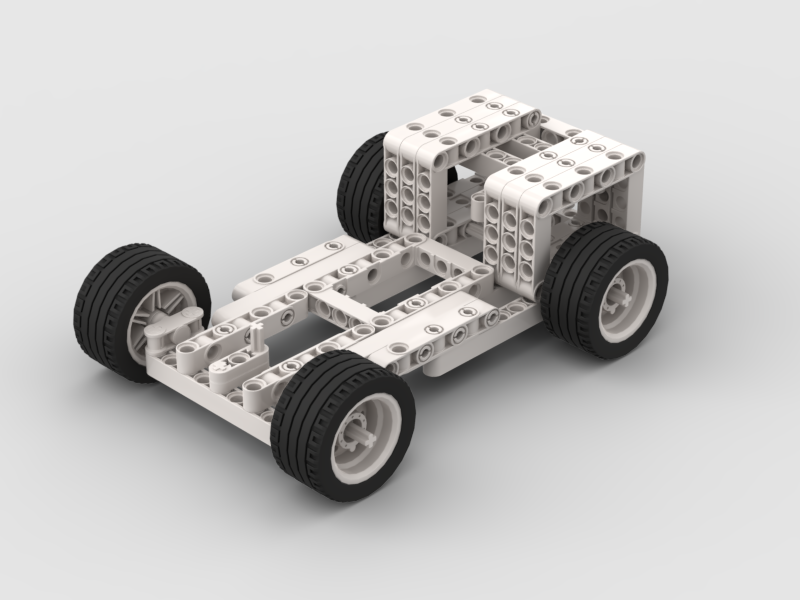
</p>

### 7.3 Límites Angulares Calibrados y Protección Mecánica

Para salvaguardar la integridad de las articulaciones, uniones y vigas de LEGO contra esfuerzos de torsión excesivos generados por el servomotor de alta velocidad, se implementaron límites de saturación estricta por software en `src/pico/main.py`.

El rango operativo del actuador Geekservo se restringe a los siguientes umbrales mapeados en el firmware de la Raspberry Pi Pico 2:

| Ángulo Límite Derecho (Giro Máximo) | Centro Geométrico Calibrado | Ángulo Límite Izquierdo (Giro Máximo) |
| :---: | :---: | :---: |
| **70°** (`LIMITE_DER`) | **90°** (`CENTRO`) | **115°** (`LIMITE_IZQ`) |
| *Restricción estricta ante comandos de giro a la derecha (−20° desde el centro).* | *Alineación de marcha lineal en pista.* | *Restricción estricta ante comandos de giro a la izquierda (+25° desde el centro).* |

> **Por qué el rango no es simétrico:** a diferencia de un servo genérico, el `base_servo` y las manguetas Ackermann del chasis LEGO tienen una holgura mecánica ligeramente distinta a cada lado por tolerancias de ensamblaje entre piezas. En vez de forzar un rango simétrico en software (que arriesgaría forzar la articulación física contra su tope mecánico de un lado), el equipo calibró cada límite de forma independiente probando el giro máximo real del prototipo, documentado fotográficamente abajo.

#### Evidencia Fotográfica de Calibración (Prueba de Giro Máximo)

| Ángulo Máximo Derecho (70°) | Ángulo Máximo Izquierdo (115°) |
| :---: | :---: |
|  |  |

> **Ventaja mecánica de la modularidad LEGO:** La sustitución del filamento impreso en 3D por vigas de fricción LEGO redujo el coeficiente de masa inercial global, consolidando un peso final competitivo de **613 gramos exactos** en la V2 (**720 g** en la V3, con la Pi 5 y los sensores nuevos) que disminuye drásticamente el subviraje físico provocado por la fuerza centrípeta en las esquinas de la pista de la WRO.

### 7.4 Análisis de Ingeniería: Cálculo Matemático de Torque y Fuerza de Tracción

Para validar científicamente que nuestro motor de tracción acoplado al driver **TB6612FNG** es capaz de romper la fricción estática del neumático sin sobrecalentar las etapas de potencia ni patinar en pista, se realizó el modelo matemático de torque dinámico basado en las mediciones reales del vehículo:

#### A. Variables Físicas del Prototipo (V3):

> **Masa remedida el 06-09-2026 con báscula digital ($d=1\,\text{g}$).** La V3 pesa **720 g** contra los $613\,\text{g}$ de la V2: **107 g más, un $17.5\,\%$**, que es lo que suman la Raspberry Pi 5 con su carcasa, el mástil del LiDAR y el ultrasonido trasero. El chasis y la geometría Ackermann no cambiaron, así que solo hay que rehacer el balance de carga.
>
* **Fuerza de Gravedad ($g$):** $9.81\,\text{m/s}^2$
* **Radio del neumático de tracción ($r$):** $18\,\text{mm} = 0.018\,\text{m}$ (Diámetro de $36\,\text{mm}$)
* **Coeficiente de fricción estática caucho-pista ($\mu_e$):** $\approx 0.85$ (Escenario de máxima adherencia en curvas)

#### Masa total del vehículo

<p align="center">
  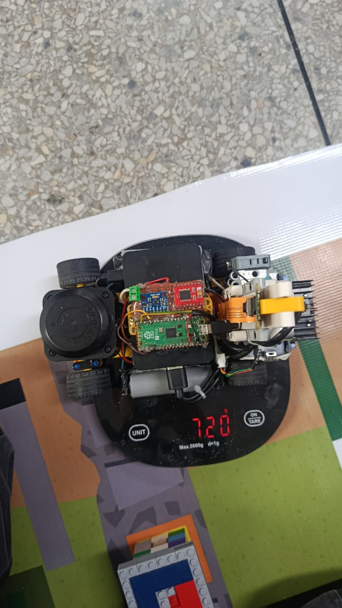
</p>

* **Masa total del vehículo ($m$):** $720\,\text{g} = 0.720\,\text{kg}$  <sub>(V2: $613\,\text{g}$)</sub>

#### B. Cálculo de la Fuerza Normal y Fricción Estática Máxima:
La fuerza de fricción máxima ($F_f$) que el motor debe vencer para mover el vehículo desde el reposo total en el peor escenario (fricción estática máxima) es:

$$F_N = m \cdot g = 0.720\,\text{kg} \cdot 9.81\,\text{m/s}^2 = 7.063\,\text{N}$$

$$F_f = F_N \cdot \mu_e = 7.063\,\text{N} \cdot 0.85 = 6.004\,\text{N}$$

#### C. Torque Mínimo Requerido en el Eje de las Ruedas:
Para contrarrestar esta fuerza en el radio del neumático ($r$), el torque mínimo de arranque ($T_{\text{min}}$) en el eje es:

$$T_{\text{min}} = F_f \cdot r = 6.004\,\text{N} \cdot 0.018\,\text{m} = 0.108\,\text{N}\cdot\text{m} = \mathbf{1.102\,\text{kg}\cdot\text{cm}}$$

#### D. Justificación de la Selección del Motor (Margen de Seguridad):
Nuestro motorreductor DC seleccionado entrega un **Torque de Bloqueo (Stall Torque) de $2.4\,\text{kg}\cdot\text{cm}$** a su voltaje operativo nominal de $7.4\,\text{V}$. 

Realizando el análisis de balance de carga:

$$\text{Margen de Torque} = \frac{T_{\text{motor}}}{T_{\text{min}}} = \frac{2.4\,\text{kg}\cdot\text{cm}}{1.102\,\text{kg}\cdot\text{cm}} = \mathbf{2.18}$$

* **Conclusión de Ingeniería:** El sistema de transmisión posee un **factor de seguridad de 2.18 veces el torque mínimo necesario**. Esto significa que el motor opera al **$45.9\%$ de su capacidad máxima** durante el arranque más agresivo en pista, garantizando una aceleración explosiva (cero subviraje mecánico por falta de par), protegiendo las celdas de las baterías 21700 contra picos severos de descarga y evitando que el puente H trabaje en su zona de fatiga térmica.

---

### 7.5 Envolvente de Giro Medida con Marcadores

Los radios de giro no se calcularon: se **dibujaron**. Se montaron cuatro marcadores en las cuatro esquinas del vehiculo, sobre vigas Technic que sobresalen del chasis, y se le hizo girar con el volante a tope sobre papel fijado a la pista. Cada esquina trazo su propia circunferencia, y esas cuatro circunferencias son la envolvente real del vehiculo girando.

| El aparejo de marcadores | El trazado sobre la pista |
| :---: | :---: |
| 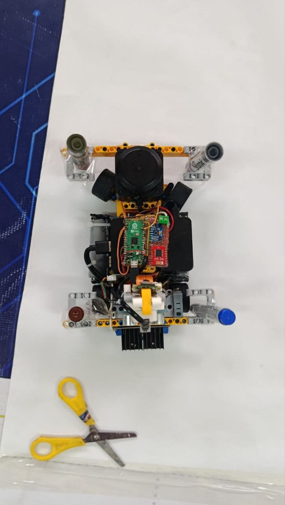 | 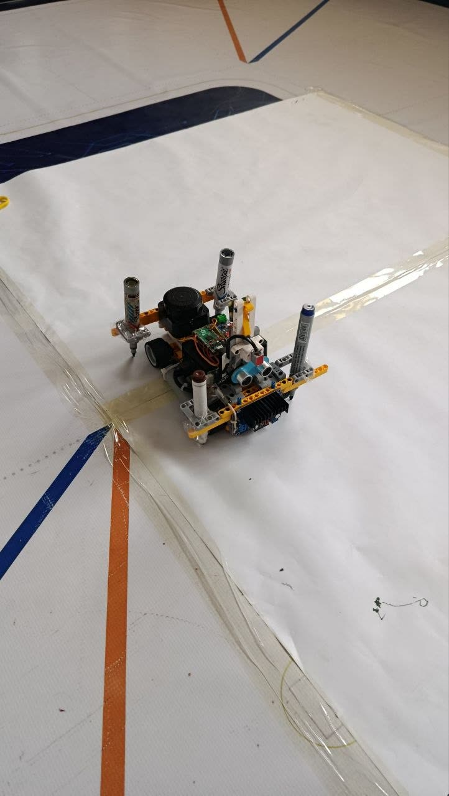 |

Midiendo cada circunferencia sobre el papel salen estos valores. La anotacion original esta en diametro; aqui se dan las dos cifras:

| Giro a la DERECHA | Diametro | Radio | Giro a la IZQUIERDA | Diametro | Radio |
| :--- | :---: | :---: | :--- | :---: | :---: |
| Esquina exterior | 700 mm | **350 mm** | Esquina exterior | 740 mm | **370 mm** |
| | 615 mm | 307,5 mm | | 580 mm | 290 mm |
| | 477 mm | 238,5 mm | | 510 mm | 255 mm |
| Esquina interior | 360 mm | **180 mm** | Esquina interior | 390 mm | **195 mm** |

| El trazado a la derecha | El trazado a la izquierda |
| :---: | :---: |
| 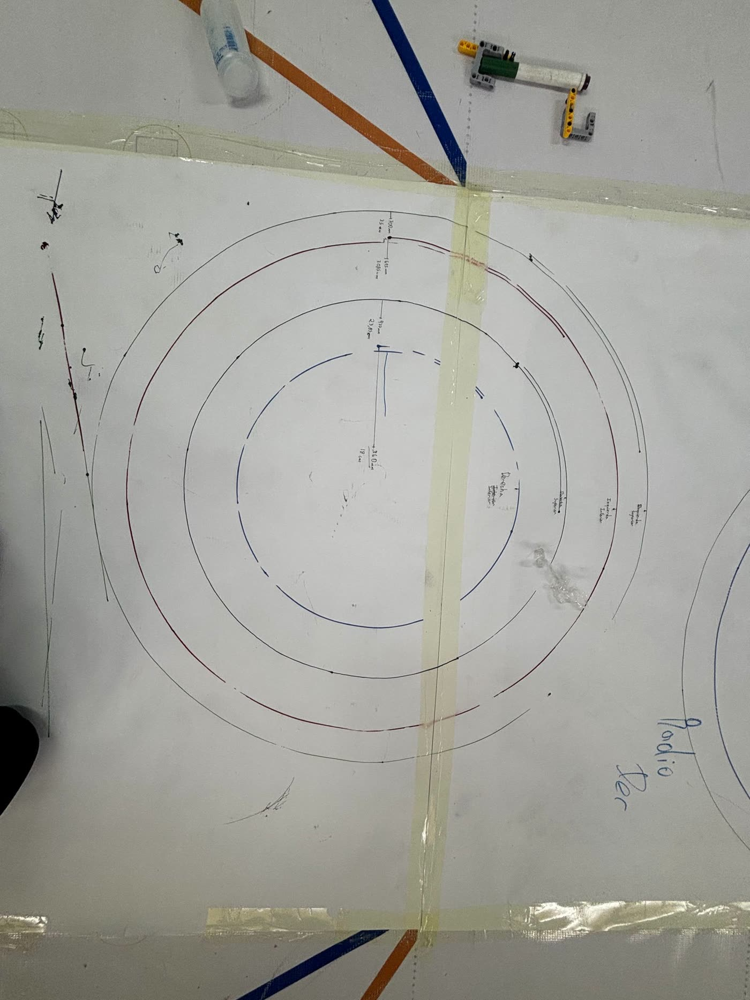 | 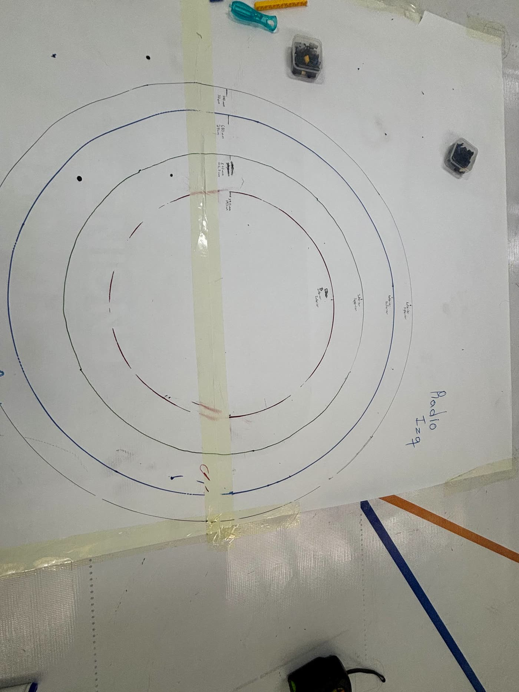 |

**La medida se valida sola.** La banda que barre el vehiculo -- la diferencia entre la circunferencia exterior y la interior -- sale de **170 mm girando a la derecha y 175 mm a la izquierda**. El chasis mide 138 mm de ancho, asi que esa banda es el cuerpo mas el voladizo de las esquinas al girar. Que las dos bandas coincidan entre si y con la anchura fisica es lo que descarta que el trazado estuviera descentrado o que el volante no llegara al tope.

**Y deja una pregunta abierta, que conviene resolver antes de competir.** El control modela los dos sentidos como practicamente simetricos: 242,5 mm a la izquierda contra 243,8 a la derecha. El trazado dice otra cosa: **el giro a la izquierda es unos 20 mm mas amplio que el de la derecha**, y lo dice en las cuatro circunferencias a la vez, asi que no es ruido de medida. Importa porque la maniobra de estacionamiento calcula sus arcos a partir de esos radios, y ahi 20 mm son la diferencia entre entrar limpio y rozar el muro magenta.

---

## 8. Análisis de Riesgos y Registro de Iteraciones

Consolidando los puntos de fallo detectados a lo largo de las secciones anteriores, este es el registro de riesgos identificados por el equipo, su causa raíz y la mitigación implementada. Cada fila corresponde a un problema real observado en pista o en banco de pruebas, no a un riesgo hipotético:

| # | Riesgo Identificado | Causa Raíz | Mitigación Implementada | Evidencia |
| :---: | :--- | :--- | :--- | :--- |
| 1 | Descalibración de la cámara por vibración mecánica | Chasis monocasco V1 impreso en 3D transmitía vibración de alta frecuencia del motor directo al sensor óptico | Migración a chasis LEGO Technic (V2), que absorbe vibración por flexión elástica de las vigas | Sección 3.1 — Cuadro comparativo V1/V2 |
| 2 | Rotura del soporte de cámara por impacto frontal | Centro de masa V1 dejaba el sensor expuesto al perímetro de la pista | Rediseño del soporte óptico retrasado respecto al parachoques en V2 | Sección 3.4 |
| 3 | *Brownouts* (reinicio de la Raspberry Pi 3B) por picos de corriente del motor | Regulador único lineal compartía línea de alimentación entre lógica y potencia | Desacoplamiento por etapas: XL4016 dedicado (8 A) solo para la línea lógica, aislado de la línea de tracción directa a batería | Sección 4.1, 4.4 — margen de seguridad del 73.25% |
| 4 | Pérdida de lectura del LiDAR en una pared durante un giro cerrado | Ángulo de barrido del RPLiDAR pierde temporalmente una de las dos paredes laterales al entrar sesgado en curva | Estado "Inercial": el software sostiene el último valor válido conocido de esa pared en vez de saltar a un valor fijo arbitrario (2000mm) | Sección 5.3-A, 8.2 |
| 5 | Falsos positivos de color por iluminación variable entre boxes y pista oficial | Los umbrales HSV se calibran en interiores (boxes) con luz artificial distinta a la luz de la pista de competencia | Herramienta `calibrar_hsv.py` dedicada para recalibrar en vivo antes de cada ronda, más limpieza morfológica (`MORPH_OPEN`/`MORPH_CLOSE`) para eliminar ruido lumínico | Sección 4.2 — Método de Calibración |
| 6 | Pérdida de comunicación UART entre Pi 3B y Pico 2 durante la carrera | Desconexión física del cable USB o saturación del buffer serial | *Fail-safe* por software: si no llega una trama nueva en >500 ms, el sistema fuerza detención inmediata | Diagrama de arquitectura de software (sección 5) |
| 7 | Desalineación del centro de dirección tras un cambio de calibración | Se probó un centro de servo de 180° que no correspondía a la geometría física real del `base_servo` | Reversión a 90° tras validación en pista, documentado en el historial de commits en vez de sobrescribirlo silenciosamente | Sección 2.1, 6.2, 7.3 |
| 8 | Falta de métricas cuantitativas de desempeño (tiempos de vuelta, error lateral histórico) | El ajuste de `KP_LATERAL`/`KD_ESTABILIDAD` se validaba solo de forma observacional en pista | Se instrumentó `comun/registro_metricas.py` (log CSV por corrida, resumible en métricas agregadas: error lateral, saturación del servo, eventos de emergencia). *Pendiente de validar con corridas reales en pista, ver la sección 5.4* | Sección 5.4 |

### 8.1 Interacción Entre Subsistemas (Pensamiento Sistémico)

El vehículo no es la suma de partes independientes: una decisión en un subsistema restringe directamente a los demás. Ejemplos concretos de esa interdependencia documentados en este repositorio:

* **Masa (mecánica) → Torque requerido (potencia) → Selección de motor:** reducir la masa a 613 g en la V2 (sección 3.4) bajó el torque mínimo de arranque a 0.938 kg·cm, lo que permitió mantener el mismo motorreductor en vez de sobredimensionar la tracción. La V3 pesa 720 g y ese margen bajó de 2.55× a **2.18×** (sección 7.4): sigue holgado, pero es el precio medido de subir a la Pi 5 y añadir el mástil y el ultrasonido.
* **Frecuencia de PWM del motor (potencia) → Ruido en el bus I2C (sensores):** la conmutación del puente H en la línea de tracción fue la razón por la que se separaron las líneas de alimentación (XL1509 para dirección, XL4016 para lógica) — sin ese aislamiento, el ruido inductivo del servo se filtraría hacia el MPU6050 y el LiDAR.
* **Latencia de cómputo de la Pi 3B (software) → Estabilidad del lazo de control (bajo nivel):** por eso la generación de PWM y la integración del giroscopio se delegan a la Pico 2 en tiempo real, y la Pi 3B solo envía consignas de alto nivel (`velocidad, ángulo`) por UART — así el *jitter* del sistema operativo Linux nunca llega a tocar el actuador directamente.

#### Diagrama de Interacción Entre Subsistemas (`Close2_round.py`)

Tres hilos concurrentes (`threading`) más el firmware de la Pico comparten estado global para tomar una única decisión de control por ciclo:

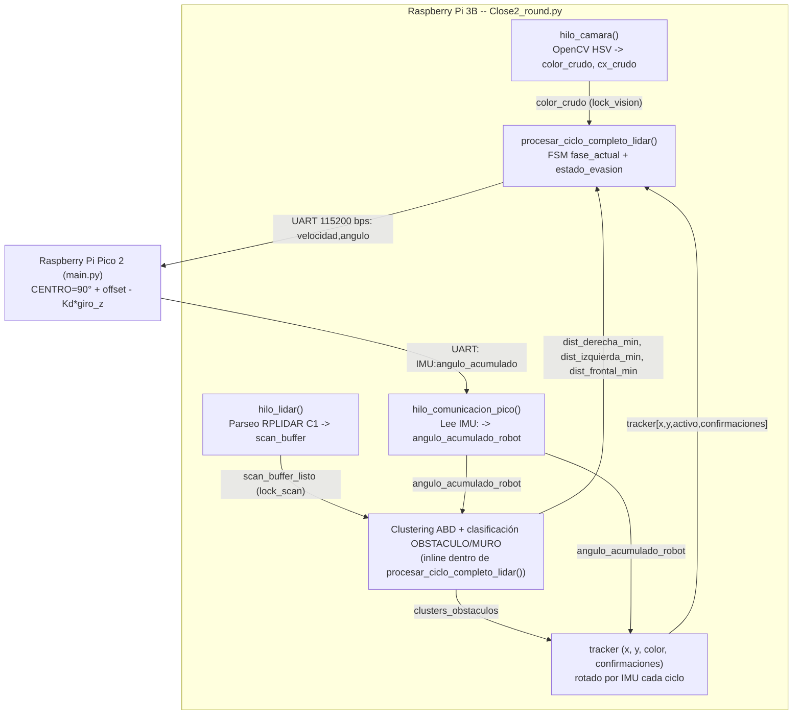
```mermaid
flowchart TD
    subgraph PI3B["Raspberry Pi 3B -- Close2_round.py"]
        CAM["hilo_camara()\nOpenCV HSV -> color_crudo, cx_crudo"]
        LID["hilo_lidar()\nParseo RPLIDAR C1 -> scan_buffer"]
        PICO_IN["hilo_comunicacion_pico()\nLee IMU: -> angulo_acumulado_robot"]
        SCAN["Clustering ABD + clasificación OBSTACULO/MURO\n(inline dentro de procesar_ciclo_completo_lidar())"]
        TRACK["tracker (x, y, color, confirmaciones)\nrotado por IMU cada ciclo"]
        FSM["procesar_ciclo_completo_lidar()\nFSM fase_actual + estado_evasion"]
    end

    CAM -- "color_crudo (lock_vision)" --> FSM
    LID -- "scan_buffer_listo (lock_scan)" --> SCAN
    PICO_IN -- "angulo_acumulado_robot" --> SCAN
    SCAN -- "clusters_obstaculos" --> TRACK
    PICO_IN -- "angulo_acumulado_robot" --> TRACK
    TRACK -- "tracker[x,y,activo,confirmaciones]" --> FSM
    SCAN -- "dist_derecha_min, dist_izquierda_min, dist_frontal_min" --> FSM

    FSM -- "UART 115200 bps: velocidad,angulo" --> PICO["Raspberry Pi Pico 2 (main.py)\nCENTRO=90° + offset - Kd*giro_z"]
    PICO -- "UART: IMU:angulo_acumulado" --> PICO_IN
```

> Este diagrama expone por qué el bug #3 de la sección 8.2 era invisible sin instrumentación: `tracker["x"]` viajaba correctamente hasta el bloque `FSM`, pero el cálculo del ángulo simplemente no lo leía -- el dato existía en el sistema, solo no estaba conectado al punto de decisión correcto.

### 8.2 Caso de Estudio: Depuración de la Ronda Cerrada con Evidencia de Pista (`Close2_round.py`)

Durante el desarrollo activo de la Ronda Cerrada, el equipo reportó que el robot "detecta el poste pero esquiva mal". En vez de ajustar parámetros a ciegas, se instrumentó el sistema para capturar evidencia real (video de la corrida + log de consola con `python3 -u Close2_round.py 2>&1 | tee run_log.txt`) y se diagnosticó cada síntoma contra las líneas exactas de log. Este es el registro de los hallazgos, en el orden en que se corrigieron:

| # | Síntoma Reportado | Evidencia (log/código) | Causa Raíz | Corrección |
| :---: | :--- | :--- | :--- | :--- |
| 1 | El robot evade al lado contrario al reglamentario | `EVADIR_POR_IZQUIERDA = (color_det == "ROJO")` | Mapeo de color invertido: la regla WRO es Rojo→derecha, Verde→izquierda, pero el código asignaba izquierda al rojo | `EVADIR_POR_IZQUIERDA = (color_det == "VERDE")` |
| 2 | Detección de color inconsistente con la calibración en laptop | `cv2.cvtColor(frame, cv2.COLOR_RGB2HSV)` en el robot vs. `COLOR_BGR2HSV` en `calibrar_hsv.py` | Picamera2 con formato `"RGB888"` en realidad entrega los bytes en orden BGR (comportamiento documentado de la librería) | Unificado a `COLOR_BGR2HSV` en ambos |
| 3 | Giro "a ciegas", sin importar la posición real del obstáculo | `angulo_objetivo_crudo = 28.0 if EVADIR_POR_IZQUIERDA else -28.0` (ángulo fijo); `KP_EVASION_LATERAL` y `MAX_ANGULO_EVASION` definidas pero sin uso en ningún lado | El tracker LiDAR (clustering ABD + corrección IMU) sí calculaba `tracker["x"]` (offset lateral real, mm) pero nunca se conectó al cálculo del ángulo | Control proporcional: `angulo = signo_evasion * ANGULO_BASE + tracker["x"] * KP_EVASION_LATERAL` |
| 4 | El robot "manda la señal de evadir de una vez", sin confirmar distancia | `if (trk_confirmado and frontal < 600) or frontal < 400 or tiempo_detectado > 0.3` | El *timeout* de 0.3s ganaba casi siempre antes que la confirmación real de distancia LiDAR | Timeout subido a `TIMEOUT_DETECTADO = 1.2` (queda como red de seguridad, no como camino normal) |
| 5 | Cascada de emergencias tras esquivar un pilar (log real: `Error heading=68.1 deg`) | `RECENTRANDO` se rendía por timeout (1.5s) sin haber corregido el rumbo, y el robot volvía a `CARRERA` desalineado, disparando `EMERGENCIA COLISION INMINENTE` de inmediato | El control proporcional de `RECENTRANDO` estaba capado a ±25° y no alcanzaba a converger en errores de rumbo grandes dentro del tiempo asignado | `TIMEOUT_RECENTRANDO` subido a 3.0s y límite de giro igualado a `MAX_ANGULO_EVASION` (32°) |
| 6 | El robot frenaba de más justo durante la maniobra de evasión | `velocidad = max(VELOCIDAD_MIN_EN_FRENADO, int(velocidad_base * factor_frenado))` aplicado en todos los estados | `factor_frenado` se aplicaba dos veces en `DETECTADO` (frenado al cuadrado) y en `ESQUIVANDO`/`PASANDO`/`RECENTRANDO` frenaba según la distancia al propio poste que se estaba evadiendo (sector frontal ensanchado a propósito durante la maniobra) | `factor_frenado` restringido exclusivamente al estado `CARRERA` |
| 7 | Crash de `GPIO.cleanup()` al detener el script con doble Ctrl+C | `lgpio.error: 'unknown handle'` en el traceback | `apagar_sistema()` se reejecutaba sobre un handle GPIO ya cerrado | Guardia de reentrada (`_apagando_en_curso`) + `try/except` alrededor de `GPIO.cleanup()` |

> **Nota metodológica:** los hallazgos #1, #2, #4, #6 y #7 se identificaron por lectura de código y razonamiento sobre la convención de signos del sistema (verificada de forma cruzada contra `Open_round.py` y `src/pico/main.py`). El hallazgo #5 se identificó directamente de una línea de log real de una corrida en pista.

**Validación en pista con paredes reales:** tras aplicar los fixes, se corrió el mismo protocolo (video + `python3 -u Close2_round.py 2>&1 | tee run_log.txt`) en un circuito con bordes físicos. El log mostró 3 evasiones completas de postes rojos, todas con el lado de evasión correcto (`Evadir x DERECHA`) y la transición `DETECTADO -> ESQUIVANDO` siempre por distancia real confirmada por el LiDAR (nunca por el timeout de seguridad). El punto crítico —`RECENTRANDO`— convergió dentro del margen las 3 veces (`Error heading` de 3.9°, 3.9° y 3.2°, todos bajo el umbral de 4°), frente al fallo de 68.1° registrado antes del fix. Las dos emergencias de colisión que sí aparecieron se resolvieron limpio vía `RETROCEDIENDO -> FORZANDO_GIRO` sin entrar en el ciclo repetitivo observado en la corrida anterior.

**Refactor de modularidad:** posteriormente, `Close2_round.py` (que concentraba cámara + LiDAR + tracker + FSM en ~1100 líneas) se dividió en `vision.py`, `lidar.py` y `tracker.py` por responsabilidad (ver sección 8.1). Durante esa limpieza se detectaron y archivaron en `src/pi3B/ronda_cerrada/legacy/` dos copias obsoletas de la Ronda Cerrada (`Close_round.py` y una iteración experimental) que **todavía tenían la regla de color invertida** — y se descubrió que `controlador_inicio.py` apuntaba por error a esa copia rota en vez de a `Close2_round.py`, ya corregido.

### 8.3 Caso de Estudio: Reactivación de la Ronda Cerrada Modular con Evidencia Cuantitativa (2026-08-27)

Tras el refactor de modularidad de la sección 8.1, `src/pi3B/ronda_cerrada/` (clustering LiDAR por ABD, fusión con centroide, FSM sin I/O) nunca se desplegó en pista: la Raspberry seguía corriendo un monolito de reemplazo (`prueba/reto_obstaculos_v2.py`, ~1000 líneas) que había perdido el clustering, la fusión por posición y el parqueo. El equipo reportó "un completo fracaso" con ese monolito. En vez de seguir depurándolo, esta sesión partió de una pregunta distinta: **¿por qué se abandonó la pila modular, si ya estaba probada?**

La metodología fue la misma que en la sección 8.2 —evidencia real contra hipótesis, no ajuste a ciegas— pero instrumentada con más rigor: cada corrida se grabó con una cámara cenital externa a la pista (no la de a bordo) para correlacionar la telemetría con lo que el robot hacía físicamente, y `registro_metricas.py` se extendió para guardar percepción cruda por ciclo (`frontal`, `izquierda`, `derecha`, `trasera`, `color_cam`, estado del tracker) además del error ya derivado, porque un mismo `error_lateral` puede salir de causas que piden arreglos opuestos y sin los datos crudos no hay forma de distinguirlas.

| # | Síntoma / Hallazgo | Evidencia | Causa Raíz | Corrección |
| :---: | :--- | :--- | :--- | :--- |
| 1 | La IMU de la pila modular estaba muerta — `heading()` devolvía siempre `0.0` | `EnlacePico._hilo_lectura` hacía `linea.split(":")[1]` sobre `"IMU:-8593.44,COLOR:PISTA"`, que da `"-8593.44,COLOR"` y hace fallar `float()` dentro de un `except` mudo | Al flashear el firmware con sensor de color, la trama pasó de `"IMU:<grados>"` a `"IMU:<grados>,COLOR:<nombre>"` y el parser no se actualizó | Recortar por la coma antes de partir por `":"` (`c84f387`) |
| 2 | La cámara veía la pista de cabeza | Captura de un frame crudo sin rotar: los pilares aparecían colgando del techo, con el piso arriba | El módulo de cámara está montado invertido en el chasis; `camara_driver.py` entregaba el frame tal cual salía de `picamera2` | Rotar 180° en la capa de adquisición (`268c633`) — de paso corrige que el filtro `cy < 180` de `vision.py` se invertía: con el piso arriba, el centroide del poste bajaba al acercarse, perdiendo la detección en el momento crítico |
| 3 | El comando de dirección llegó a pedir **+107°/-78°** con el servo real en -20/+25 | CSV de la corrida 2: `err=-1456mm → ang=-30.6°`, luego `err=-1012mm → ang=-42.6°` (el error cae 31% y el comando sube) | `_centrado_paredes` devolvía `(izq-der)*KP_LATERAL` sin acotar — único cálculo de ángulo del módulo sin recorte. En las esquinas el pasillo se abre a >1400mm, pidiendo ~200° de servo; el *rate limiter* de 6°/ciclo rampaba hacia ese objetivo imposible (*windup*) | Recortar al recorrido real y asimétrico del servo en `_centrado_paredes` y en la salida común tras el *rate limiter* (`ad74c17`) — verificado reprocesando el CSV: comandos fuera de rango 97→0, servo apuntando al lado contrario 2.79s→1.28s |
| 4 | Las transiciones de evasión saltaban casi siempre por `timeout`, nunca por geometría | 4 de 5 transiciones de la corrida 3 fueron `\| timeout` | `TIMEOUT_APROXIMACION=1.5s` y `TIMEOUT_SOBREPASO=1.2s` estaban calibrados para una velocidad que el robot no tenía — documentados como red de seguridad, funcionaban como ruta principal | Derivar los timeouts de la velocidad real medida en cada fase en vez de un número suelto (`e78884f`, refinado en `12ca0f1` tras medir la curva PWM→velocidad) |
| 5 | Alimentación: la Raspberry estaba limitada **en reposo** | `vcgencmd get_throttled` → `0x50005` (bits de bajo voltaje activo) | El regulador XL4015/4016 entregaba 4.9V en bornes; bajo la caída de carga la Pi veía menos de los ~4.65V del umbral de detección | Reajuste del trimpot a 5.132V (hardware, sin commit de código) — verificado con reinicio limpio: `0x50000`, tasa del lazo de control 8.6→10.1Hz |
| 6 | Tras la esquiva, el robot se metía de vuelta contra el mismo poste | Corrida 3, ciclo a ciclo: `t=1.54 ang=-5.4 trk_x=-215` (progresando) → `t=2.04 ang=+21.3 trk_x=-272` (servo al tope contrario) → `t=2.44 trk_x=-195` (el poste vuelve al centro) | `SOBREPASO` enderezaba hacia `_heading_base`, el rumbo **anterior** a la evasión — deshacía el giro de esquiva justo a la altura del poste | `SOBREPASO` mantiene el rumbo con el que entró a ese estado, no el previo a la evasión (`cb4f710`) |
| 7 | Tras rebasar el poste, el robot terminaba pegado a un muro sin haber chocado de frente | Corrida 4: mediana de `izquierda` cae de 561mm en `APROXIMACION` a 310mm en `SOBREPASO` (mínimo 80mm); `derecha` nunca bajó de 257mm — siempre el mismo lado. 3 de 6 emergencias fueron laterales con el frente despejado (una a 1032mm) | `REINCORPORACION` anulaba el error de **rumbo**, que no dice nada de la posición del robot en el pasillo: se puede cumplir el objetivo entero y acabar contra un muro, porque enderezar estando desplazado no corrige el desplazamiento | `REINCORPORACION` vuelve al centro con el mismo control de posición que `CRUCERO` (`izquierda-derecha`), que se anula solo al llegar al eje y no puede sobrepasar (`cb4f710`) |
| 8 | El retroceso de emergencia reorientaba el robot 50-60° por episodio | Corrida 4, 6 episodios de `RETROCESO`: todos de 3.49s exactos (el timeout completo), todos saliendo por `"tiempo maximo"`; el frente ya estaba despejado 1.5-2.4s antes de que el estado terminara | `_est_retroceso` solo salía por obstáculo trasero o timeout, sin comprobar si el peligro ya se había resuelto — 3.5s de servo puesto es mucha rotación de sobra | Salir en cuanto frontal y laterales superan un margen más holgado que el de entrada, con un mínimo de 0.6s (`9e857da`) — rotación acumulada 324°→162°, tiempo en retroceso 41%→4% en la corrida siguiente |
| 9 | El modelo de velocidad del tracker sobreestimaba y rompía la asociación con el LiDAR | `tracker.MM_POR_SEG_A_PWM100 = 900.0`, con el propio comentario admitiendo que era una suposición sin medir | Medido en pista por odometría LiDAR (PWM 40→158mm/s, 70→285mm/s, 90→358mm/s; ajuste `v=4.02·pwm-1.0`, validado cruzado con la velocidad de crucero real de la corrida 3, 220 vs 215mm/s): el valor real es ~400, no 900 | `MM_POR_SEG_A_PWM100 = 400.0` (`12ca0f1`) — con 900 el error de predicción acumulaba ~20mm/ciclo, saliendo de `UMBRAL_ASOCIACION` (250mm) en poco más de un segundo (los `"timeout de prediccion"` del log) |
| 10 | Al alargar `SOBREPASO` para que coincidiera con la velocidad real, el robot volvió a acercarse a la pared (84mm, a 4mm del umbral de emergencia) | Corrida 7, con el servo casi recto todo el tramo: `der` cae monótono de 366mm a 84mm durante los 2.9s de `SOBREPASO` (81mm/s de cierre lateral sostenido) | El timeout de `SOBREPASO` se recalculó correctamente respecto al poste, pero en este estado el rumbo mantenido apunta ligeramente hacia la pared — el límite real no es el poste, es la pared | `DIST_SOBREPASO_MM` de 350mm a 200mm (`e5999af`) — predicción con el modelo de cierre lateral: salida a 236mm, medido 232mm (2% de error) |

> **Nota metodológica:** todos los hallazgos de esta tabla se identificaron leyendo `registro_metricas.py` de cada corrida (nunca por observación cualitativa de "se ve raro"), y cada corrección se validó reprocesando el CSV de la corrida anterior con la lógica nueva antes de volver a probar en pista — el hallazgo #10 incluso se predijo numéricamente (236mm) y se confirmó dentro del 2% en la corrida siguiente. El hallazgo #5 (alimentación) es la excepción: no es un bug de software, y sin él ninguno de los arreglos de código se habría podido medir con datos limpios (la tasa del lazo de control estaba degradada por el mismo *brownout*).

**Progresión medida, corrida a corrida** (mismo montaje: un pilar rojo, robot en posición de arranque):

| Corrida | Cambio aplicado | Emergencias | % tiempo en `RETROCESO` | % tiempo en `CRUCERO` | Pared mínima |
| :---: | :--- | :---: | :---: | :---: | :---: |
| 2 | (instrumentación) | 1 | 10% | 77% | 106mm |
| 3 | Windup + alimentación | 2 | 15% | 66% | 112mm |
| 4 | Timeouts por física | 6 | 42% | 13% | 69mm |
| 5 | Salida del retroceso | 1 | 4% | 66% | 100mm |
| 6 | Trayectoria por posición | **0** | **0%** | 76% | 232mm |
| 7 | Velocidad medida (tracker) | 0 | 0% | 70% | 84mm |
| 8 | `SOBREPASO` acortado | **0** | **0%** | **79%** | 150mm |

La corrida 4 es peor que la 3 en casi todas las columnas, y eso es información, no ruido: al alargar los timeouts, la evasión por fin llegaba a completarse y quedó al descubierto el fallo de trayectoria (#7) que hasta entonces estaba tapado por transiciones que nunca llegaban a ese punto. Lo mismo entre 6 y 7: corregir la velocidad del tracker alargó `SOBREPASO` de 2.1 a 2.8s y destapó el hallazgo #10. Cada arreglo hizo visible el siguiente — es el patrón esperable al depurar una cadena de estados acoplados, no una regresión.

**Video de las corridas 6-8** (cámara cenital, recortado a la ventana de acción): [`video/video-drafts/2026-08-27_S3_corrida6.mp4`](video/video-drafts/2026-08-27_S3_corrida6.mp4), [`_corrida7.mp4`](video/video-drafts/2026-08-27_S3_corrida7.mp4), [`_corrida8.mp4`](video/video-drafts/2026-08-27_S3_corrida8.mp4) — índice completo en [`video/video.md`](video/video.md).

**Estado al cierre de la sesión:** las tres últimas corridas terminaron sin una sola emergencia, con el robot detectando el pilar rojo, esquivando por la derecha (regla WRO), rebasándolo y reincorporándose al carril de forma repetible. Quedan pendientes, en orden de prioridad:

* **Fail-safe de pérdida de comunicación Pi↔Pico (sección 5, diagrama de arquitectura).** Esta auditoría descubrió que faltaba. El código se cerró después para `ronda_nueva`: watchdog autónomo de 500 ms en la Pico y handshake `WD:OK/STOP` en la Pi. El firmware ya se cargó y respondió en 465 ms al cortar el heartbeat `0,0`; queda pendiente validar una desconexión física con las ruedas levantadas.
* La maniobra de estacionamiento en paralelo (sección 13 del reglamento — nunca ejercitada, ver limitación en la sección 5.3-C sobre por qué el sentido de carrera no la bloquea).
* Validar la evasión por la izquierda con el pilar verde (toda la sesión se corrió con rojo para aislar variables).
* El apareo color↔cluster cuando hay dos postes casi equidistantes en el mismo frame (`_intentar_capturar_poste` empareja por "cluster más cercano" y "blob de mayor área" con criterios independientes, riesgo de asignar el color equivocado a la posición equivocada).

### 8.4 Caso de Estudio: Gauntlet de 6 Pilares, Asistencia de Esquina y el Límite de la Reactividad Pura (2026-08-28)

Continuación de la sección 8.3 al día siguiente. Se probó el sistema con **6 pilares** (2 por tramo recto, el doble del reglamento oficial) para estresar la fusión sensorial, y se investigaron dos síntomas nuevos que aparecieron en esa corrida.

**1. Emergencias en esquina, sin ningún poste cerca.** En la primera corrida de 6 pilares, dos emergencias ocurrieron con el `tracker` inactivo (sin ningún poste involucrado): `frontal`/`izquierda`/`derecha` cayendo juntos de ~500mm a ~110mm en unos 5s, con el ángulo de dirección casi sin moverse. Diagnóstico: `lidar_geometria.py` ya calculaba `angulo_muro` (triangulación con los haces perpendicular y diagonal de cada lado) en cada barrido, pero `navegacion.py` nunca lo leía — mismo patrón que `poste_cx_estable` el primer día. Verificado **con el robot físico, sin motores** antes de tocar la dirección: apuntando a la esquina real, `perp_izq=234mm` pero `diag_izq=3000mm` (el haz diagonal ya no encuentra el muro — se "abrió"), dando `angulo_muro=-22°` estable, contra apenas +11° que hubiera dado `izquierda-derecha` solo. Arreglo (`71ede18`): `_centrado_paredes` suma `-angulo_muro * KP_ANGULO_MURO` (KP=0.65). **Validado con motores** en una corrida limpia (sin pilares, robot con margen real antes de la esquina): navegó dos esquinas completas, 186° de rumbo, **pared mínima 412mm en toda la corrida, cero emergencias** — contra 76mm y 5 emergencias en la corrida original.

**2. Falso positivo de "ROJO" sin ningún pilar en pista**, detectado una sola vez durante un giro rápido (rumbo +5°→+86° en 2.7s). No se reprodujo sosteniendo el robot quieto en el mismo rango de ángulos durante 60s, lo que sugiere un artefacto transitorio ligado al movimiento (desenfoque, reajuste de auto-exposición) y no un objeto fijo. Se instrumentó `vision.py` (`a6358eb`) con guardado opcional de frame+máscara en cada transición de color (`WRO_DEBUG_VISION=1`, apagado por defecto) para poder capturarlo la próxima vez. **No volvió a aparecer** en la corrida de validación del punto 1 ni en el gauntlet repetido del punto 3 — sigue sin causa confirmada.

**3. Repitiendo el gauntlet completo con el arreglo de esquina activo:** 5 evasiones correctas en los primeros 34s (igual de bien que antes), pero a partir de t≈155s el robot quedó atrapado en un bucle de emergencia-retroceso-reintento durante el resto de la corrida (133s, 51 episodios de `RETROCESO` en total). Causa, confirmada en el CSV: `izquierda` y `derecha` bajaban **casi exactamente iguales entre sí** en cada ciclo de acercamiento (ej. 210/213 → 204/207 → ... → 99/108mm), sin diverger nunca — el robot se acercaba por la bisectriz exacta de la esquina. Con esa simetría perfecta, `angulo_muro` se queda cerca de 0 (nunca superó ±4° en ninguno de los ~20 acercamientos registrados) porque **no hay ninguna asimetría que triangular** — ambos lados de la pared se ven igual de cerca todo el tiempo. El retroceso tampoco puede romper el empate: también decide por la diagonal trasera con más espacio, y esa señal es igual de simétrica en este caso.

> **Esto no es un defecto del arreglo de la sección 8.3-1 — es un límite de cualquier controlador puramente reactivo (sin memoria entre ciclos) ante una aproximación simétrica.** No hay dato instantáneo del LiDAR que pueda preferir un lado sobre otro cuando los dos son honestamente idénticos. La solución necesita estado persistente: detectar N episodios de `RETROCESO` seguidos sin avance neto de rumbo, y forzar un giro comprometido hacia un lado (decidido una vez, no reactivo) para romper la simetría — pendiente de diseñar e implementar, no se abordó en esta sesión por el alcance y el tiempo ya invertido.

**Estado al cierre:** la asistencia de esquina queda validada y sirve para el caso general (aproximación con algo de asimetría inicial, que es la mayoría de los casos reales). El caso límite de la esquina perfectamente simétrica es el próximo punto pendiente de más prioridad, junto con los ya listados en la sección 8.3 (fail-safe de comunicación, parqueo, evasión por la izquierda con pilar verde, apareo color↔cluster).

### 8.5 Diseño e Implementación: Desempate de Esquina Simétrica con Memoria Persistente (2026-08-28, continuación)

Continuación directa de 8.4-3. La conclusión de esa sección fue que ningún control reactivo puro puede romper un empate honesto entre paredes — hace falta estado que persista *entre* ciclos, algo que ningún otro estado de `navegacion.py` tiene o necesita.

**Diseño.** Se añadió `GIRO_FORZADO`, único estado del archivo que no recalcula su decisión cada ciclo:

- `_racha_retroceso` cuenta entradas a `RETROCESO` seguidas sin avance neto de rumbo (≥8° desde que empezó la racha corta la cuenta — un par de frenazos con progreso real no debe disparar esto).
- Una memoria aparte (`_signo_memoria_asimetria`) guarda el signo de `izquierda-derecha` cada vez que supera 30mm (ruido típico del C1): casi ninguna esquina es simétrica perfecta desde lejos, así que normalmente hay un sesgo real que capturar antes de que se cierre del todo. Si nunca lo hubo (el caso exacto de 8.4-3), cae a un lado por defecto — arbitrario a propósito, documentado como tal; el punto no es acertar el lado "correcto" (no lo hay, por definición del problema), es terminar el bucle.
- A las 4 rachas sin avance, `_est_retroceso` entra a `GIRO_FORZADO` con el lado fijado en ese instante y no vuelto a tocar; el estado mantiene el giro hasta que la pared de ese lado se abra de verdad (asimetría por encima de 150mm) o por timeout de seguridad (2.5s).

**Validación fuera de pista.** Sin acceso al robot en el momento de esta sesión, se validó con barridos LiDAR sintéticos (mismo patrón que el resto del módulo: lógica sin I/O, se puede probar con `Medicion` construida a mano) tres escenarios:

| Escenario | Resultado |
| :--- | :--- |
| Reproducir el bucle de 8.4-3 (100mm simétrico → emergencia → retroceso → reacercarse igual de simétrico, repetido) | Dispara `GIRO_FORZADO` en la 4ª racha, sale de vuelta a `CRUCERO` |
| Mismas emergencias pero con el rumbo progresando de verdad entre medias | Nunca dispara `GIRO_FORZADO` — la racha se corta cada vez que hay avance real |
| Acercamiento con sesgo real hacia un lado (50mm, sobre el umbral de 30mm) antes de cerrarse simétrico | `GIRO_FORZADO` usa el lado memorizado, no el default |

Commit `6b74f8e`.

**Al probarlo en pista, no funcionó — y el log explicó por qué en el primer minuto.** La racha se reiniciaba sola: `racha 1, 1, 1, 2, 3, 1...`, sin llegar nunca al umbral de 4. El CSV lo confirmó: el robot **sí giraba** 5-7° por episodio (rumbo de -37° a +39° a lo largo de 12 emergencias) pero sin escapar de la esquina. El criterio de "avance neto de rumbo" era falso de raíz — el rumbo se mueve sin que el robot progrese, así que no sirve como medida de escape. Sustituido por la **cadencia**, que sí distingue los dos casos sin ambigüedad: atascado, las emergencias caen cada 4.7-5.8s como un reloj (12 episodios medidos, mediana 4.8s); en una corrida sana no hay ninguna (corridas 6, 7 y 8 de la sección 8.3).

**Pero ese ni siquiera era el fallo principal.** Al mirar el acercamiento ciclo a ciclo apareció la causa real, y no era la esquina simétrica de 8.4-3:

| t | frontal | izq | der | izq-der | angulo_muro | **ángulo** |
| :--- | ---: | ---: | ---: | ---: | ---: | ---: |
| 44.96 | 278 | 206 | 244 | -38 | -6.4 | **-1.3** |
| 45.96 | 208 | 144 | 174 | -30 | -5.9 | **-0.5** |
| 46.86 | 124 | 87 | 115 | -28 | -3.5 | **-1.6** |

El frente se cierra de 302 a 124mm en 3 segundos con **el servo en ~1°**: el robot entra recto contra la pared con la dirección prácticamente centrada. Descomponiendo `_centrado_paredes`, los dos términos apuntan a lados **opuestos** y se anulan (`T_pos=-5.32` contra `T_muro=+4.17` → `-1.15`). Ocurre en **274 de los 394 ciclos** con el frente por debajo de 400mm (70%), dejando un comando mediano de **1.5° con un servo que da 20-25°**.

La raíz es que los dos términos miden cosas distintas —posición entre paredes y orientación respecto al muro— y ninguno mira el frente. `(izq-der)` dice dónde está el robot *entre* las paredes, no cuánto espacio queda: en un pasillo que se cierra a 200mm de ancho vale casi cero aunque el robot esté a punto de chocar con las dos. (Se descartó por medición la hipótesis alternativa de que el haz diagonal estuviera contaminado por la pared frontal: no lo estaba en ninguno de los ciclos.)

**Corrección: `_con_escape_frontal`.** Introduce la pregunta que faltaba —"hay pared delante, hacia dónde salgo"— con autoridad creciente según se cierra el frente (`DIST_ESCAPE_FRONTAL=500mm`, `ANGULO_ESCAPE_MAX=22°`), *mezclándose sobre* el centrado en vez de sumarse, porque sumar dejaría que la cancelación se lo siguiera comiendo. Cuando las dos paredes están dentro del ruido del LiDAR usa la misma memoria persistente que `GIRO_FORZADO`, para que las dos defensas elijan el mismo lado.

**Validado con motores, mismo montaje que la corrida anterior:**

| | Antes | Después |
| :--- | ---: | ---: |
| Emergencias | 12 | **1** |
| Tiempo en `RETROCESO` | 32% | **2%** |
| Ciclos en peligro sin autoridad de dirección (<3°) | 71% | **8%** |
| Rumbo recorrido | 106° | **442°** |
| Evasiones iniciadas | 0 | **8** |
| Pared mínima | 75mm | 114mm |

El bucle desapareció y el robot volvió a encadenar evasiones (8 en 84s, rojo y verde). `GIRO_FORZADO` **nunca llegó a dispararse**, que es exactamente el diseño: el escape frontal ataca la causa y el desempate queda como red de abajo para el caso simétrico puro de 8.4-3, que esta corrida no volvió a reproducir. Commits `6b74f8e` (desempate) y `9626e80` (escape frontal + criterio de cadencia).

> **Lección metodológica:** el arreglo de la primera mitad de esta sección se diseñó contra el síntoma descrito en 8.4-3 ("esquina simétrica") sin volver a mirar datos crudos, y en pista resultó que el bucle observado tenía otra causa — dos términos de control cancelándose, que ninguna cantidad de simulación sintética iba a revelar porque la simulación reproducía la hipótesis, no la pista. La validación sintética sirve para comprobar que la lógica hace lo que se cree, no para descubrir qué está pasando en el robot.

**Pendiente:** la corrida se cortó a los 84s a petición del equipo, así que queda por confirmar una vuelta completa (3 vueltas + parqueo) sin interrupción.

---

---

## 9. Estado Actual y Trabajo Pendiente

Lista viva, ordenada por lo que más cuesta hoy en puntos. Cada entrada dice **qué se sabe medido** y **qué falta**, para que nadie repita un experimento ya descartado.

### 9.1 Bloqueantes de la Ronda de Obstáculos

**1. El localizador se queda ciego con el robot cruzado.**
`Localizador.actualizar` rechaza la medida de avance mientras `alineado` es falso (rumbo fuera de `pose_resync_max_heading_deg`, o el piloto en GIRO/RETROCESO) y solo la adopta al agotar `pose_resync_blind_cycles`, que son **25 ciclos, o sea 2,5 s a 10 Hz**.
*Medido el 06-09:* el avance sostuvo 2121 mm con `avance_valido=0` durante diez ciclos mientras `frontal_min` daba 517-543 (26 mm de dispersión). Al resincronizar, el avance real ya era 525 — por debajo de la ventana de disparo de la esquina (680-1050) —, así que el giro salió de golpe, sin anticipación y con un pilar a 226 mm por delante.
*Descartado:* la regla "una medida que se repite resincroniza aunque el robot vaya cruzado" **no vale**. La tumba `test_cruzado_no_adopta_la_pared_espuria`, y con razón: cruzado 40° la pared de delante es espuria y adoptarla manda el avance de 3000 a 800. Con estabilidad y rumbo los dos casos son indistinguibles; **hace falta otra señal** para separarlos.

**2. La evasión de pilares arranca demasiado tarde.**
El robot llega a **13 mm** del bloque antes de que la ruta se mueva.
*Descartado como causa:* no es error de seguimiento (mediana 14 mm), no es que el plan ceda (45 ciclos de 1734), y no es la cámara ni la homografía (ver 9.3).

**3. El mapa aprende pilares que no existen.**
Registra **9-10 casillas donde hay 5 bloques**, en todas las configuraciones probadas. Como `Piloto._memorizar` solo admite detecciones **con color**, el duplicado no viene del detector de objetos del LiDAR sino de la proyección a `(avance, offset)` — otra vez el localizador.

### 9.2 Pendientes de Medida (banco, no pista)

* **Radio de giro en REVERSA.** Es la única entrada geométrica del parqueo sin medir. La inferencia desde la IMU da ~306 mm contra los 228 de marcha adelante, un 34 % peor, pero es inferencia. Se cierra en dos minutos con cinta: marcar, girar en reversa a tope hasta 90°, marcar, medir la cuerda; `R = cuerda / raíz(2)`.
* **Los 40 mm de la separación de la bahía.** El detector mide 389-391 mm y la regla dice 350 entre centros. No cuadra con ninguna lectura posible (caras 330, centros 350, bordes externos 370). `lidar.bay_expected_separation_mm` se deja en 390 **a propósito**: bajarlo sin entender la discrepancia rompe el único detector de hueco que funciona.
* **`approach_lateral_mm = 270` deja cero holgura.** Con el volante a tope el semiancho es 70, y 270 − 70 = 200, exactamente la profundidad de la bahía: el borde roza la punta de los delimitadores al pasar.
* **Arranque automático en la Pi 5.** `wro_start.service` y `wro_robot.service` están copiadas pero deshabilitadas. Rehabilitarlas exige decidir qué ronda se lanza por defecto, porque el selector de dos botones ya no existe (sección 5.1).
* **Comentarios del firmware de la Pico.** `src/pico/main.py` sigue diciendo "Pi 3B" en tres comentarios. **No se tocaron a propósito**: el `main.py` que corre en el robot va unos 1000 bytes por delante del que hay en el repo y sin commitear, así que editar el del repo aumenta la divergencia. Primero hay que traerse el del robot.
* **`self_echo_*` probablemente sobra.** Enmascara un eco de rueda que el *mastilfix* del 05-09 eliminó. Recuperar esa cobertura angular es gratis, pero hay que verificarlo antes de quitarlo.

### 9.3 Descartado con Datos (no repetir)

* **El consumo NO es una restricción.** Medido con multímetro el 06-09 (sección 4.4): $1.39\,\text{A}$ en marcha, $0.61\,\text{A}$ en reposo y $0.21\,\text{A}$ con la Pi 5 apagada. Son $11.7\,\text{W}$ a $8.4\,\text{V}$ y unas 58 rondas seguidas con las celdas de $5.0\,\text{Ah}$. La estimación por hoja de datos era conservadora por $1.5\times$.

* **La cámara y la homografía NO son el problema.** `diag_pilares.py` con la pista montada: 194/194 ciclos de fusión, ±2 mm de estabilidad y **47 mm** de discrepancia cámara-LiDAR sobre una tolerancia de 80. La proyección al carril cae en las filas oficiales (352 contra 380, y 573 contra 574).
* **El 19 % de fusión no significa que la cámara falle.** Es `FUSION/LIDAR`, y el denominador está lleno de fantasmas: de 327 bultos sin color medidos en pista, solo el **23 %** cae cerca de una fila oficial y **93 están fuera del carril**.
* **"Un bulto sin color no entra nunca en el plan" es PEOR.** Probado: 8 esquinas y 92 s atascado contra el bloque interior, contra 12 esquinas y tres vueltas con `plan_colorless_below_mm = 1400`. Con 0 el planificador pedía el techo (offset ≥ 870) en 779 de 1733 ciclos; con 1400, en 53 de 1515.

### 9.4 Parqueo

`calibration.parking_ready` sigue en `false`: la maniobra nunca se ha ejercitado con motores. Una corrida normal se niega a arrancar por eso; `--solo-parqueo` y `--sin-parqueo` omiten esa comprobación a propósito.
El bloqueante de percepción **ya está resuelto** (el muro de la bahía se veía como `None` con el umbral de carrera), pero falta la validación en pista.

---

## Licencia y Dependencias de Terceros

Este repositorio se distribuye bajo la [Licencia MIT](LICENSE). El software de alto nivel (Raspberry Pi 5, y antes la 3B) depende de las siguientes librerías de código abierto (ver [`src/pi5/requirements.txt`](src/pi5/requirements.txt) e [`INSTALACION.md`](INSTALACION.md)): OpenCV (`opencv-python`), NumPy, PySerial, RPi.GPIO y `picamera2` (paquete oficial de Raspberry Pi para la Pi Camera Module 3). El firmware de la Pico 2 corre sobre MicroPython y no usa librerías externas adicionales.
