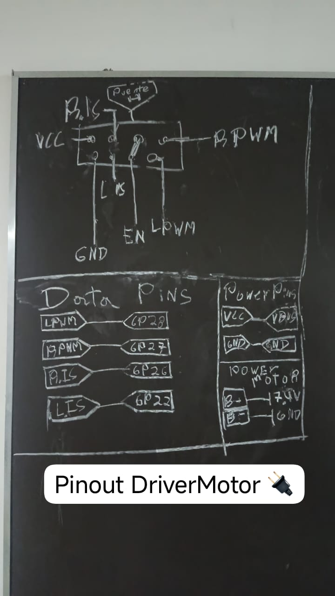
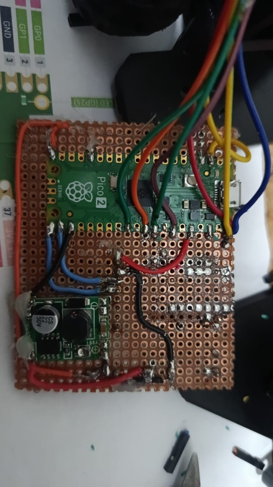

# Sistema de Control de Motores con Raspberry Pi Pico 2 y Puente H

Este repositorio contiene la especificación técnica, el mapa de conexiones y los detalles de implementación de hardware para un sistema de tracción electromecánica de alta potencia controlado por microcontrolador. Diseñado como guía educativa para futuros ingenieros en mecatrónica, electrónica y sistemas embebidos.

---

## 1. Arquitectura General del Sistema

El desarrollo físico consta de tres etapas fundamentales integradas en una placa de prototipado rápido (perfboard):
1. **Etapa de Control (Lógica):** Gobernada por la **Raspberry Pi Pico 2** (basada en el silicio RP2350), encargada de la generación de señales de modulación por ancho de pulsos (PWM) y lectura analógica de diagnóstico.
2. **Etapa de Regulación de Voltaje:** Servida por un módulo reductor conmutado (**Buck Converter Step-Down**) encargado de estabilizar los niveles de voltaje requeridos para la lógica de forma eficiente y sin disipación excesiva de calor.
3. **Etapa de Potencia:** Un módulo **Puente H** de alta corriente diseñado para conmutar las cargas inductivas de los motores a partir de una fuente de alimentación externa.

---

## 2. Esquema de Conexiones (Pinout)

A partir del análisis del diagrama de bloques técnico y la distribución en pizarra, se ha establecido la siguiente asignación estricta de pines para asegurar la integridad de la señal y el correcto censado:

### Diagrama de Referencia

### Pines de Datos (Señales de Control y Diagnóstico)

| Señal del Driver | Pin GPIO (Pico 2) | Función Técnica |
| :--- | :--- | :--- |
| **LPWM** | `GP28` (Pin 34) | Señal PWM para control de velocidad y sentido de giro izquierdo (*Left PWM*). |
| **RPWM** | `GP27` (Pin 32) | Señal PWM para control de velocidad y sentido de giro derecho (*Right PWM*). |
| **R_IS** | `GP26 / ADC0` (Pin 31) | Entrada Analógica: Monitoreo de corriente del lado derecho (*Right Current Sense*). |
| **L_IS** | `GP22` | Entrada Analógica: Monitoreo de corriente del lado izquierdo (*Left Current Sense*). |
| **EN** | `VCC` | Habilitación de compuertas lógicas internas de los drivers de potencia (Always High). |

### Líneas de Alimentación y Potencia

| Línea del Driver | Conexión Destino | Voltaje Nominal | Descripción |
| :--- | :--- | :--- | :--- |
| **VCC** | `VBUS` (Raspberry Pi Pico) | 5.0V DC | Alimentación del circuito lógico del driver. |
| **GND** | `GND` Común | 0V | Masa de referencia unificada del sistema. |
| **B+** | Terminal Positivo (+) | 7.4V (LiPo 2S) | Suministro de potencia principal dedicado a los motores. |
| **B-** | Terminal Negativo (-) | 0V | Retorno de potencia hacia la batería. |

---

## 3. Detalles de Implementación de Hardware

Al observar la implementación física real del circuito en la placa perforada, se destacan los siguientes criterios de diseño electrónico:

* **Módulo Regulador Buck (Esquina Inferior Izquierda):** Integra un circuito regulador conmutado acompañado de un condensador electrolítico de filtrado grueso (`22µF / 50V`). Su función es vital: mitigar el ruido electromagnético y las caídas de tensión provocadas por los transitorios de arranque de los motores, aislando la alimentación de la Raspberry Pi Pico 2.
* **Organización del Cableado:** Se ha implementado un código de colores estructurado para los buses de datos superiores (cables verde, naranja, marrón y amarillo) facilitando el seguimiento de señales mediante osciloscopio o multímetro durante las fases de pruebas operativas.
* **Masa Unificada:** Es un requisito indispensable que la masa de potencia (`B-`) y la masa lógica (`GND`) se unan en un único punto (estrella) en la placa para evitar bucles de masa (*ground loops*) que distorsionen las lecturas de los pines de diagnóstico `R_IS` y `L_IS`.

---
## 

## Notas Importantes para Ingeniería

>  **Aviso de Seguridad:** Antes de conectar las salidas del regulador Step-Down a cualquier pin de la Raspberry Pi Pico 2, utilice un multímetro para ajustar el potenciómetro de precisión hasta asegurar un voltaje seguro. Los pines GPIO de la Pico 2 operan estrictamente a niveles lógicos de **3.3V** y voltajes mayores dañarán permanentemente el microcontrolador.

